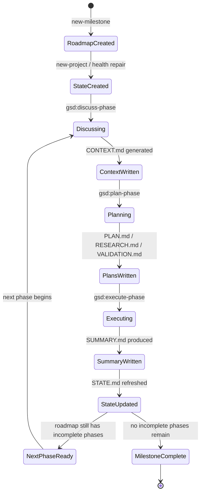

# GSD Context 管理架构（findings）

## 1. 主线 ≤15% 的硬性约束如何实现
### 1.1 模板层显式声明（grep "Context budget" 全 GSD）
- `execute-phase.md` 直接把编排器预算写成约 15%，并把子 agent 写成 100% fresh；这不是实现细节，而是顶层设计约束。见 `D:\workflow\get-shit-done\get-shit-done\workflows\execute-phase.md:16-31`。
- 同一段把 orchestrator 的任务压缩成“discover plans / analyze dependencies / group into waves / spawn subagents / collect results”，因此主上下文只需要支撑这些元操作。见 `D:\workflow\get-shit-done\get-shit-done\workflows\execute-phase.md:17-20`。
- `--wave N` 被定义成节流开关，可用于 pacing、quota management、staged rollout；这说明预算控制不是隐式的，而是命令级暴露。见 `D:\workflow\get-shit-done\get-shit-done\workflows\execute-phase.md:21-24`。
- `autonomous.md` 说每个 incomplete phase 都只走 discuss → plan → execute，且 pauses 只留给用户决策；这把主线的注意力范围限制得很窄。见 `D:\workflow\get-shit-done\get-shit-done\workflows\autonomous.md:1-4`。
- `autonomous.md` 又强调 `--interactive` 时 only discuss conversations accumulate，而 plan/execute 由 background agents 承担；这也是把主上下文压小的做法。见 `D:\workflow\get-shit-done\get-shit-done\workflows\autonomous.md:44-46`。
- `plan-phase.md` 把 “CONTEXT.md loaded early and passed to ALL agents” 写进检查清单，说明共享上下文不是整库读，而是一个 phase 级压缩包。见 `D:\workflow\get-shit-done\get-shit-done\workflows\plan-phase.md:1665-1674`。
- `new-milestone.md` 直接规定研究员跑完后不能继续读研究文件或自行综合，必须等所有研究 agent 结束后再启动 synthesizer。见 `D:\workflow\get-shit-done\get-shit-done\workflows\new-milestone.md:339-362`。
- `discuss-phase.md` 把 CONTEXT.md 定义成给下游 agents 用的“决策冻结文件”，不是给编排器反复回读的原始对话堆。见 `D:\workflow\get-shit-done\get-shit-done\workflows\discuss-phase.md:37-43`。
- `discuss-phase.md` 的 success criteria 里明确要求 CONTEXT.md “captures decisions, not vague vision”；这等于是把可执行信息压成最小决策集。见 `D:\workflow\get-shit-done\get-shit-done\workflows\discuss-phase.md:63-71`。
- `execute-phase.md` 的 checkpoint 逻辑要求在中断处改派 fresh continuation agent，而不是 resume 原代理；这减少了长链路上下文泄漏。见 `D:\workflow\get-shit-done\get-shit-done\workflows\execute-phase.md:984-994`。
- 这里的机制性结论是：GSD 通过“文本预算声明 + wave 过滤 + phase 冻结文件 + fresh agent 续跑”四层组合，让主编排者不背实现细节。见 `D:\workflow\get-shit-done\get-shit-done\workflows\execute-phase.md:17-31`、`D:\workflow\get-shit-done\get-shit-done\templates\context.md:3-11`、`D:\workflow\get-shit-done\get-shit-done\templates\state.md:77-121`。

### 1.2 编排器只调 Skill()/Task() 不直接做事（4-5 个具体片段引用）
- `autonomous.md` 的目标句已经把编排器定位为“推动 phase 流程”，而不是实现任务本身。见 `D:\workflow\get-shit-done\get-shit-done\workflows\autonomous.md:1-4`。
- 它还规定每个 phase 的动作固定成 discuss → plan → execute，所以编排器的职责是串联阶段，而不是深入补细节。见 `D:\workflow\get-shit-done\get-shit-done\workflows\autonomous.md:3-4`。
- `execute-phase.md` 的开头直接写“Orchestrator stays lean”，把职责限定在计划发现、依赖分析、分 wave、spawn、collect。见 `D:\workflow\get-shit-done\get-shit-done\workflows\execute-phase.md:17-20`。
- 同文件接着写 “Each subagent loads the full execute-plan context and handles its own plan”，说明实际实施的责任已经彻底下放。见 `D:\workflow\get-shit-done\get-shit-done\workflows\execute-phase.md:19-20`。
- `new-milestone.md` 的研究步骤里，4 个 researcher Task() 发出后，编排器必须停下来，不能自己继续查资料或综合。见 `D:\workflow\get-shit-done\get-shit-done\workflows\new-milestone.md:339-362`。
- `discuss-phase.md` 也明确“Not your job: Figure out HOW to implement. That's what research and planning do”，这把编排器和实现逻辑隔离开来。见 `D:\workflow\get-shit-done\get-shit-done\workflows\discuss-phase.md:37-43`。
- `plan-phase.md` 的检查清单要求 researcher、planner、checker 都要从 CONTEXT.md 获得输入；编排器本身只负责派发。见 `D:\workflow\get-shit-done\get-shit-done\workflows\plan-phase.md:1668-1674`。
- `plan-phase.md` 的 available_agent_types 也把这些角色具体化成 gsd-phase-researcher、gsd-pattern-mapper、gsd-planner、gsd-plan-checker。见 `D:\workflow\get-shit-done\get-shit-done\workflows\plan-phase.md:15-21`。
- `plan-phase.md` 进一步说明 gsd-planner 只在研究与上下文给定后“creates detailed plans”，而不是从零推翻 phase 范围。见 `D:\workflow\get-shit-done\get-shit-done\workflows\plan-phase.md:15-21` 与 `:31-40`。
- `autonomous.md` 的 `--interactive` 选项把人机问答留在 discuss，并把 plan+execute 交给后台，这进一步证明编排器在主线中主要是调度器。见 `D:\workflow\get-shit-done\get-shit-done\workflows\autonomous.md:44-46`。

### 1.3 Subagent 100% fresh 怎么保证（机制层面）
- `execute-phase.md` 直接把 “100% fresh per subagent” 写入目标。见 `D:\workflow\get-shit-done\get-shit-done\workflows\execute-phase.md:30-31`。
- 它不是口号，而是和 checkpoint 处理绑定：`Spawn continuation agent (NOT resume)`。见 `D:\workflow\get-shit-done\get-shit-done\workflows\execute-phase.md:984-994`。
- 紧接着解释原因：resume 依赖内部序列化，在并行 tool calls 场景会坏掉，所以 fresh agents 更可靠。见 `D:\workflow\get-shit-done\get-shit-done\workflows\execute-phase.md:992-994`。
- 这意味着“恢复”不是重载旧代理记忆，而是把已完成任务表和当前任务号显式塞给新代理。见 `D:\workflow\get-shit-done\get-shit-done\workflows\execute-phase.md:985-991`。
- `plan-phase.md` 同样偏向显式输入：CONTEXT.md、RESEARCH.md 都是传给 agent 的文件，而非让 agent 继承旧对话历史。见 `D:\workflow\get-shit-done\get-shit-done\workflows\plan-phase.md:1668-1674`。
- `new-milestone.md` 也要求研究员全部结束后再启动 synthesizer，这避免多波次读写交叠。见 `D:\workflow\get-shit-done\get-shit-done\workflows\new-milestone.md:339-362`。
- `gsd-context-monitor.js` 用 “没有 metrics 文件 = subagent or fresh session” 的规则来分辨新上下文，说明 hook 层也在承认 fresh session 是默认安全状态。见 `D:\workflow\get-shit-done\hooks\gsd-context-monitor.js:72-78`。
- 同一 hook 还在 metrics 过期后退出，避免旧上下文指标误导当前会话。见 `D:\workflow\get-shit-done\hooks\gsd-context-monitor.js:83-86`。
- `gsd-session-state.sh` 在 SessionStart 时只注入 STATE.md 摘要，不把整个历史对话拼进来，因此也符合“新会话只拿最小必要状态”的原则。见 `D:\workflow\get-shit-done\hooks\gsd-session-state.sh:17-57`。
- `autonomous.md` 的 `--interactive` 模式把 discuss 留在当前会话，plan/execute 用后台 agents，从进程结构上避免把沉重上下文带到主线程。见 `D:\workflow\get-shit-done\get-shit-done\workflows\autonomous.md:44-46`。

## 2. State Machine: STATE.md / ROADMAP.md / CONTEXT.md / SUMMARY.md
### 2.1 文件用途分工矩阵（5 列：写者/时机/字段/读者）
| 文件 | 写者 | 时机 | 字段 / 内容 | 读者 |
|---|---|---|---|---|
| `STATE.md` | `/gsd-new-project`、`/gsd-health --repair`、`execute-phase`、`complete-milestone` 流程 | 初始化、每个重要动作后、阶段完成后 | 当前 phase、plan、status、最后活动、进度条、绩效、累计决策、pending todos、blockers、deferred items、session continuity。见 `D:\workflow\get-shit-done\get-shit-done\templates\state.md:7-24`、`:28-45`、`:47-81`。 | 全部 workflow、状态栏 hook、恢复逻辑。见 `D:\workflow\get-shit-done\get-shit-done\templates\state.md:84-121`。 |
| `ROADMAP.md` | `/gsd-new-milestone`、`/gsd-new-project`、后续计划更新流程 | milestone/phase 初始化与重排 | phase 编号、依赖、目标、需求、成功标准、plans、milestone 分组、progress table、status 值。见 `D:\workflow\get-shit-done\get-shit-done\templates\roadmap.md:14-25`、`:61-85`、`:136-145`、`:181-201`。 | `autonomous`、`plan-phase`、`discuss-phase`、`execute-phase`。见 `D:\workflow\get-shit-done\get-shit-done\workflows\autonomous.md:48-55`、`D:\workflow\get-shit-done\get-shit-done\workflows\plan-phase.md:117-124`。 |
| `CONTEXT.md` | `discuss-phase` | phase 讨论收束时 | phase boundary、相关 specs/ADRs/设计文档、locked decisions、Claude discretion、next phase readiness。见 `D:\workflow\get-shit-done\get-shit-done\templates\context.md:15-24`、`:47-70`、`:77-125`。 | `gsd-phase-researcher`、`gsd-planner`。见 `D:\workflow\get-shit-done\get-shit-done\templates\context.md:5-11`、`D:\workflow\get-shit-done\get-shit-done\workflows\discuss-phase.md:37-43`。 |
| `SUMMARY.md` | `execute-phase` | 每个 plan 执行完成后 | frontmatter: phase、plan、subsystem、tags、provides、affects、tech-stack、key-files、key-decisions、duration、completed。见 `D:\workflow\get-shit-done\get-shit-done\templates\summary-standard.md:1-18`、`summary-minimal.md:1-18`、`summary-complex.md:1-23`。 | `STATE.md` 汇总、后续 phase、归档/学习提炼流程。见 `D:\workflow\get-shit-done\get-shit-done\templates\state.md:111-120`、`D:\workflow\get-shit-done\get-shit-done\templates\README.md:21-22`。 |

### 2.2 phase 生命周期下的状态变化（Mermaid）

- `STATE.md` 的 lifecycle 明确列出 creation / reading / writing 三阶段，因此它是最基础的“状态机存储”。见 `D:\workflow\get-shit-done\get-shit-done\templates\state.md:98-121`。
- `ROADMAP.md` 定义 phase 编号和 milestone 分组，所以它是 phase life cycle 的结构源。见 `D:\workflow\get-shit-done\get-shit-done\templates\roadmap.md:16-24`、`:136-201`。
- `CONTEXT.md` 把 phase boundary 冻结下来，说明讨论阶段完成后，范围就不再在计划时被重新协商。见 `D:\workflow\get-shit-done\get-shit-done\templates\context.md:15-24`。
- `SUMMARY.md` 的 frontmatter 让 summary 不只是自然语言总结，还能被后续步骤做机器扫描。见 `D:\workflow\get-shit-done\get-shit-done\templates\summary-standard.md:1-18`。
- `execute-phase.md` 的 resumption 说明将 `SUMMARY.md` 视为跳过已完成 plan 的依据，所以 summary 是执行态向下一次会话的桥接。见 `D:\workflow\get-shit-done\get-shit-done\workflows\execute-phase.md:1697-1700`。
- `state.md` 的 `Progress` 字段说明它不仅存事实，也存完成百分比。见 `D:\workflow\get-shit-done\get-shit-done\templates\state.md:19-27`。
- `state.md` 的 `Performance Metrics` 说明状态机还把执行效率纳入记忆，而不是只记“做到哪一步”。见 `D:\workflow\get-shit-done\get-shit-done\templates\state.md:28-45`。
- `roadmap.md` 的 decimal phase 规则解释了为什么 autonomous 需要 re-read ROADMAP.md；因为 roadmap 本身允许中途插入紧急 phase。见 `D:\workflow\get-shit-done\get-shit-done\templates\roadmap.md:16-20` 与 `D:\workflow\get-shit-done\get-shit-done\workflows\autonomous.md:3-4`。

### 2.3 跨会话续跑：哪些字段 enable 这个
- `Session Continuity` 是 `STATE.md` 最直接的恢复区块：它把 `Last session`、`Stopped at`、`Resume file` 明确列出。见 `D:\workflow\get-shit-done\get-shit-done\templates\state.md:77-81`。
- `Current Position` 把 phase / plan / status / last activity 压成一眼可恢复的当前点。见 `D:\workflow\get-shit-done\get-shit-done\templates\state.md:19-27`。
- `Accumulated Context` 的 Decisions / Pending Todos / Blockers 三块是跨会话保留最关键的认知状态。见 `D:\workflow\get-shit-done\get-shit-done\templates\state.md:47-67`。
- `ROADMAP.md` 的 phase 顺序、依赖和 success criteria 让新会话知道下一步要往哪走。见 `D:\workflow\get-shit-done\get-shit-done\templates\roadmap.md:14-25` 与 `:61-85`。
- `SUMMARY.md` 的 `key-files`、`key-decisions`、`completed` 字段让已完成工作可以被压缩成恢复元数据。见 `D:\workflow\get-shit-done\get-shit-done\templates\summary-standard.md:1-18`。
- `execute-phase.md` 直接写明重跑同一 phase 时会跳过已完成 SUMMARYs 并从第一个未完成 plan 继续，这是跨会话续跑的明确机制。见 `D:\workflow\get-shit-done\get-shit-done\workflows\execute-phase.md:1697-1700`。
- `gsd-statusline.js` 读取 `STATE.md` 后会渲染 `activePhase`、`nextAction`、`nextPhases`、`completedPhases`、`totalPhases`、`percent`，这说明恢复字段不仅用于文件，也直接驱动界面提示。见 `D:\workflow\get-shit-done\hooks\gsd-statusline.js:124-135`、`:233-263`、`:475-477`。
- `gsd-session-state.sh` 会在 SessionStart 直接把 STATE.md 头部与 config mode 摘入 additionalContext，因此跨会话不需要人工翻文件。见 `D:\workflow\get-shit-done\hooks\gsd-session-state.sh:17-57`。

## 3. gsd-sdk 角色
- `QUERY-HANDLERS.md` 明说这是一层 typed query layer，给 `gsd-sdk query` 和 `createRegistry()` 调用者用。见 `D:\workflow\get-shit-done\sdk\src\query\QUERY-HANDLERS.md:1-4`。
- `normalizeQueryCommand()` 负责把输入 argv 归一化成 command/subcommand 组合，减少 workflow 端自己拆 token 的负担。见 `D:\workflow\get-shit-done\sdk\src\query\QUERY-HANDLERS.md:27-31`。
- `resolveQueryArgv()` 采用最长前缀匹配，因此 registry 可以稳定支持 dotted / spaced 两种写法。见 `D:\workflow\get-shit-done\sdk\src\query\QUERY-HANDLERS.md:29-33`。
- 当 registry 找不到原生 handler 时，CLI 可以 fallback 到 `gsd-tools.cjs`；这让 SDK 可以逐步替代旧路径，而不是一次性切断。见 `D:\workflow\get-shit-done\sdk\src\query\QUERY-HANDLERS.md:32-33`。
- `QueryResult.format = 'text'` 允许字符串原样输出，这对 `agent-skills` 这类 XML 块很关键。见 `D:\workflow\get-shit-done\sdk\src\query\utils.ts:24-36`。
- `QUERY-HANDLERS.md` 把 `init.*`、`phase.*`、`roadmap.*`、`state.*`、`verify.*`、`validate.*` 分别绑定到 manifest family，说明 query 层已经做了明确域划分。见 `D:\workflow\get-shit-done\sdk\src\query\QUERY-HANDLERS.md:13-25`。
- 这里最直接的 context 管理 query 是 `init.milestone-op`、`roadmap.analyze`、`init.plan-phase` 和 `state.get` 这几类。见 `D:\workflow\get-shit-done\get-shit-done\workflows\autonomous.md:48-55`、`:82-90`、`D:\workflow\get-shit-done\get-shit-done\workflows\plan-phase.md:31-40`、`D:\workflow\get-shit-done\sdk\src\query\QUERY-HANDLERS.md:154-155`。
- `QUERY-HANDLERS.md` 也指出 `state.validate` 是只读，不属于 mutation commands。见 `D:\workflow\get-shit-done\sdk\src\query\QUERY-HANDLERS.md:45-48`。
- 这套 query 层的意义在于：读状态时不用把整个 `.planning/` 扫进主上下文，而是拿结构化 JSON。见 `D:\workflow\get-shit-done\sdk\src\query\QUERY-HANDLERS.md:27-33` 与 `D:\workflow\get-shit-done\sdk\src\query\utils.ts:24-36`。
- `autonomous.md` 与 `plan-phase.md` 的 init/roadmap 调用都在用 `gsd-sdk query`，说明 SDK 已经是 workflow 的上下文入口。见 `D:\workflow\get-shit-done\get-shit-done\workflows\autonomous.md:48-55`、`D:\workflow\get-shit-done\get-shit-done\workflows\plan-phase.md:31-40`。
- `discuss-phase.md` 也通过 `gsd-sdk query config-get workflow.discuss_mode` 来路由模式，说明配置读取已经不是手工 grep。见 `D:\workflow\get-shit-done\get-shit-done\workflows\discuss-phase.md:47-60`。

## 4. Hook 体系
### 4.1 gsd-context-monitor.js 完整逻辑
- 这是一个 PostToolUse hook，用来监控上下文剩余量并在阈值触发时发出提醒。见 `D:\workflow\get-shit-done\hooks\gsd-context-monitor.js:1-11`。
- 它先从 stdin 解析 JSON，再提取 `session_id`；如果没有 session 就静默退出。见 `D:\workflow\get-shit-done\hooks\gsd-context-monitor.js:41-47`。
- 它把 `session_id` 作为路径片段前做了路径穿越检查，避免读写临时目录之外的文件。见 `D:\workflow\get-shit-done\hooks\gsd-context-monitor.js:49-54`。
- 它只在 `.planning/config.json` 中 `hooks.community === true` 时启用。见 `D:\workflow\get-shit-done\hooks\gsd-context-monitor.js:10-16`。
- metrics 文件路径固定在 temp 目录下的 `claude-ctx-${sessionId}.json`。见 `D:\workflow\get-shit-done\hooks\gsd-context-monitor.js:72-77`。
- 如果 metrics 文件缺失，它把会话视为 subagent 或 fresh session，然后退出。见 `D:\workflow\get-shit-done\hooks\gsd-context-monitor.js:75-78`。
- 它会丢弃超过 60 秒的 metrics，避免拿旧状态吓唬当前会话。见 `D:\workflow\get-shit-done\hooks\gsd-context-monitor.js:83-86`。
- 它的 warning threshold 设为 35%，critical threshold 设为 25%。见 `D:\workflow\get-shit-done\hooks\gsd-context-monitor.js:26-29` 与 `:88-95`。
- 它用 `warned.json` 做 debounce，最少间隔 5 次 tool use 才再次提醒。见 `D:\workflow\get-shit-done\hooks\gsd-context-monitor.js:96-127`。
- 在 critical 且检测到 `.planning/STATE.md` 的情况下，它会自动调用 `state record-session --stopped-at ...` 记录断点。见 `D:\workflow\get-shit-done\hooks\gsd-context-monitor.js:129-155`。
- 这个记录过程是 detached、stdio ignore、unref 的，不会阻塞主流程。见 `D:\workflow\get-shit-done\hooks\gsd-context-monitor.js:147-155`。
- 提醒文案强调不要开始新复杂工作、不要写 handoff 文件、GSD state 已在 STATE.md 里追踪。见 `D:\workflow\get-shit-done\hooks\gsd-context-monitor.js:158-166`。
- 这意味着 context monitor 不是单纯的“剩余量显示”，而是把“停在自然断点”编码成行为建议。见 `D:\workflow\get-shit-done\hooks\gsd-context-monitor.js:158-169`。

### 4.2 gsd-statusline.js 完整逻辑
- 它会向上查找 `.planning/STATE.md`，并把解析后的状态转成状态栏片段。见 `D:\workflow\get-shit-done\hooks\gsd-statusline.js:99-109` 与 `:233-263`。
- `parseStateMd()` 先读 frontmatter，再从正文里抽 phase 字段，因此它同时支持结构化字段和老式正文。见 `D:\workflow\get-shit-done\hooks\gsd-statusline.js:122-137`。
- 这个 parser 明确列出了 phase-lifecycle 新字段：`activePhase`、`nextAction`、`nextPhases`、`completedPhases`、`totalPhases`、`percent`。见 `D:\workflow\get-shit-done\hooks\gsd-statusline.js:126-135`。
- `formatGsdState()` 会优先显示 milestone、status、phase、next action 等对人最有用的信息。见 `D:\workflow\get-shit-done\hooks\gsd-statusline.js:233-263`。
- 如果存在 `nextAction`，它会直接把下一步命令提示给用户。见 `D:\workflow\get-shit-done\hooks\gsd-statusline.js:255-258`。
- 如果进度到 100% 或 completed equals total，它就显示 `milestone complete`。见 `D:\workflow\get-shit-done\hooks\gsd-statusline.js:259-262`。
- 若不存在新字段，它回落到旧版显示，保持向后兼容。见 `D:\workflow\get-shit-done\hooks\gsd-statusline.js:263-265`。
- 状态栏除了 GSD 状态，还能显示 todo 数量、是否有可用更新、最后 slash command 后缀。见 `D:\workflow\get-shit-done\hooks\gsd-statusline.js:375-477`。
- `readLastSlashCommand()` 被包装成可选增强，所以失败不会损坏主状态栏。见 `D:\workflow\get-shit-done\hooks\gsd-statusline.js:414-416`。
- 模块导出的 helper 说明这套状态逻辑是可测的，不只是展示用。见 `D:\workflow\get-shit-done\hooks\gsd-statusline.js:449-453`。

### 4.3 gsd-phase-boundary.sh 触发时机
- 它是一个 PostToolUse hook，专门检查 `.planning/` 文件写入。见 `D:\workflow\get-shit-done\hooks\gsd-phase-boundary.sh:1-8`。
- 只有在 `.planning/config.json` 且 `hooks.community === true` 时才会生效。见 `D:\workflow\get-shit-done\hooks\gsd-phase-boundary.sh:10-16`。
- 它从 hook 输入 JSON 中解析 `tool_input.file_path`。见 `D:\workflow\get-shit-done\hooks\gsd-phase-boundary.sh:18-22`。
- 如果路径命中 `.planning/*`，它会置 `planning_modified=true`。见 `D:\workflow\get-shit-done\hooks\gsd-phase-boundary.sh:26-29`。
- 输出采用结构化 JSON，包含 `hookEventName`、`additionalContext`、`planning_modified` 和 `file_path`。见 `D:\workflow\get-shit-done\hooks\gsd-phase-boundary.sh:31-45`。
- `additionalContext` 会提示用户检查 STATE.md 是否需要同步更新，这就是 phase boundary 的提醒语义。见 `D:\workflow\get-shit-done\hooks\gsd-phase-boundary.sh:34-45`。
- 这个 hook 不做写操作，只发提醒，所以它是边界提示器，不是修复器。见 `D:\workflow\get-shit-done\hooks\gsd-phase-boundary.sh:31-47`。

### 4.4 gsd-session-state.sh
- 这个 hook 是 SessionStart hook，核心目标是把 STATE.md 的头部摘要注入启动上下文。见 `D:\workflow\get-shit-done\hooks\gsd-session-state.sh:1-7`。
- 它也通过 `hooks.community === true` 做 opt-in 控制。见 `D:\workflow\get-shit-done\hooks\gsd-session-state.sh:9-15`。
- 它检测 `.planning/STATE.md` 是否存在；存在则读取前 20 行。见 `D:\workflow\get-shit-done\hooks\gsd-session-state.sh:21-26`。
- 它读取 `.planning/config.json` 的 `mode`，并把该 mode 注入提醒。见 `D:\workflow\get-shit-done\hooks\gsd-session-state.sh:28-31`。
- 它将 additionalContext 包装成 JSON envelope，并输出 typed 字段 `state_present` 与 `config_mode`。见 `D:\workflow\get-shit-done\hooks\gsd-session-state.sh:33-57`。
- 如果 STATE.md 存在，它会提示用户检查 blockers 和 current phase。见 `D:\workflow\get-shit-done\hooks\gsd-session-state.sh:39-45`。
- 如果 STATE.md 不存在，它会建议先走 `/gsd-new-project`。见 `D:\workflow\get-shit-done\hooks\gsd-session-state.sh:43-45`。
- 这个 hook 的关键价值是：新会话一开始就带着最小状态摘要，而不是从零读全量文件。见 `D:\workflow\get-shit-done\hooks\gsd-session-state.sh:17-57`。

## 5. discuss-phase 的“先确认再做”机制
- 这个 phase 的第一个定义就是“extract implementation decisions that downstream agents need”，说明它不是执行器。见 `D:\workflow\get-shit-done\get-shit-done\workflows\discuss-phase.md:1-5`。
- 它把流程拆成加载前置上下文、扫代码库、分析 phase、列灰区、逐项深挖、写 CONTEXT.md。见 `D:\workflow\get-shit-done\get-shit-done\workflows\discuss-phase.md:20-28`。
- 这套流程的产物是 `NN-CONTEXT.md`，其目标是让下游 agents 不再向用户重复提问。见 `D:\workflow\get-shit-done\get-shit-done\workflows\discuss-phase.md:26-29`。
- 它明确说 CONTEXT.md 会被 researcher 和 planner 读取，因此 discuss phase 是下游认知的前置门。见 `D:\workflow\get-shit-done\get-shit-done\workflows\discuss-phase.md:37-43`。
- 它还强调“Not your job: Figure out HOW to implement”，把 how 留给 research 和 planning。见 `D:\workflow\get-shit-done\get-shit-done\workflows\discuss-phase.md:37-43`。
- scope guardrail 把 phase boundary 锁在 ROADMAP.md 上，明确“讨论只澄清如何实现已定范围”。见 `D:\workflow\get-shit-done\get-shit-done\workflows\discuss-phase.md:56-58`。
- mode routing 通过 `workflow.discuss_mode` 控制进入 discuss 或 assumptions flow，因此“先确认”不仅是文本约束，也是可配置路由。见 `D:\workflow\get-shit-done\get-shit-done\workflows\discuss-phase.md:47-60`。
- `progressive_disclosure` 规定只有对应 flag 或条件满足时才读特定 mode 文件，这让讨论过程天然分层。见 `D:\workflow\get-shit-done\get-shit-done\workflows\discuss-phase.md:17-34`。
- `context.md` 模板要求列出相关规范、ADR、设计文档，并解释每份文档决定了什么；这能把用户确认结果固化成后续可执行材料。见 `D:\workflow\get-shit-done\get-shit-done\templates\context.md:61-70`。
- `discuss-phase.md` 的 success criteria 要求 CONTEXT.md 里是 decision 而不是 vague vision，这就是“先确认再做”的验收条件。见 `D:\workflow\get-shit-done\get-shit-done\workflows\discuss-phase.md:63-71`。
- `--chain` 和 `--auto` 会把 discuss 结果直接推到 plan-phase，说明一旦确认完，后续环节就自动接力。见 `D:\workflow\get-shit-done\get-shit-done\workflows\discuss-phase.md:494-496`。
- `discuss-phase.md` 还说明 lazy loading：模板在写对应步骤时才加载，这进一步降低了前置上下文噪音。见 `D:\workflow\get-shit-done\get-shit-done\workflows\discuss-phase.md:58-60`。

## 6. 与 CCG v3.0.0 的差距对比
- GSD 把“编排器 budget 约 15% / subagent 100% fresh”写成明确约束；CCG 的 `templates/commands/team-exec.md` 只写了 wave 调度、zero-write 和 state.md 断点，没有同级别的上下文预算语义。见 GSD `D:\workflow\get-shit-done\get-shit-done\workflows\execute-phase.md:16-31`，对照 CCG `D:\workflow\ccg-workflow\templates\commands\team-exec.md:5-20`。
- GSD 的 checkpoint 语义要求 fresh continuation agent；CCG 的 `templates/commands/execute.md` 则把 `resume <SESSION_ID>` 作为常规路径，意味着旧会话复用是中心机制。见 GSD `D:\workflow\get-shit-done\get-shit-done\workflows\execute-phase.md:984-994`，对照 CCG `D:\workflow\ccg-workflow\templates\commands\execute.md:46-107`。
- GSD 有 `CONTEXT.md` 作为 phase 决策冻结点；CCG 的 `templates/commands/plan.md` 有计划草案和 SESSION_ID 交接，但没有明确的 phase-scoped decision file。见 GSD `D:\workflow\get-shit-done\get-shit-done\templates\context.md:3-11`，对照 CCG `D:\workflow\ccg-workflow\templates\commands\plan.md:139-185` 与 `:219-257`。
- GSD 的 `STATE.md` 有 `Session Continuity` 和短期记忆分层；CCG 的 `team-exec.md` 只有 `.ccg/state.md` 的 wave 断点与 task 状态，没有同等丰富的恢复字段。见 GSD `D:\workflow\get-shit-done\get-shit-done\templates\state.md:77-121`，对照 CCG `D:\workflow\ccg-workflow\templates\commands\team-exec.md:47-53`。
- GSD 有 SessionStart / PostToolUse hook 直接注入状态与边界提醒；CCG 的 `workflow.md`、`execute.md` 主要通过命令模板和人工确认串联，没有可见的同类 hook 层。见 GSD `D:\workflow\get-shit-done\hooks\gsd-session-state.sh:1-57`、`D:\workflow\get-shit-done\hooks\gsd-phase-boundary.sh:1-45`，对照 CCG `D:\workflow\ccg-workflow\templates\commands\workflow.md:33-90`、`D:\workflow\ccg-workflow\templates\commands\execute.md:21-107`。
- GSD 用 `gsd-sdk query` 统一读取 `init.milestone-op`、`roadmap.analyze`、`init.plan-phase`、`config-get`；CCG 目前更依赖计划文件和 wrapper 参数，而不是 typed query registry。见 GSD `D:\workflow\get-shit-done\get-shit-done\workflows\autonomous.md:48-55`、`:82-90`、`D:\workflow\get-shit-done\get-shit-done\workflows\plan-phase.md:31-40`，对照 CCG `D:\workflow\ccg-workflow\templates\commands\workflow.md:35-90` 与 `D:\workflow\ccg-workflow\templates\commands\plan.md:120-185`。
- GSD 的 `SUMMARY.md` frontmatter 直接承载 phase / plan / decisions / duration；CCG 的计划流更多围绕 `.claude/plan/<功能名>.md` 和外部 session id 续跑。见 GSD `D:\workflow\get-shit-done\get-shit-done\templates\summary-standard.md:1-18`，对照 CCG `D:\workflow\ccg-workflow\templates\commands\execute.md:46-107` 与 `D:\workflow\ccg-workflow\templates\commands\plan.md:219-257`。
- `team-exec.md` 里虽然也有 wave-based 并行，但它主要解决并行 spawn 与依赖图问题；GSD 额外加入了 context budget、decision freeze、phase boundary hooks 与 query registry，所以上下文治理更完整。见 CCG `D:\workflow\ccg-workflow\templates\commands\team-exec.md:8-20`，对照 GSD `D:\workflow\get-shit-done\get-shit-done\workflows\execute-phase.md:17-31` 与 `D:\workflow\get-shit-done\hooks\gsd-session-state.sh:17-57`。
- 因此，CCG 现在更像“多模型执行框架”，GSD 更像“带状态机和 hook 的上下文操作系统”。这个判断来自两边对角色、状态和 hook 的公开描述。见 GSD `D:\workflow\get-shit-done\get-shit-done\workflows\discuss-phase.md:17-29`、`execute-phase.md:17-31`，对照 CCG `D:\workflow\ccg-workflow\templates\commands\workflow.md:22-30`。

## 7. 移植到 CCG 的最小可行集（80/20）
- **机制 1：显式 context budget + fresh subagent 约束**
  - 改动范围：`templates/commands/team-exec.md`、`templates/commands/execute.md`、`templates/commands/workflow.md`，约 20-35 行。
  - 预期收益：把主编排器职责压成元操作，减少大会话里不必要的上下文膨胀，尤其适合 wave 并行、审计回合和长任务。见 GSD `D:\workflow\get-shit-done\get-shit-done\workflows\execute-phase.md:17-31`。
  - 风险 / BC 影响：如果当前 CCG 依赖 `resume <SESSION_ID>` 维持连续性，fresh-first 会改变使用习惯；但会换来更稳定的并行行为。对照 CCG `D:\workflow\ccg-workflow\templates\commands\execute.md:46-107`。
- **机制 2：phase-scoped CONTEXT.md 冻结点**
  - 改动范围：`templates/commands/plan.md`、`templates/commands/workflow.md`、`templates/commands/team-exec.md`，约 30-50 行。
  - 预期收益：把用户确认过的决定冻结成一个可复用的小文件，下游研究和实施不必再向用户重复确认。见 GSD `D:\workflow\get-shit-done\get-shit-done\templates\context.md:3-11` 与 `D:\workflow\get-shit-done\get-shit-done\workflows\discuss-phase.md:63-71`。
  - 风险 / BC 影响：需要新增读取规则；但对旧流程兼容较好，因为没有 CONTEXT.md 时可退化为现状。见 GSD `D:\workflow\get-shit-done\get-shit-done\workflows\plan-phase.md:117-124`。
- **机制 3：STATE.md / summary frontmatter 的恢复链**
  - 改动范围：`templates/commands/team-exec.md`、`templates/commands/execute.md`、状态栏或状态文件模板，约 25-40 行。
  - 预期收益：把当前 phase、plan、status、nextAction、累计决策压成最小恢复链，适合跨会话续跑。见 GSD `D:\workflow\get-shit-done\get-shit-done\templates\state.md:19-27`、`:77-121` 与 `D:\workflow\get-shit-done\get-shit-done\templates\summary-standard.md:1-18`。
  - 风险 / BC 影响：需要和现有 `.ccg/state.md` 断点语义对齐，避免双状态源并存。对照 CCG `D:\workflow\ccg-workflow\templates\commands\team-exec.md:47-53`。
- **机制 4：SessionStart / PostToolUse 轻量 hooks**
  - 改动范围：hook 脚本、配置说明、运行约定文档，约 40-60 行。
  - 预期收益：新会话启动即看到状态摘要，写 `.planning/` 时立刻得到边界提醒，适合多人、多工具并发。见 GSD `D:\workflow\get-shit-done\hooks\gsd-session-state.sh:17-57`、`D:\workflow\get-shit-done\hooks\gsd-phase-boundary.sh:1-45`。
  - 风险 / BC 影响：最好做成 opt-in，否则会改变现有用户的工作节奏；还要确保 hook 输出结构化且不阻塞主流程。见 GSD `D:\workflow\get-shit-done\hooks\gsd-context-monitor.js:10-16` 与 `:147-155`。
- **机制 5：typed query 层作为统一读取入口**
  - 改动范围：命令路由层与状态读取层，约 30-50 行说明或薄封装。
  - 预期收益：把 roadmap / state / init / config 之类读操作统一成结构化 JSON，编排器不必直接扫大文件。见 GSD `D:\workflow\get-shit-done\sdk\src\query\QUERY-HANDLERS.md:27-33` 与 `D:\workflow\get-shit-done\sdk\src\query\utils.ts:24-36`。
  - 风险 / BC 影响：如果 CCG 目前主要靠文本模板和 wrapper 参数，统一 query 层会改变命令边界；但长期维护成本更低。对照 CCG `D:\workflow\ccg-workflow\templates\commands\workflow.md:33-90`。

### 1.1 补充证据展开
- `autonomous.md` 在初始化阶段先解析 `--from`、`--to`、`--only`、`--interactive`，说明主线控制本身就是参数驱动的，而不是靠隐式状态。见 `D:\workflow\get-shit-done\get-shit-done\workflows\autonomous.md:19-46`。
- `autonomous.md` 用 `gsd-sdk query init.milestone-op` 初始化，而不是直接读多个状态文件，这说明“先拿结构化元信息再继续”是设计原则。见 `D:\workflow\get-shit-done\get-shit-done\workflows\autonomous.md:48-55`。
- `autonomous.md` 在 milestone 起步时要求 roadmap 和 state 都必须存在，否则直接报错。见 `D:\workflow\get-shit-done\get-shit-done\workflows\autonomous.md:57-58`。
- `autonomous.md` 的 startup banner 明确展示 phase 数量和已完成数量，说明总量级信息必须一眼可见。见 `D:\workflow\get-shit-done\get-shit-done\workflows\autonomous.md:60-69`。
- `autonomous.md` 对单 phase、起始 phase、结束 phase 都有单独提示语，说明 phase 过滤不是内部实现细节，而是用户可见行为。见 `D:\workflow\get-shit-done\get-shit-done\workflows\autonomous.md:71-74`。
- `autonomous.md` 的 phase discovery 先调用 `roadmap.analyze` 再筛选 incomplete phases，表示 phase 列表不是静态常量。见 `D:\workflow\get-shit-done\get-shit-done\workflows\autonomous.md:82-90`。
- `autonomous.md` 对 `disk_status` 和 `roadmap_complete` 采用 OR 条件判定 incomplete，说明“完成”需要磁盘态与 roadmap 态同时满足。见 `D:\workflow\get-shit-done\get-shit-done\workflows\autonomous.md:90-90`。
- `autonomous.md` 对 `--from` 与 `--to` 用 numeric comparison，这说明 decimal phase 是明确支持对象。见 `D:\workflow\get-shit-done\get-shit-done\workflows\autonomous.md:92-96`。
- `autonomous.md` 对 TO_PHASE / ONLY_PHASE 为空的场景提供 clean exit 文案，而不是继续执行未知逻辑。见 `D:\workflow\get-shit-done\get-shit-done\workflows\autonomous.md:98-112`。
- `autonomous.md` 要求按 number 数值排序后再执行，说明 phase 顺序是严格语义的一部分。见 `D:\workflow\get-shit-done\get-shit-done\workflows\autonomous.md:114-115`。
- `autonomous.md` 在没有未完成 phase 时会直接结束，表示执行器不是无条件循环。见 `D:\workflow\get-shit-done\get-shit-done\workflows\autonomous.md:116-123`。
- `autonomous.md` 在 phase 执行后会重新读取 ROADMAP.md，以捕捉动态插入的 phase。见 `D:\workflow\get-shit-done\get-shit-done\workflows\autonomous.md:124-126`。
- `autonomous.md` 明确区分“继续当前 phase”与“进入下一 phase”，说明 roadmap 读取是连续性机制。见 `D:\workflow\get-shit-done\get-shit-done\workflows\autonomous.md:124-126`。
- `autonomous.md` 的 interactive 模式在主会话保留 discuss 对话，但 plan/execute 后台化，这体现了主线 context 预算管理。见 `D:\workflow\get-shit-done\get-shit-done\workflows\autonomous.md:44-46`。
- `autonomous.md` 的 bootstrap 依赖 milestone 级 init JSON 中的 `commit_docs`，说明文档提交策略也属于上下文管理的一部分。见 `D:\workflow\get-shit-done\get-shit-done\workflows\autonomous.md:55-55`。
- `execute-phase.md` 的 `available optional flags` 明确写了 `--gaps-only`、`--interactive` 只在文档中存在，不是自动激活。见 `D:\workflow\get-shit-done\get-shit-done\workflows\execute-phase.md:45-55`。
- `execute-phase.md` 还写了 flags 的 active 判定必须从 `$ARGUMENTS` 字面 token 读取，说明它特别防止“凭空推断”。见 `D:\workflow\get-shit-done\get-shit-done\workflows\execute-phase.md:50-54`。
- `execute-phase.md` 的 `plan discovery` 会跳过已完成计划，并把过滤后的列表按 wave 组织。见 `D:\workflow\get-shit-done\get-shit-done\workflows\execute-phase.md:76-90`。
- `execute-phase.md` 对 `--wave` 的解释强调 pacing/quota/staged rollout，说明它是上下文和时间双重降载工具。见 `D:\workflow\get-shit-done\get-shit-done\workflows\execute-phase.md:21-24`。
- `execute-phase.md` 在无未完成计划时会结束 phase，而不是强制继续跑一个空 wave。见 `D:\workflow\get-shit-done\get-shit-done\workflows\execute-phase.md:98-104`。
- `execute-phase.md` 若 selected wave 跑完后仍有未完成计划，就显式提供继续下一 wave 的命令建议。见 `D:\workflow\get-shit-done\get-shit-done\workflows\execute-phase.md:1105-1109`。
- `execute-phase.md` 说明 selected wave 恰好是最后一个未完成 work 时，才继续 phase-level verification。见 `D:\workflow\get-shit-done\get-shit-done\workflows\execute-phase.md:1111-1114`。
- `execute-phase.md` 的 failure handling 把“agent fails mid-plan”与“dependency chain breaks”分开处理，说明状态机会按 failure 类型分流。见 `D:\workflow\get-shit-done\get-shit-done\workflows\execute-phase.md:1690-1694`。
- `execute-phase.md` 的 resumption section 把 SUMMARY.md 视为 skip/restart 的依据，说明 summary 不是纯文档，是恢复索引。见 `D:\workflow\get-shit-done\get-shit-done\workflows\execute-phase.md:1697-1700`。
- `plan-phase.md` 先加载所有上下文再进入研究/规划，表明计划阶段依赖一个共同的最小知识包。见 `D:\workflow\get-shit-done\get-shit-done\workflows\plan-phase.md:31-40`。
- `plan-phase.md` 读取 `CONTEXT.md` 之后再决定是否存在 prior context，这让讨论结果具有门控效果。见 `D:\workflow\get-shit-done\get-shit-done\workflows\plan-phase.md:117-124`。
- `plan-phase.md` 的 `--prd` 快速路径会把 PRD 内容全量映射成 locked decisions，这说明它把需求文本视为约束集而非建议集。见 `D:\workflow\get-shit-done\get-shit-done\workflows\plan-phase.md:130-156`。
- `plan-phase.md` 在 PRD 路径中还要求把 canonical refs 从 ROADMAP.md 和 specs/ADRs 展开成完整路径。见 `D:\workflow\get-shit-done\get-shit-done\workflows\plan-phase.md:151-156`。
- `plan-phase.md` 会把 CONTEXT.md 的缺失视为可选分支，让用户在继续前明确选择。见 `D:\workflow\get-shit-done\get-shit-done\workflows\plan-phase.md:240-256`。
- `plan-phase.md` 的讨论门控里，TEXT_MODE 时用纯文本列表而不是 TUI，说明交互模式也影响 context footprint。见 `D:\workflow\get-shit-done\get-shit-done\workflows\plan-phase.md:245-256`。
- `discuss-phase.md` 的 mode routing 把 assumptions 和 discuss 做成两条 workflow，而不是一个大分支，说明阶段行为可组合。见 `D:\workflow\get-shit-done\get-shit-done\workflows\discuss-phase.md:47-60`。
- `discuss-phase.md` 的 `--power`、`--all`、`--auto`、`--chain`、`--batch`、`--analyze` 这些模式分支，说明 discuss 本身也是一个小状态机。见 `D:\workflow\get-shit-done\get-shit-done\workflows\discuss-phase.md:17-31`。
- `discuss-phase.md` 的 success criteria 明确要求用户知道 next steps，这说明输出不只是决策文件，也是后续操作提示。见 `D:\workflow\get-shit-done\get-shit-done\workflows\discuss-phase.md:63-71`。
- `new-milestone.md` 的研究员列表包含 stack/features/architecture/pitfalls 这四个维度，说明它先把问题空间切块，再合成。见 `D:\workflow\get-shit-done\get-shit-done\workflows\new-milestone.md:324-327`。
- `new-milestone.md` 还明确要求 synthesizer 等研究结果全返回后再工作，这能防止中途看到半成品就提前定论。见 `D:\workflow\get-shit-done\get-shit-done\workflows\new-milestone.md:339-362`。
- `gsd-context-monitor.js` 的 debounce 计数器设计说明 warning 本身是稀缺资源，不能每次 tool use 都打扰用户。见 `D:\workflow\get-shit-done\hooks\gsd-context-monitor.js:96-127`。
- `gsd-context-monitor.js` 在 critical 时只记录一次 crash moment，并用 `criticalRecorded` 防止重复覆盖。见 `D:\workflow\get-shit-done\hooks\gsd-context-monitor.js:132-155`。
- `gsd-statusline.js` 允许 old STATE.md 没有新字段时仍旧正常显示，说明状态文件的演进是兼容优先。见 `D:\workflow\get-shit-done\hooks\gsd-statusline.js:134-135`、`:263-265`。
- `gsd-statusline.js` 的状态渲染里，next action 优先于完成态显示，这是对“下一步行动”的强调。见 `D:\workflow\get-shit-done\hooks\gsd-statusline.js:255-262`。
- `gsd-session-state.sh` 在没有 STATE.md 时给出“new project”提示，这说明它同时承担 onboarding 语义。见 `D:\workflow\get-shit-done\hooks\gsd-session-state.sh:39-45`。
- `gsd-phase-boundary.sh` 通过 typed JSON contract 让测试能断言 `planning_modified`，说明边界提示也是可验证接口。见 `D:\workflow\get-shit-done\hooks\gsd-phase-boundary.sh:23-45`。
- `QUERY-HANDLERS.md` 里把 init composition handlers 排除出 QUERY_MUTATION_COMMANDS，说明初始化 query 本身不直接做 durable writes。见 `D:\workflow\get-shit-done\sdk\src\query\QUERY-HANDLERS.md:45-48`。
- `QUERY-HANDLERS.md` 还强调 `graphify` 和 `from-gsd2` 是 CLI-only，这说明 query 层并不是要吞掉所有旧命令。见 `D:\workflow\get-shit-done\sdk\src\query\QUERY-HANDLERS.md:7-12` 与 `:250-254`。
- `summary-standard.md`、`summary-minimal.md`、`summary-complex.md` 三种模板显示 summary 产物本身也分复杂度层级。见 `D:\workflow\get-shit-done\get-shit-done\templates\summary-standard.md:1-18`、`summary-minimal.md:1-18`、`summary-complex.md:1-23`。
- `templates/README.md` 把 `STATE.md`、`ROADMAP.md`、`PROJECT.md`、`REQUIREMENTS.md` 等列成 canonical artifact，说明这些文件是受治理的结构化资产。见 `D:\workflow\get-shit-done\get-shit-done\templates\README.md:9-24`。
- `templates/README.md` 对 phase subdirectory artifacts 也列了 `NN-CONTEXT.md`、`NN-RESEARCH.md`、`NN-SUMMARY.md` 等，说明 phase 级上下文不是偶然产物，而是官方目录结构。见 `D:\workflow\get-shit-done\get-shit-done\templates\README.md:36-53`。
- `templates/README.md` 说明 archive 目录的 `vX.Y-ROADMAP.md` 和 `vX.Y-REQUIREMENTS.md` 是 milestone close 的快照，这对跨会话追溯很关键。见 `D:\workflow\get-shit-done\get-shit-done\templates\README.md:57-66`。

### 2.2 补充证据展开
- `state.md` 的 `Project Reference` 明确指向 `PROJECT.md`，说明 state 不是单源真相，而是一个索引层。见 `D:\workflow\get-shit-done\get-shit-done\templates\state.md:12-18`。
- `state.md` 的 `Current Position` 里把 phase 和 plan 同时写入，因此一个会话能定位到“在哪个 phase 的哪一个 plan”。见 `D:\workflow\get-shit-done\get-shit-done\templates\state.md:19-27`。
- `state.md` 的 `Velocity` 指标让状态机不只记录语义位置，还记录吞吐。见 `D:\workflow\get-shit-done\get-shit-done\templates\state.md:30-45`。
- `state.md` 的 `Decisions` 小节明确说正式决策会记录在 PROJECT.md 的 Key Decisions 表里。见 `D:\workflow\get-shit-done\get-shit-done\templates\state.md:49-56`。
- `state.md` 的 `Pending Todos` 说明这份文件会吸收会话期间捕获但尚未处理的想法。见 `D:\workflow\get-shit-done\get-shit-done\templates\state.md:57-61`。
- `state.md` 的 `Blockers/Concerns` 小节让问题不仅是历史记录，也是后续工作输入。见 `D:\workflow\get-shit-done\get-shit-done\templates\state.md:63-67`。
- `state.md` 的 `Deferred Items` 提供了 milestone 结束后保留到下一轮的明确容器。见 `D:\workflow\get-shit-done\get-shit-done\templates\state.md:69-76`。
- `state.md` 的 `Session Continuity` 把恢复文件路径本身纳入状态，这很适合长链路人机交接。见 `D:\workflow\get-shit-done\get-shit-done\templates\state.md:77-81`。
- `state.md` 的 lifecycle 里写明每个 significant action 后都要更新，这说明它是持续增量写入而不是阶段末端批量写入。见 `D:\workflow\get-shit-done\get-shit-done\templates\state.md:111-120`。
- `roadmap.md` 把 phase numbering 的整数和 decimal 语义写得很清楚：整数是 planned work，decimal 是 urgent insertions。见 `D:\workflow\get-shit-done\get-shit-done\templates\roadmap.md:16-20`。
- `roadmap.md` 还说明 decimal phases 在 numeric order 中插到相邻整数之间，这也是 autonomous 需要数值排序的原因。见 `D:\workflow\get-shit-done\get-shit-done\templates\roadmap.md:16-20`。
- `roadmap.md` 的 success criteria 强调 observable behavior from user perspective，这表示 roadmap 本身就把完成标准外化。见 `D:\workflow\get-shit-done\get-shit-done\templates\roadmap.md:71-75` 与 `:81-85`。
- `roadmap.md` 的 status values 只有 Not started / In progress / Complete / Deferred，说明状态语义刻意保持少而稳。见 `D:\workflow\get-shit-done\get-shit-done\templates\roadmap.md:129-134`。
- `context.md` 的 file template 以 `Phase [X]: [Name] - Context` 开头，说明它是 phase 绑定的，不是全局讨论记录。见 `D:\workflow\get-shit-done\get-shit-done\templates\context.md:15-24`。
- `context.md` 里的 `Domain` 和 `Phase Boundary` 让这一文件自然具备 scope 边界。见 `D:\workflow\get-shit-done\get-shit-done\templates\context.md:23-24`。
- `context.md` 的 `Relevant References` 要求使用 full relative paths，便于 agents 直接读取。见 `D:\workflow\get-shit-done\get-shit-done\templates\context.md:61-70`。
- `context.md` 的 `Locked Decisions` 表示哪些问题已经不允许在 planning 阶段重新摇摆。见 `D:\workflow\get-shit-done\get-shit-done\templates\context.md:71-76`。
- `context.md` 的 `Claude's Discretion` 专门放未覆盖区域，说明它明确区分“锁定”和“留白”。见 `D:\workflow\get-shit-done\get-shit-done\templates\context.md:77-98`。
- `context.md` 的 `Next Phase Readiness` 让上下游都能看到什么已经准备好、什么还阻塞。见 `D:\workflow\get-shit-done\get-shit-done\templates\context.md:123-125`。
- `summary-standard.md` 的 frontmatter 字段 `provides`、`affects`、`tech-stack`、`key-files`、`key-decisions` 说明 summary 兼具索引和叙述双重角色。见 `D:\workflow\get-shit-done\get-shit-done\templates\summary-standard.md:1-18`。
- `summary-minimal.md` 仍然保留这些字段，只是 `key-decisions` 可以为空数组，说明最小 summary 也要满足机器可读约束。见 `D:\workflow\get-shit-done\get-shit-done\templates\summary-minimal.md:1-18`。
- `summary-complex.md` 额外增加 `requires` 和 `patterns-established`，说明复杂 summary 会成为后续 phase 的知识源。见 `D:\workflow\get-shit-done\get-shit-done\templates\summary-complex.md:1-23`。
- `templates/README.md` 把 `LEARNINGS.md` 归为 `/gsd-execute-phase` 的产物，说明执行后还会回流到下一轮规划。见 `D:\workflow\get-shit-done\get-shit-done\templates\README.md:19-22`。
- `templates/README.md` 说明 `NN-CONTEXT.md`、`NN-RESEARCH.md`、`NN-VALIDATION.md`、`NN-UAT.md` 都是 phase subdirectory artifacts，体现了 phase 级上下文资产化。见 `D:\workflow\get-shit-done\get-shit-done\templates\README.md:40-53`。

### 2.3 补充证据展开
- `STATE.md` 的 `Last session` 与 `Stopped at` 组成了最小恢复点。见 `D:\workflow\get-shit-done\get-shit-done\templates\state.md:79-81`。
- `STATE.md` 的 `Resume file` 允许外部 resume 文档接管恢复路径。见 `D:\workflow\get-shit-done\get-shit-done\templates\state.md:79-81`。
- `SUMMARY.md` 的 `completed` 日期说明执行结果可以按时间切片恢复。见 `D:\workflow\get-shit-done\get-shit-done\templates\summary-standard.md:15-18`。
- `SUMMARY.md` 的 `duration` 让恢复后可估算剩余工作量。见 `D:\workflow\get-shit-done\get-shit-done\templates\summary-standard.md:15-18`。
- `SUMMARY.md` 的 `key-files` 让后续会话能快速重开关键路径。见 `D:\workflow\get-shit-done\get-shit-done\templates\summary-standard.md:12-18`。
- `SUMMARY.md` 的 `key-decisions` 直接把已做决定压缩到结构化数组，降低重读成本。见 `D:\workflow\get-shit-done\get-shit-done\templates\summary-standard.md:15-18`。
- `execute-phase.md` 认为 summary 足以决定哪些 plan 跳过，说明 summary 已经承载“执行状态索引”。见 `D:\workflow\get-shit-done\get-shit-done\workflows\execute-phase.md:1697-1700`。
- `gsd-statusline.js` 的 `nextAction`/`nextPhases` 字段意味着恢复时不只是知道“在哪”，还知道“接下来做什么”。见 `D:\workflow\get-shit-done\hooks\gsd-statusline.js:124-135`、`:255-263`。
- `gsd-statusline.js` 读取 STATE.md 是向上查找 10 层，这让子目录启动的新会话也能被恢复提示覆盖。见 `D:\workflow\get-shit-done\hooks\gsd-statusline.js:99-109`。
- `gsd-session-state.sh` 只注入 STATE.md 头 20 行，说明跨会话恢复时优先保留摘要，不把全文灌进上下文。见 `D:\workflow\get-shit-done\hooks\gsd-session-state.sh:21-26`。
- `gsd-session-state.sh` 把 `config_mode` 注入上下文，说明恢复提示还会携带模式信息。见 `D:\workflow\get-shit-done\hooks\gsd-session-state.sh:28-31`、`:49-55`。
- `gsd-context-monitor.js` 的 critical breadcrumb 用日期字符串记录 stopped-at，说明恢复点不仅有状态，也有时间戳。见 `D:\workflow\get-shit-done\hooks\gsd-context-monitor.js:146-155`。
- `autonomous.md` 在完结 phase 后会 re-read ROADMAP.md，这让恢复链能看到之后插入的 phase。见 `D:\workflow\get-shit-done\get-shit-done\workflows\autonomous.md:124-126`。

## 3. gsd-sdk 角色（补充）
- `QUERY-HANDLERS.md` 的开头就是“typed query layer consumed by gsd-sdk query and createRegistry callers”，说明 SDK 和程序化调用共享一套接口。见 `D:\workflow\get-shit-done\sdk\src\query\QUERY-HANDLERS.md:1-4`。
- `QUERY-HANDLERS.md` 指出 `createRegistry()` 位于 `index.ts`，这说明查询路由不是脚本拼接，而是 registry 驱动。见 `D:\workflow\get-shit-done\sdk\src\query\QUERY-HANDLERS.md:5-12`。
- `QUERY-HANDLERS.md` 把 registry coverage 和 CJS mirror 的关系写得非常明确：SDK output 要能和 `gsd-tools.cjs` JSON 对齐。见 `D:\workflow\get-shit-done\sdk\src\query\QUERY-HANDLERS.md:5-12`。
- `normalizeQueryCommand()` 与 `resolveQueryArgv()` 的组合，意味着 query 层先统一 token，再做 longest-prefix dispatch。见 `D:\workflow\get-shit-done\sdk\src\query\QUERY-HANDLERS.md:27-33`。
- `QUERY-HANDLERS.md` 明确把 `state json` 映射成 `state.json`、`init execute-phase 9` 映射成 `init.execute-phase`，这很适合 workflow 里写人类可读命令。见 `D:\workflow\get-shit-done\sdk\src\query\QUERY-HANDLERS.md:29-31`。
- `QUERY-HANDLERS.md` 的 CJS fallback 说明 SDK 可以渐进迁移，不要求所有命令一次性原生化。见 `D:\workflow\get-shit-done\sdk\src\query\QUERY-HANDLERS.md:32-33`。
- `QUERY-HANDLERS.md` 的 output clause 规定成功结果写 stdout JSON，这使 workflow 可以把 query 当成结构化数据源。见 `D:\workflow\get-shit-done\sdk\src\query\QUERY-HANDLERS.md:32-33`。
- `QUERY-HANDLERS.md` 里列出的 manifest families 说明 state/roadmap/init/phase/validate 这些家族本身就被命令空间化。见 `D:\workflow\get-shit-done\sdk\src\query\QUERY-HANDLERS.md:13-25`。
- `utils.ts` 的 `QueryHandler` 接口接收 `args`、`projectDir`、`workstream?`，因此 query 也兼顾 workstream 上下文。见 `D:\workflow\get-shit-done\sdk\src\query\utils.ts:39-45`。
- `generateSlug` 与 `currentTimestamp` 是纯 SDK 实现的简单命令，这说明 query 层既包括复杂路由，也包括基础工具函数。见 `D:\workflow\get-shit-done\sdk\src\query\utils.ts:46-105`。
- `currentTimestamp` 的 `date` 和 `filename` 格式和 workflow 里的日期/文件命名需求直接对应。见 `D:\workflow\get-shit-done\sdk\src\query\utils.ts:77-105`。
- `QUERY-HANDLERS.md` 明确写了 `state.validate` 不属于 mutation commands，说明读取与写入边界清晰。见 `D:\workflow\get-shit-done\sdk\src\query\QUERY-HANDLERS.md:45-48`。
- `QUERY-HANDLERS.md` 还指出 `skill-manifest` 只在 `--write` 时写盘，属于特殊例外而非默认写路径。见 `D:\workflow\get-shit-done\sdk\src\query\QUERY-HANDLERS.md:45-48`。
- `QUERY-HANDLERS.md` 对 `graphify` 和 `from-gsd2` 的 CLI-only 标注说明 query 层不是“命令镜像总目录”，而是经过筛选的 registry。见 `D:\workflow\get-shit-done\sdk\src\query\QUERY-HANDLERS.md:7-12`。
- `autonomous.md`、`plan-phase.md`、`discuss-phase.md` 的 query 调用都说明 SDK 角色不是辅助，而是 workflow 读取状态的主入口。见 `D:\workflow\get-shit-done\get-shit-done\workflows\autonomous.md:50-55`、`D:\workflow\get-shit-done\get-shit-done\workflows\plan-phase.md:31-40`、`D:\workflow\get-shit-done\get-shit-done\workflows\discuss-phase.md:47-60`。

### 4.1 补充证据展开
- `gsd-context-monitor.js` 顶部注释已经把数据流写成 3 步：statusline 写 metrics、hook 读取 metrics、阈值触发警告。见 `D:\workflow\get-shit-done\hooks\gsd-context-monitor.js:7-11`。
- `gsd-context-monitor.js` 还在注释里强调它是 PostToolUse hook，这意味着每次工具调用后都可能触发上下文检查。见 `D:\workflow\get-shit-done\hooks\gsd-context-monitor.js:1-5`。
- 它的 guard 先看 session_id 是否存在，再看格式是否合法，再看 metrics 是否存在，这是一条严格的短路链。见 `D:\workflow\get-shit-done\hooks\gsd-context-monitor.js:41-78`。
- 它的 `STALE_SECONDS` 常量把时效性定义为 60 秒以内。见 `D:\workflow\get-shit-done\hooks\gsd-context-monitor.js:26-29`。
- `DEBOUNCE_CALLS` 常量说明这是一个按 tool use 计数的噪音抑制器。见 `D:\workflow\get-shit-done\hooks\gsd-context-monitor.js:26-29`。
- 触发 warning 时，hook 会构造 `CONTEXT WARNING` 或 `CONTEXT CRITICAL` 的区分式文案。见 `D:\workflow\get-shit-done\hooks\gsd-context-monitor.js:158-169`。
- critical 文案还带有“不要开始新复杂工作”这一行为建议，说明它是面向行动的提醒。见 `D:\workflow\get-shit-done\hooks\gsd-context-monitor.js:163-166`。
- `criticalRecorded` sentinel 的写入说明一次 critical session 只记录一个停止点。见 `D:\workflow\get-shit-done\hooks\gsd-context-monitor.js:132-155`。
- `spawn` 调用使用 `process.execPath` 和 `gsdTools` 路径，说明它不是 shell 字符串拼接，而是直接起进程。见 `D:\workflow\get-shit-done\hooks\gsd-context-monitor.js:143-151`。
- `cwd` 透传给 detached subprocess，说明恢复记录会在当前项目工作目录下运行。见 `D:\workflow\get-shit-done\hooks\gsd-context-monitor.js:147-151`。
- `isGsdActive` 的判断依赖 `.planning/STATE.md`，这把 GSD 项目存在与否直接映射到了 hook 行为。见 `D:\workflow\get-shit-done\hooks\gsd-context-monitor.js:129-130`。
- hook 的默认出口是 `process.exit(0)`，所以任何异常都尽量不阻断主流程。见 `D:\workflow\get-shit-done\hooks\gsd-context-monitor.js:45-78`。
- 这套设计的实际效果是：上下文告警存在，但不会把工具链卡死。见 `D:\workflow\get-shit-done\hooks\gsd-context-monitor.js:31-40` 与 `:145-155`。

### 4.2 补充证据展开
- `gsd-statusline.js` 里 `readGsdState()` 先向上查找 `.planning/STATE.md`，再尝试解析，这让状态栏能适应 nested workdir。见 `D:\workflow\get-shit-done\hooks\gsd-statusline.js:99-109`。
- `parseStateMd()` 注释中列出的字段说明它会把 frontmatter 与正文联合使用。见 `D:\workflow\get-shit-done\hooks\gsd-statusline.js:122-137`。
- `activePhase` 只在 orchestrator mid-flight 时有值，否则为空。见 `D:\workflow\get-shit-done\hooks\gsd-statusline.js:128-131`。
- `nextAction` 被解释成 recommended next command，说明状态栏不是纯状态，还提供导航。见 `D:\workflow\get-shit-done\hooks\gsd-statusline.js:129-131`。
- `completedPhases` 和 `totalPhases` 共同决定 progress percentage。见 `D:\workflow\get-shit-done\hooks\gsd-statusline.js:131-132`。
- `formatGsdState()` 把 progress 为 100% 的场景单独优化成 milestone complete。见 `D:\workflow\get-shit-done\hooks\gsd-statusline.js:259-262`。
- `formatGsdState()` 的默认兼容路径说明老 STATE.md 不需要迁移即可继续工作。见 `D:\workflow\get-shit-done\hooks\gsd-statusline.js:263-265`。
- `gsd-statusline.js` 在最终渲染里，如果没有 task，就会显示 GSD state；如果有 task，则 state 可能被压缩到别的位置。见 `D:\workflow\get-shit-done\hooks\gsd-statusline.js:375-379`。
- `gsd-statusline.js` 还会读当前 slash command 以决定提示后缀，说明它会把“正在做什么命令”与“GSD 状态”合成一条线。见 `D:\workflow\get-shit-done\hooks\gsd-statusline.js:414-477`。
- `gsd-statusline.js` 的导出表明测试可以直接验证 parse 与 format 的行为，因此状态机制是可回归的。见 `D:\workflow\get-shit-done\hooks\gsd-statusline.js:449-453`。

### 4.3 补充证据展开
- `gsd-phase-boundary.sh` 先检查 config 再读输入，再看 file_path，这使它在没有 opt-in 时完全无副作用。见 `D:\workflow\get-shit-done\hooks\gsd-phase-boundary.sh:10-22`。
- 它的 docstring 写明使用 Node.js 做 JSON parsing，因为 GSD 项目里总可用而且不依赖 jq。见 `D:\workflow\get-shit-done\hooks\gsd-phase-boundary.sh:3-6`。
- 它对 `.planning/*` 的识别包含 `.planning/` 与 `.planning/*` 两种形式，因此边界覆盖 root 与子目录。见 `D:\workflow\get-shit-done\hooks\gsd-phase-boundary.sh:26-29`。
- `additionalContext` 中的提醒句并不是一般告警，而是把 STATE.md 更新作为明确问题。见 `D:\workflow\get-shit-done\hooks\gsd-phase-boundary.sh:34-45`。
- 输出中的 `planning_modified` 是 typed boolean，因此调用方可以直接按布尔值分支。见 `D:\workflow\get-shit-done\hooks\gsd-phase-boundary.sh:36-43`。
- `file_path` 被原样带出，这使得用户能准确知道是哪一个文件触发边界提醒。见 `D:\workflow\get-shit-done\hooks\gsd-phase-boundary.sh:36-43`。
- 这个 hook 不会修改 STATE.md，也不会自动帮用户修正，只负责提醒。见 `D:\workflow\get-shit-done\hooks\gsd-phase-boundary.sh:31-45`。

### 4.4 补充证据展开
- `gsd-session-state.sh` 的注释明确说它在 session start 输出 STATE.md head 作为 orientation。见 `D:\workflow\get-shit-done\hooks\gsd-session-state.sh:1-5`。
- 它的 shell guard 和 community opt-in 结构与其他 hook 一致，说明 hook 开关是统一的。见 `D:\workflow\get-shit-done\hooks\gsd-session-state.sh:6-15`。
- 它构造的 `headerLines` 里，STATE.md 存在时会附加“check for blockers and current phase”。见 `D:\workflow\get-shit-done\hooks\gsd-session-state.sh:39-43`。
- 若 STATE.md 不存在，它会给出“suggest /gsd-new-project if starting new work”的引导。见 `D:\workflow\get-shit-done\hooks\gsd-session-state.sh:43-45`。
- 它总会在末尾添加 `Config: "mode": "..."`，说明 mode 信息是 session start 的固定元数据。见 `D:\workflow\get-shit-done\hooks\gsd-session-state.sh:46-48`。
- JSON envelope 的 `hookEventName` 固定为 SessionStart，这让客户端可以按事件类型处理。见 `D:\workflow\get-shit-done\hooks\gsd-session-state.sh:49-56`。
- `state_present` 与 `config_mode` 两个 typed 字段能被测试直接断言，不需要解析 prose。见 `D:\workflow\get-shit-done\hooks\gsd-session-state.sh:49-55`。
- `STATE_HEAD` 只截前 20 行，说明它只保留摘要，不吞全文。见 `D:\workflow\get-shit-done\hooks\gsd-session-state.sh:21-26`。

## 5. discuss-phase 的“先确认再做”机制（补充）
- `discuss-phase.md` 的上下文加载顺序把 prior context 放在最前，说明确认逻辑优先于代码扫描。见 `D:\workflow\get-shit-done\get-shit-done\workflows\discuss-phase.md:20-23`。
- 它的 gray area 机制明确要让用户先选“哪些地方要讨论”，而不是默认深入所有部分。见 `D:\workflow\get-shit-done\get-shit-done\workflows\discuss-phase.md:23-25`。
- 它的输出要求是“decisions clear enough that downstream agents can act without asking again”，这是先确认再做的功能定义。见 `D:\workflow\get-shit-done\get-shit-done\workflows\discuss-phase.md:26-29`。
- `discuss-phase.md` 的 lazy loading 说明 mode 文件只在需要时才读，降低了上下文噪音。见 `D:\workflow\get-shit-done\get-shit-done\workflows\discuss-phase.md:29-34`。
- `discuss-phase.md` 的 external docs loading 只在写 CONTEXT.md 时落地，说明讨论不是泛读。见 `D:\workflow\get-shit-done\get-shit-done\workflows\discuss-phase.md:58-60`。
- 它的 success criteria 把“用户知道 next steps”作为显式结果，这使它兼具决策和导航作用。见 `D:\workflow\get-shit-done\get-shit-done\workflows\discuss-phase.md:63-71`。
- `context.md` 中的 `domain` / `topic area` 结构暗示不同 phase 讨论可以按领域组织，不需要统一模板。见 `D:\workflow\get-shit-done\get-shit-done\templates\context.md:23-70`。
- `context.md` 中的 `Locked Decisions` 与 `Claude's Discretion` 把能改和不能改区分开，这也是“先确认再做”的文件化结果。见 `D:\workflow\get-shit-done\get-shit-done\templates\context.md:71-98`。
- `discuss-phase.md` 的 `--auto` 和 `--chain` 会让后续 phase 自动接续，但前提仍是先把讨论做完。见 `D:\workflow\get-shit-done\get-shit-done\workflows\discuss-phase.md:494-496`。
- `discuss-phase.md` 里 `phase number` 是 required ARGUMENTS，因此没有 phase 就不能进入讨论，这也防止上下文漂移。见 `D:\workflow\get-shit-done\get-shit-done\workflows\discuss-phase.md:40-44`。
- `discuss-phase.md` 的 success criteria 还要求 scope creep 被 redirected，而不是直接回答。见 `D:\workflow\get-shit-done\get-shit-done\workflows\discuss-phase.md:63-71`。
- `discuss-phase.md` 让 CONTEXT.md 成为后续研究/计划的输入，因此它的本质是“决策打包”。见 `D:\workflow\get-shit-done\get-shit-done\workflows\discuss-phase.md:37-43`。

## 6. 与 CCG v3.0.0 的差距对比（补充）
- CCG `team-exec.md` 已经有 wave-based 依赖图调度，但它的主关注是执行效率与并行 spawn，而不是上下文预算本身。见 `D:\workflow\ccg-workflow\templates\commands\team-exec.md:5-20`。
- CCG `team-exec.md` 的 state.md 只要求 wave 结束更新一次，粒度比 GSD 的 significant action 后更新更粗。见 `D:\workflow\ccg-workflow\templates\commands\team-exec.md:47-53`，对照 GSD `D:\workflow\get-shit-done\get-shit-done\templates\state.md:111-120`。
- CCG `execute.md` 允许外部模型会话复用 `resume <SESSION_ID>`，而 GSD 在继续 agent 时更强调 fresh continuation agent。见 `D:\workflow\ccg-workflow\templates\commands\execute.md:46-107`，对照 GSD `D:\workflow\get-shit-done\get-shit-done\workflows\execute-phase.md:984-994`。
- CCG `workflow.md` 中角色仍是“Claude 是编排、计划、执行、交付”的单体角色，GSD 则把 discuss / plan / execute 拆成更明确的 phase 机器。见 `D:\workflow\ccg-workflow\templates\commands\workflow.md:22-30`，对照 GSD `D:\workflow\get-shit-done\get-shit-done\workflows\autonomous.md:1-4`。
- CCG `plan.md` 的 SESSION_ID 仍是外部会话句柄，而 GSD 的 `STATE.md` / `SUMMARY.md` / `CONTEXT.md` 形成了更完整的文件态恢复链。见 `D:\workflow\ccg-workflow\templates\commands\plan.md:182-257`，对照 GSD `D:\workflow\get-shit-done\get-shit-done\templates\state.md:77-121` 与 `summary-standard.md:1-18`。
- CCG `workflow.md` 有多模型调用规范，但没有看到类似 GSD `gsd-session-state.sh` 的 SessionStart 注入，也没有类似 `gsd-phase-boundary.sh` 的 PostToolUse 提醒。见 `D:\workflow\ccg-workflow\templates\commands\workflow.md:33-90`，对照 GSD `D:\workflow\get-shit-done\hooks\gsd-session-state.sh:1-57` 与 `gsd-phase-boundary.sh:1-45`。
- CCG `execute.md` 强调外部模型零写权限和 Claude 执行，但没有对应的 typed query registry 来统一读取 roadmap/state/config。见 `D:\workflow\ccg-workflow\templates\commands\execute.md:11-18`、`:21-29`，对照 GSD `D:\workflow\get-shit-done\sdk\src\query\QUERY-HANDLERS.md:27-33`。
- CCG `workflow.md` 的并行调用语法依赖 codeagent-wrapper 和 TaskOutput，而 GSD 还把 phase / state / roadmap 的读取封装成 `gsd-sdk query` 入口。见 `D:\workflow\ccg-workflow\templates\commands\workflow.md:40-90`，对照 GSD `D:\workflow\get-shit-done\get-shit-done\workflows\autonomous.md:48-55`。
- 因此 CCG 目前已有“执行编排”，但还缺少 GSD 这种“状态文件 + hook + query registry”三件套组合。这个判断来自对比两个项目的公开命令与 hook 文件。见 GSD `D:\workflow\get-shit-done\hooks\gsd-session-state.sh:17-57`、`D:\workflow\get-shit-done\sdk\src\query\QUERY-HANDLERS.md:27-33`，对照 CCG `D:\workflow\ccg-workflow\templates\commands\team-exec.md:5-20`。

## 7. 移植到 CCG 的最小可行集（80/20）（补充）
- **机制 1：显式 context budget + fresh subagent 约束**
  - 改动范围：`templates/commands/team-exec.md`、`templates/commands/execute.md`、`templates/commands/workflow.md`，约 20-35 行。
  - 预期收益：把“编排者只做调度”写死，避免主会话拿着过多执行细节，尤其适合 wave-based 任务。见 GSD `D:\workflow\get-shit-done\get-shit-done\workflows\execute-phase.md:17-31`。
  - 风险 / BC 影响：若用户习惯长期复用 session id，fresh-first 会改变操作方式；但并行安全性更高。对照 CCG `D:\workflow\ccg-workflow\templates\commands\execute.md:46-107`。
- **机制 2：phase-scoped CONTEXT.md 冻结点**
  - 改动范围：`templates/commands/plan.md`、`templates/commands/workflow.md`、`templates/commands/team-exec.md`，约 30-50 行。
  - 预期收益：下游不必重复询问已经确认的设计决策，减少主线来回。见 GSD `D:\workflow\get-shit-done\get-shit-done\templates\context.md:3-11`、`:61-70`。
  - 风险 / BC 影响：需要新增读取约定，但无 CONTEXT.md 时可退化到现有流程。见 GSD `D:\workflow\get-shit-done\get-shit-done\workflows\plan-phase.md:117-124`。
- **机制 3：STATE.md / summary frontmatter 的恢复链**
  - 改动范围：`templates/commands/team-exec.md`、`templates/commands/execute.md`、状态模板，约 25-40 行。
  - 预期收益：把当前位置、下一动作、累计决策、完成度压缩成恢复链，适合长任务和跨会话继续。见 GSD `D:\workflow\get-shit-done\get-shit-done\templates\state.md:19-27`、`:77-121`。
  - 风险 / BC 影响：需要避免与现有 `.ccg/state.md` 冲突，尤其是 wave 级 state 与 phase 级 state 的边界。对照 CCG `D:\workflow\ccg-workflow\templates\commands\team-exec.md:47-53`。
- **机制 4：SessionStart / PostToolUse 轻量 hooks**
  - 改动范围：hook 脚本、配置说明、运行约定文档，约 40-60 行。
  - 预期收益：每个新会话自动看到状态摘要，每次 `.planning/` 修改都收到边界提醒。见 GSD `D:\workflow\get-shit-done\hooks\gsd-session-state.sh:17-57`、`D:\workflow\get-shit-done\hooks\gsd-phase-boundary.sh:1-45`。
  - 风险 / BC 影响：最好默认 opt-in，否则会改变现有交互节奏；还要控制 hook 输出不能阻塞。见 GSD `D:\workflow\get-shit-done\hooks\gsd-context-monitor.js:10-16` 与 `:147-155`。
- **机制 5：typed query 层作为统一读取入口**
  - 改动范围：命令路由层与状态读取层，约 30-50 行说明或薄封装。
  - 预期收益：把 roadmap/state/config/init 这些读取统一成结构化 JSON，减少文本扫描和上下文浪费。见 GSD `D:\workflow\get-shit-done\sdk\src\query\QUERY-HANDLERS.md:27-33` 与 `D:\workflow\get-shit-done\sdk\src\query\utils.ts:24-36`。
  - 风险 / BC 影响：若 CCG 仍主要依赖模板和 wrapper，统一 query 层会改变命令边界；但长期最稳。对照 CCG `D:\workflow\ccg-workflow\templates\commands\workflow.md:33-90`。

### 1.3 机制拆解补记
- `execute-phase.md` 把“phase 级编排”和“plan 级执行”分开，说明系统先确定阶段，再处理阶段内任务。见 `D:\workflow\get-shit-done\get-shit-done\workflows\execute-phase.md:17-20`。
- `autonomous.md` 的 `--from` / `--to` / `--only` 让 phase 选择可局部化，不必读完全部 roadmap。见 `D:\workflow\get-shit-done\get-shit-done\workflows\autonomous.md:19-46`。
- `autonomous.md` 先做 milestone init，再做 phase discovery，说明上下文收集有顺序。见 `D:\workflow\get-shit-done\get-shit-done\workflows\autonomous.md:48-55` 与 `:82-90`。
- `autonomous.md` 在完成 phase 后重读 ROADMAP.md，说明 roadmap 本身是动态 source of truth。见 `D:\workflow\get-shit-done\get-shit-done\workflows\autonomous.md:124-126`。
- `execute-phase.md` 的 wave filter 只影响部分 wave，而不影响 phase 末端的验证条件。见 `D:\workflow\get-shit-done\get-shit-done\workflows\execute-phase.md:21-24` 与 `:1105-1114`。
- `execute-phase.md` 把 checkpoint 处理显式做成 fresh agent 接力，说明状态传递采用显式 payload 而不是会话隐式记忆。见 `D:\workflow\get-shit-done\get-shit-done\workflows\execute-phase.md:984-994`。
- `plan-phase.md` 的 `CONTEXT.md` 要在 planning 早期加载，这意味着“先确认”的结果会直接参与计划生成。见 `D:\workflow\get-shit-done\get-shit-done\workflows\plan-phase.md:1668-1674`。
- `discuss-phase.md` 把读取 prior context 放在第一步，意味着 phase 内的记忆优先级高于现场临场发挥。见 `D:\workflow\get-shit-done\get-shit-done\workflows\discuss-phase.md:20-23`。
- `state.md` 的 `Project Reference` 链向 PROJECT.md，而不是把所有信息堆在一个大文件里。见 `D:\workflow\get-shit-done\get-shit-done\templates\state.md:12-18`。
- `state.md` 的 `Decisions` 小节明确把正式决策归档到 PROJECT.md 的 Key Decisions 表。见 `D:\workflow\get-shit-done\get-shit-done\templates\state.md:49-56`。
- `state.md` 的 `Pending Todos` 与 `Blockers/Concerns` 是两个不同类别的未完成信息，说明它做了 issue 与 idea 的分离。见 `D:\workflow\get-shit-done\get-shit-done\templates\state.md:57-67`。
- `roadmap.md` 在 milestone-grouped roadmap 中保留连续 phase numbering，说明 phase 序号跨 milestone 仍连续。见 `D:\workflow\get-shit-done\get-shit-done\templates\roadmap.md:136-201`。
- `summary-standard.md` 和 `summary-complex.md` 的 frontmatter 差异说明 summary 的复杂度可按 phase 量级变化。见 `D:\workflow\get-shit-done\get-shit-done\templates\summary-standard.md:1-18` 与 `summary-complex.md:1-23`。
- `templates/README.md` 把 `NN-RESEARCH.md`、`NN-VALIDATION.md`、`NN-UAT.md` 视为 phase subdirectory artifacts，说明 phase 级记忆是体系化的。见 `D:\workflow\get-shit-done\get-shit-done\templates\README.md:36-53`。
- `gsd-statusline.js` 的 `nextAction` 不是任意文本，而是推荐下一条命令，这给恢复链提供方向。见 `D:\workflow\get-shit-done\hooks\gsd-statusline.js:129-131` 与 `:255-258`。
- `gsd-statusline.js` 的 `completedPhases` 与 `totalPhases` 直接决定进度表述，这使状态栏与 STATE.md 字段绑定。见 `D:\workflow\get-shit-done\hooks\gsd-statusline.js:131-132` 与 `:259-262`。

### 2.1 字段级对照补充
- `STATE.md` 的 `Current Position` 包含 “Phase: [X] of [Y] ([Phase name])”，这是恢复链最常见的读点。见 `D:\workflow\get-shit-done\get-shit-done\templates\state.md:19-27`。
- 同一区块的 `Plan: [A] of [B]` 把当前 phase 内的细粒度进展也保留下来。见 `D:\workflow\get-shit-done\get-shit-done\templates\state.md:21-24`。
- `Status:` 只有几种状态值，说明该文件故意避免状态爆炸。见 `D:\workflow\get-shit-done\get-shit-done\templates\state.md:21-24` 与 `roadmap.md:129-134`。
- `Last activity:` 让恢复时能知道最近发生了什么动作。见 `D:\workflow\get-shit-done\get-shit-done\templates\state.md:23-24`。
- `Progress:` 视觉化条带把总完成度压缩成一个短字段。见 `D:\workflow\get-shit-done\get-shit-done\templates\state.md:26-27`。
- `Performance Metrics` 中的 `Average duration` 和 `Total execution time` 表示状态文件还保存执行效率维度。见 `D:\workflow\get-shit-done\get-shit-done\templates\state.md:30-45`。
- `By Phase` 表说明 state 并不只有一个总值，还追踪 phase 级统计。见 `D:\workflow\get-shit-done\get-shit-done\templates\state.md:35-40`。
- `Recent Trend` 记录最近 5 个 plan 的趋势，说明 state 具备轻量回顾功能。见 `D:\workflow\get-shit-done\get-shit-done\templates\state.md:41-45`。
- `Accumulated Context` 下的 `Decisions`、`Pending Todos`、`Blockers/Concerns` 共同构成阶段记忆核心。见 `D:\workflow\get-shit-done\get-shit-done\templates\state.md:47-67`。
- `Deferred Items` 记录跨 milestone 移交内容，说明状态机还承担 backlog 的移交。见 `D:\workflow\get-shit-done\get-shit-done\templates\state.md:69-76`。
- `Session Continuity` 是跨会话语义的显式容器。见 `D:\workflow\get-shit-done\get-shit-done\templates\state.md:77-81`。
- `ROADMAP.md` 的 `Requirements` 列表说明每个 phase 都绑定需求编号，不是无约束任务池。见 `D:\workflow\get-shit-done\get-shit-done\templates\roadmap.md:67-75`。
- `ROADMAP.md` 的 `Success Criteria` 以 observable behavior 书写，避免实现细节混淆完成标准。见 `D:\workflow\get-shit-done\get-shit-done\templates\roadmap.md:71-75` 与 `:81-85`。
- `ROADMAP.md` 的 `Plans` 数量与 phase 目标绑定，因此 roadmap 同时也是工作负载表。见 `D:\workflow\get-shit-done\get-shit-done\templates\roadmap.md:62-80`。
- `SUMMARY.md` 的 `provides` 和 `affects` 把产物与后续影响显式建图。见 `D:\workflow\get-shit-done\get-shit-done\templates\summary-standard.md:6-18`。
- `SUMMARY.md` 的 `tech-stack` 使 summary 兼有技术索引与执行记录双重角色。见 `D:\workflow\get-shit-done\get-shit-done\templates\summary-complex.md:12-23`。
- `SUMMARY.md` 的 `requires` 在复杂模板中提供跨 phase 依赖线索。见 `D:\workflow\get-shit-done\get-shit-done\templates\summary-complex.md:6-10`。
- `CONTEXT.md` 的 `Relevant References` 一栏强制使用完整相对路径。见 `D:\workflow\get-shit-done\get-shit-done\templates\context.md:61-70`。
- `CONTEXT.md` 的 `Locked Decisions` 让哪些事不能改变可读可见。见 `D:\workflow\get-shit-done\get-shit-done\templates\context.md:71-76`。
- `CONTEXT.md` 的 `Claude's Discretion` 允许保留未决区域，避免假装所有问题都已决。见 `D:\workflow\get-shit-done\get-shit-done\templates\context.md:77-98`。
- `CONTEXT.md` 的 `Next Phase Readiness` 让 planning 前就知道下一步是否能开始。见 `D:\workflow\get-shit-done\get-shit-done\templates\context.md:123-125`。
- `templates/README.md` 的 canonical artifact 机制保证这些文件名本身就是治理对象。见 `D:\workflow\get-shit-done\get-shit-done\templates\README.md:1-5` 与 `:70-76`。

### 3.1 SDK 查询层补充
- `QUERY-HANDLERS.md` 说 SDK output 要匹配 `gsd-tools.cjs` JSON，这表明新旧两套路由有明确 parity 要求。见 `D:\workflow\get-shit-done\sdk\src\query\QUERY-HANDLERS.md:5-12`。
- `QUERY-HANDLERS.md` 的 CJS routing seams 也说明 registry 并不是孤岛，而是逐步替换旧脚本的桥。见 `D:\workflow\get-shit-done\sdk\src\query\QUERY-HANDLERS.md:13-25`。
- `resolveQueryArgv()` 的 longest-prefix match 让 `state.update`、`state json`、`init.execute-phase` 这些命令在同一套路由下工作。见 `D:\workflow\get-shit-done\sdk\src\query\QUERY-HANDLERS.md:27-33`。
- `QUERY-HANDLERS.md` 还说明单个 dotted token 会被拆开再试一次，这为人类写法提供了容错。见 `D:\workflow\get-shit-done\sdk\src\query\QUERY-HANDLERS.md:29-31`。
- `state.validate` 的只读属性说明 query 层区分 read 与 write 很严格。见 `D:\workflow\get-shit-done\sdk\src\query\QUERY-HANDLERS.md:45-48`。
- `skill-manifest` 的条件写盘例外说明 registry 中存在少量特殊写路径。见 `D:\workflow\get-shit-done\sdk\src\query\QUERY-HANDLERS.md:45-48`。
- `utils.ts` 里的 `generateSlug` 对文本做低成本标准化，适合 workflow 内的命名辅助。见 `D:\workflow\get-shit-done\sdk\src\query\utils.ts:48-73`。
- `currentTimestamp` 提供 `date`、`filename`、`full` 三种格式，适合文件命名和日志字段。见 `D:\workflow\get-shit-done\sdk\src\query\utils.ts:77-105`。
- `QueryHandler` 的 `workstream?` 参数说明 SDK 并不只服务于单一工作区。见 `D:\workflow\get-shit-done\sdk\src\query\utils.ts:39-45`。
- `agent-skills` 使用 text format 的设计说明 query 层已经考虑到“有些输出不能被 JSON 包装”。见 `D:\workflow\get-shit-done\sdk\src\query\utils.ts:27-36`。
- 这类设计对于 GSD 的 workflows 很关键，因为它允许 XML / markdown 片段作为可嵌入上下文直接流入 subagent prompt。见 `D:\workflow\get-shit-done\sdk\src\query\utils.ts:27-36`。
- `autonomous.md` 中对 `gsd-sdk query roadmap.analyze` 的使用说明，证明 SDK 查询是 phase discovery 的主入口。见 `D:\workflow\get-shit-done\get-shit-done\workflows\autonomous.md:82-90`。
- `plan-phase.md` 的 `gsd-sdk query init.plan-phase` 说明 SDK 还能直接返回 phase 级上下文包。见 `D:\workflow\get-shit-done\get-shit-done\workflows\plan-phase.md:31-40`。
- `discuss-phase.md` 的 `config-get workflow.discuss_mode` 说明 SDK 也承担 workflow 配置读取。见 `D:\workflow\get-shit-done\get-shit-done\workflows\discuss-phase.md:47-60`。
- 这些 query 的共同效果是减少对整份 ROADMAP/STATE/CONFIG 的直接文本读取。见 `D:\workflow\get-shit-done\sdk\src\query\QUERY-HANDLERS.md:27-33`。

### 4.1–4.4 hook 补记
- `gsd-context-monitor.js` 的 warning path 和 critical path 不同，说明它既是提醒器，也是临界断点记录器。见 `D:\workflow\get-shit-done\hooks\gsd-context-monitor.js:96-155`。
- `gsd-context-monitor.js` 在 warning 时只写 warnData，不会触发 record-session。见 `D:\workflow\get-shit-done\hooks\gsd-context-monitor.js:96-127`。
- `gsd-context-monitor.js` 在 critical 时才调用 record-session，这意味着 critical 是一个跨工具/跨会话的关键状态。见 `D:\workflow\get-shit-done\hooks\gsd-context-monitor.js:132-155`。
- `gsd-statusline.js` 的 `readGsdState` 和 `formatGsdState` 是可测试 helper，而不是只在 CLI 中硬编码。见 `D:\workflow\get-shit-done\hooks\gsd-statusline.js:449-453`。
- `gsd-statusline.js` 的 `nextAction` 场景把状态直接转成行动建议，这比普通状态栏更接近导航器。见 `D:\workflow\get-shit-done\hooks\gsd-statusline.js:255-258`。
- `gsd-statusline.js` 的默认兼容路径保证老 STATE.md 不需要迁移即可继续被读。见 `D:\workflow\get-shit-done\hooks\gsd-statusline.js:263-265`。
- `gsd-phase-boundary.sh` 的输出是 structured JSON，而不是单纯 echo 文案，这意味着它可以被自动化测试和客户端消费。见 `D:\workflow\get-shit-done\hooks\gsd-phase-boundary.sh:31-45`。
- `gsd-session-state.sh` 的 additionalContext 会附带 config mode，说明会话状态和项目模式是一起恢复的。见 `D:\workflow\get-shit-done\hooks\gsd-session-state.sh:46-57`。
- `gsd-session-state.sh` 在 STATE.md 不存在时会给出 new project 指引，说明它也是 onboarding hint。见 `D:\workflow\get-shit-done\hooks\gsd-session-state.sh:39-45`。
- `gsd-context-monitor.js` 的本地化 temp file 机制让它不需要扫描项目文件树。见 `D:\workflow\get-shit-done\hooks\gsd-context-monitor.js:72-78`。
- `gsd-context-monitor.js` 的 stale metric 过滤让旧 session 不会误触发当前 session 的提醒。见 `D:\workflow\get-shit-done\hooks\gsd-context-monitor.js:83-86`。
- `gsd-phase-boundary.sh` 把 `.planning/` 写入视为边界事件，而不是普通文件变更。见 `D:\workflow\get-shit-done\hooks\gsd-phase-boundary.sh:23-45`。
- `gsd-session-state.sh` 与 `gsd-phase-boundary.sh` 都通过 `hooks.community` 做总开关，说明 hook 体系是可选而非强制。见 `D:\workflow\get-shit-done\hooks\gsd-session-state.sh:9-15` 与 `D:\workflow\get-shit-done\hooks\gsd-phase-boundary.sh:10-16`。

### 5.1 discuss-phase 再补
- `discuss-phase.md` 的目标是让 downstream agents 不再提问用户，因此它是问题冻结器。见 `D:\workflow\get-shit-done\get-shit-done\workflows\discuss-phase.md:17-29`。
- 它的逐步流程包含“present remaining gray areas”与“user selects which to discuss”，说明它先收敛不确定性，再讨论。见 `D:\workflow\get-shit-done\get-shit-done\workflows\discuss-phase.md:20-25`。
- 它的 `How it works` 明确提到 prior context、codebase scouting、analyze phase，这说明讨论阶段不是纯问答，而是受限研究。见 `D:\workflow\get-shit-done\get-shit-done\workflows\discuss-phase.md:20-25`。
- `discuss-phase.md` 的 `phase number` required 输入避免了无边界讨论。见 `D:\workflow\get-shit-done\get-shit-done\workflows\discuss-phase.md:40-44`。
- 它的 `context files are resolved in-workflow using init phase-op and roadmap/state tool calls` 说明讨论阶段本身也依赖 SDK 查询。见 `D:\workflow\get-shit-done\get-shit-done\workflows\discuss-phase.md:40-44`。
- `progressive_disclosure` 中不满足条件就不读 mode 文件，这是一种严格按需展开。见 `D:\workflow\get-shit-done\get-shit-done\workflows\discuss-phase.md:17-34`。
- `context.md` 的模板标注 `Gathered` 和 `Status: Ready for planning`，说明 CONTEXT.md 产出后就进入计划门控。见 `D:\workflow\get-shit-done\get-shit-done\templates\context.md:17-24`。
- `context.md` 的 `Relevant References` 区块要求列出“every spec, ADR, feature doc, or design doc”，说明它就是 downstream agents 的阅读提纲。见 `D:\workflow\get-shit-done\get-shit-done\templates\context.md:61-70`。
- `context.md` 的 `Next Phase Readiness` 是讨论结束后交接的最后一屏。见 `D:\workflow\get-shit-done\get-shit-done\templates\context.md:123-125`。
- `discuss-phase.md` 的 `--power` 模式和其它 mode 分支说明它能根据任务复杂度动态升级讨论深度。见 `D:\workflow\get-shit-done\get-shit-done\workflows\discuss-phase.md:17-31`。
- `discuss-phase.md` 的 `--batch`、`--analyze` 等模式进一步证明讨论是可组合的流程层，而不是单次交互。见 `D:\workflow\get-shit-done\get-shit-done\workflows\discuss-phase.md:20-31`。
- `discuss-phase.md` 的 success criteria 最后要求 user knows next steps，表明它既是决策沉淀，也是任务导航。见 `D:\workflow\get-shit-done\get-shit-done\workflows\discuss-phase.md:63-71`。

### 6.1 CCG 差距再补
- CCG `team-exec.md` 虽然写了“Lead 不写代码，只做编排和汇总”，但没有像 GSD 那样把上下文预算量化成 15%。见 `D:\workflow\ccg-workflow\templates\commands\team-exec.md:5-20`，对照 GSD `D:\workflow\get-shit-done\get-shit-done\workflows\execute-phase.md:16-31`。
- CCG `team-exec.md` 的 wave 结束后写 `.ccg/state.md`，说明它有 state，但没有 GSD 那样的 SessionStart / PostToolUse hook 联动。见 `D:\workflow\ccg-workflow\templates\commands\team-exec.md:11-20`。
- CCG `execute.md` 的前置条件是用户明确回复 Y 后才执行，属于显式人工闸门；GSD 的 discuss/plan/execute 仍然多一个 phase 级 decision freeze。见 `D:\workflow\ccg-workflow\templates\commands\execute.md:11-18`，对照 GSD `D:\workflow\get-shit-done\get-shit-done\workflows\discuss-phase.md:63-71`。
- CCG `workflow.md` 通过 `codeagent-wrapper` 驱动多模型会话；GSD 则在 workflow 侧直接调用 typed queries。见 `D:\workflow\ccg-workflow\templates\commands\workflow.md:40-90`，对照 GSD `D:\workflow\get-shit-done\get-shit-done\workflows\autonomous.md:48-55`。
- CCG `plan.md` 的计划交付结束点是保存 `.claude/plan/<功能名>.md` 并提示手动执行；GSD 的 plan/discuss/execute 之间则有更强的文件型中间态。见 `D:\workflow\ccg-workflow\templates\commands\plan.md:219-257`，对照 GSD `D:\workflow\get-shit-done\get-shit-done\templates\context.md:3-11` 与 `summary-standard.md:1-18`。
- CCG `workflow.md` 已有 6 阶段工作流，但从现有文本看，它没有 GSD 这种 phase-boundary hook 作为自动提醒层。见 `D:\workflow\ccg-workflow\templates\commands\workflow.md:15-30`，对照 GSD `D:\workflow\get-shit-done\hooks\gsd-phase-boundary.sh:1-45`。
- CCG `execute.md` 允许 TaskOutput 轮询与 resume session，但没有像 GSD 那样明确定义“不要 resume，spawn fresh continuation agent”的策略。见 `D:\workflow\ccg-workflow\templates\commands\execute.md:94-107`，对照 GSD `D:\workflow\get-shit-done\get-shit-done\workflows\execute-phase.md:984-994`。
- CCG `workflow.md` 依赖用户输入的增强需求与 SESSION_ID；GSD 则把 phase context、roadmap、state、summary 一起作为文件化恢复链。见 `D:\workflow\ccg-workflow\templates\commands\workflow.md:43-84`，对照 GSD `D:\workflow\get-shit-done\get-shit-done\templates\state.md:77-121`。

### 7.1 最小可行集再补
- **机制 1：显式 context budget + fresh subagent 约束** 的改动收益很高，因为它直接解决主线程上下文爆炸。见 GSD `D:\workflow\get-shit-done\get-shit-done\workflows\execute-phase.md:17-31`。
- 该机制的风险主要是用户一开始会觉得会话不连续，但这可以用 state 文件和 summary 文件弥补。见 GSD `D:\workflow\get-shit-done\get-shit-done\templates\state.md:77-121`。
- **机制 2：phase-scoped CONTEXT.md 冻结点** 的价值在于减少重复确认和跑偏。见 GSD `D:\workflow\get-shit-done\get-shit-done\templates\context.md:61-98`。
- 该机制的风险是需要多一个文件约定，但不强制时可以渐进落地。见 GSD `D:\workflow\get-shit-done\get-shit-done\workflows\plan-phase.md:117-124`。
- **机制 3：STATE.md / summary frontmatter 的恢复链** 适合长任务，因为它让“做到哪、下一步干嘛、为什么这么做”都可恢复。见 GSD `D:\workflow\get-shit-done\get-shit-done\templates\state.md:19-27` 与 `summary-standard.md:1-18`。
- 这个机制最大的 BC 风险是与现有 `.ccg/state.md` 的粒度冲突，需要统一概念。见 CCG `D:\workflow\ccg-workflow\templates\commands\team-exec.md:47-53`。
- **机制 4：SessionStart / PostToolUse 轻量 hooks** 最适合补齐“新会话一眼知道状态”这件事。见 GSD `D:\workflow\get-shit-done\hooks\gsd-session-state.sh:17-57`。
- 它的风险是用户可能觉得提醒过多，所以应保持 opt-in。见 GSD `D:\workflow\get-shit-done\hooks\gsd-context-monitor.js:10-16`。
- **机制 5：typed query 层作为统一读取入口** 能把 CCG 从文本扫描升级到结构化读取。见 GSD `D:\workflow\get-shit-done\sdk\src\query\QUERY-HANDLERS.md:27-33`。
- 它的风险是要维护 query registry 的一致性，但换来的是更稳定的 workflow 脚本输入。见 GSD `D:\workflow\get-shit-done\sdk\src\query\QUERY-HANDLERS.md:13-25`。
