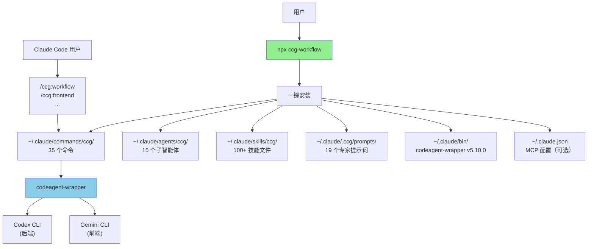

# skills-v2 (CCG Multi-Model Collaboration System)

> [根目录](../CLAUDE.md) > **skills-v2**

**Last Updated**: 2026-05-12 (2.1.0)

---

## 变更记录

公共发布版本（npm `ccgx-workflow` 1.0.0+）变更历史见 [CHANGELOG.md](./CHANGELOG.md)。

重命名为 ccgx-workflow 之前的内部 dogfood 历史（v3.x / v4.x，**从未发布到 npm**）见
[.ccg-migration/INTERNAL-DEV-LOG.md](./.ccg-migration/INTERNAL-DEV-LOG.md)——保留作工程
考古，不作为版本对照。


## 模块职责

**CCG (Claude + Codex + Gemini)** - 多模型协作系统的核心实现，提供：

1. **多模型协作编排**：可配置路由 Gemini（前端）+ Codex（后端）+ Claude（编排），v2.1.0+ 支持切换
2. **~30 个斜杠命令**：开发工作流 + 自治长跑 + Git 工具 + 项目管理 + OPSX + Agent Teams + Codex 执行 + 异步三件套 + verify 统一入口 + Skill Registry 自动生成
3. **19 个专家提示词**：Claude 6 个 + Codex 6 个 + Gemini 7 个
4. **19 个子智能体**：核心 7 个 (planner / ui-ux-designer / init-architect / get-current-datetime / team-architect / team-qa / team-reviewer) + specialist 矩阵 8 个 (assumptions-analyzer / pattern-mapper / plan-checker / nyquist-auditor / verifier / integration-checker / framework-selector / eval-auditor) + fresh-context 协议 4 个 (phase-runner / code-fixer / debug-session-manager / debugger)
5. **Skill Registry**：SKILL.md frontmatter 驱动，user-invocable 技能自动生成 slash commands
6. **100+ 技能文件**：6 质量关卡 + 10 域知识秘典（61 文件，全 `user-invocable: false`）+ 20 impeccable 工具（可选安装）+ scrapling + override-refusal
7. **跨平台 CLI 工具**：一键安装（支持 macOS、Linux、Windows）
8. **MCP 集成**：fast-context（推荐）/ ace-tool / ContextWeaver + context7（自动安装）+ Codex & Gemini MCP 同步
9. **Agent Teams 并行实施**：Team 系列 5 个命令（含统一工作流），spawn Builder teammates 并行写代码
10. **8 种输出风格**：默认 + 专业工程师 + 猫娘 + 老王 + 大小姐 + 邪修 + 冷刃简报 + 铁律军令 + 祭仪长卷

---

## 模块索引

| 子模块 | 文档 | 职责 |
|--------|------|------|
| TypeScript CLI 源码 | [src/CLAUDE.md](./src/CLAUDE.md) | CLI 主入口、命令实现、安装器、i18n、工具链 |
| 模板文件 | [templates/CLAUDE.md](./templates/CLAUDE.md) | 斜杠命令、提示词、子智能体、技能、规则模板 |
| codeagent-wrapper | [codeagent-wrapper/CLAUDE.md](./codeagent-wrapper/CLAUDE.md) | Go 二进制包装器，多模型调用桥接，v5.10.0 |

---

## 入口与启动

### 用户安装入口

```bash
# 一键安装（推荐）
npx ccg-workflow

# 交互式菜单
npx ccg-workflow menu
```

### CLI 入口点

- **主入口**：`bin/ccg.mjs` → `src/cli.ts`
- **核心命令**：
  - `init` - 初始化工作流（`src/commands/init.ts`）
  - `update` - 更新工作流（`src/commands/update.ts`）
  - `menu` - 交互式菜单（`src/commands/menu.ts`）
  - `config` - MCP 配置管理（`src/commands/config-mcp.ts`）
  - `diagnose-mcp` - MCP 诊断（`src/commands/diagnose-mcp.ts`）

### codeagent-wrapper 入口

- **主入口**：`codeagent-wrapper/main.go`
- **当前版本**：v5.10.0
- **调用语法**：
  ```bash
  codeagent-wrapper --backend <codex|gemini|claude> - [工作目录] <<'EOF'
  <任务内容>
  EOF
  ```
- 详见 [codeagent-wrapper/CLAUDE.md](./codeagent-wrapper/CLAUDE.md)

---

## 对外接口

### CLI 命令接口

| 命令 | 用途 |
|------|------|
| `npx ccg-workflow` | 一键安装/菜单 |
| `npx ccg-workflow menu` | 交互式菜单 |
| `npx ccg-workflow update` | 更新到最新版本 |
| `npx ccg-workflow diagnose-mcp` | 诊断 MCP 配置 |

### Slash Commands 接口（~30 个）

**开发工作流**：
| 命令 | 用途 | 模型 |
|------|------|------|
| `/ccg:workflow` | 完整 6 阶段工作流（智能路由前端/后端，含 frontend/backend/feat 子流程） | Codex ∥ Gemini |
| `/ccg:plan` | 多模型协作规划（Phase 1-2） | Codex ∥ Gemini |
| `/ccg:execute` | 多模型协作执行（Phase 3-5） | Codex ∥ Gemini + Claude |
| `/ccg:codex-exec` | Codex 全权执行计划（MCP + 代码 + 测试） | Codex + 多模型审核 |
| `/ccg:autonomous` | 跨 phase 自治长跑（按 roadmap.md 顺序执行） | phase-runner |
| `/ccg:context` | 项目上下文管理（.context 初始化/日志/压缩/历史） | Claude |
| `/ccg:enhance` | 内置 Prompt 增强 | Claude |
| `/ccg:analyze` | 技术分析（仅分析） | Codex ∥ Gemini |
| `/ccg:debug` | 问题诊断 + 修复（manager + debugger 双层 fresh-context） | debug-session-manager |
| `/ccg:optimize` | 性能优化 | Codex ∥ Gemini |
| `/ccg:test` | 测试生成 | 智能路由 |
| `/ccg:review` | 代码审查（自动 git diff，`--fix --auto` worktree 闭环） | Codex ∥ Gemini + code-fixer |
| `/ccg:verify --gate=<change\|quality\|security\|module\|all>` | 统一 verify 入口 | Claude |
| `/ccg:verify-work` | 变更校验编排器（按变更类型自动选门 + UAT 会话式） | 编排 |

**异步三件套**：
| 命令 | 用途 |
|------|------|
| `/ccg:status [job-id]` | 列表 / 单查 job 状态（`--wait --timeout-ms` 阻塞） |
| `/ccg:result <job-id>` | 取最终 verdict / summary / artifacts |
| `/ccg:cancel <job-id>` | 中止活跃 job |

**项目管理**：
| 命令 | 用途 |
|------|------|
| `/ccg:init` | 初始化项目 CLAUDE.md |

**Git 工具**：
| 命令 | 用途 |
|------|------|
| `/ccg:commit` | 智能提交（conventional commit） |
| `/ccg:rollback` | 交互式回滚 |
| `/ccg:clean-branches` | 清理已合并分支 |
| `/ccg:worktree` | Worktree 管理 |

**OpenSpec (OPSX) 封装**：
| 命令 | 用途 |
|------|------|
| `/ccg:spec-init` | 初始化 OpenSpec 环境 + 验证多模型 MCP |
| `/ccg:spec-research` | 需求 → 约束集（并行探索 + OPSX 提案） |
| `/ccg:spec-plan` | 多模型分析 → 消除歧义 → 零决策可执行计划 |
| `/ccg:spec-impl` | 按规范执行 + 多模型协作 + 归档 |
| `/ccg:spec-review` | 双模型交叉审查（独立工具，随时可用） |

**Agent Teams 并行实施**（v1.7.60+，需启用 `CLAUDE_CODE_EXPERIMENTAL_AGENT_TEAMS=1`）：
| 命令 | 用途 | 说明 |
|------|------|------|
| `/ccg:team` | **统一工作流（推荐）** | 8 阶段全流程：需求→架构→规划→开发→测试→审查→修复→集成，7 角色自动编排 |
| `/ccg:team-research` | 需求 → 约束集 | 并行探索代码库，Codex + Gemini 双模型分析 |
| `/ccg:team-plan` | 约束 → 并行计划 | 消除歧义，拆分为文件范围隔离的独立子任务 |
| `/ccg:team-exec` | 并行实施 | spawn Builder teammates（Sonnet）并行写代码 |
| `/ccg:team-review` | 双模型审查 | Codex + Gemini 交叉审查，分级处理 Critical/Warning/Info |

---

## 固定 / 可配置项

| 项目 | 默认值 | 可配置 | 说明 |
|------|--------|--------|------|
| 语言 | 中文 | ✗ | 所有模板为中文 |
| 前端模型 | Gemini | ✓ (v2.1.0+) | init Step 2/4 / 菜单 6 |
| 后端模型 | Codex | ✓ (v2.1.0+) | init Step 2/4 / 菜单 6 |
| Gemini 型号 | gemini-3.1-pro-preview | ✓ (v2.1.0+) | 选 gemini 时可配 |
| 协作模式 | smart | ✗ | 最佳实践 |
| 命令数量 | 29 个 | ✗ | 全部安装 |

---

## 关键依赖与配置

### TypeScript 依赖

**运行时依赖**：
- `cac@^6.7.14` - CLI 框架
- `inquirer@^12.9.6` - 交互式提示
- `ora@^9.0.0` - 加载动画
- `ansis@^4.1.0` - 终端颜色
- `fs-extra@^11.3.2` - 文件系统工具
- `smol-toml@^1.4.2` - TOML 解析

**开发依赖**：
- `typescript@^5.9.2`
- `unbuild@^3.6.1` - 构建工具
- `tsx@^4.20.5` - TypeScript 执行器

### Go 依赖

- Go 标准库（无外部第三方依赖）

### 配置文件

**用户配置**：
- `~/.claude/.ccg/config.toml` - CCG 主配置

**MCP 配置**：
- `~/.claude.json` - Claude Code MCP 服务配置

---

## 相关文件清单

### 核心源码

```
src/
├── cli.ts                       # CLI 入口
├── cli-setup.ts                 # 命令注册
├── index.ts                     # 模块导出
├── commands/
│   ├── init.ts                  # 初始化命令
│   ├── update.ts                # 更新命令
│   ├── menu.ts                  # 交互式菜单
│   ├── config-mcp.ts            # MCP 配置管理
│   └── diagnose-mcp.ts          # MCP 诊断
├── i18n/
│   └── index.ts                 # 国际化（v1.7.69+）
├── types/
│   ├── cli.ts                   # CLI 类型定义
│   └── index.ts                 # 类型导出
└── utils/
    ├── installer.ts             # 安装器主入口（v1.7.83 重构后）
    ├── installer-data.ts        # 安装数据流
    ├── installer-mcp.ts         # MCP 安装子模块
    ├── installer-prompt.ts      # 提示词安装子模块
    ├── installer-template.ts    # 模板安装子模块
    ├── skill-registry.ts        # Skill Registry（v2.0.0 frontmatter 驱动）
    ├── migration.ts             # 版本迁移
    ├── version.ts               # 版本检查/下载
    ├── config.ts                # 配置管理
    ├── mcp.ts                   # MCP 工具集成
    ├── platform.ts              # 平台检测
    └── __tests__/               # 单元测试
        ├── installer.test.ts
        ├── installWorkflows.test.ts
        ├── injectConfigVariables.test.ts
        ├── version.test.ts
        ├── config.test.ts
        └── platform.test.ts
```

详见 [src/CLAUDE.md](./src/CLAUDE.md)

### 模板文件

```
templates/
├── commands/                    # 35 个斜杠命令
│   ├── workflow.md              # 完整 6 阶段工作流
│   ├── plan.md                  # 多模型协作规划
│   ├── execute.md               # 多模型协作执行
│   ├── codex-exec.md            # Codex 全权执行计划
│   ├── context.md               # 项目上下文管理（.context）
│   ├── enhance.md               # 内置 Prompt 增强
│   ├── frontend.md              # 前端专项
│   ├── backend.md               # 后端专项
│   ├── feat.md                  # 智能功能开发
│   ├── analyze.md               # 技术分析
│   ├── debug.md                 # 问题诊断 + 修复
│   ├── optimize.md              # 性能优化
│   ├── test.md                  # 测试生成
│   ├── review.md                # 代码审查
│   ├── init.md                  # 初始化项目 CLAUDE.md
│   ├── commit.md                # 智能 Git 提交
│   ├── rollback.md              # 交互式回滚
│   ├── clean-branches.md        # 清理已合并分支
│   ├── worktree.md              # Worktree 管理
│   ├── spec-init.md             # 初始化 OpenSpec 环境
│   ├── spec-research.md         # 需求 → 约束集
│   ├── spec-plan.md             # 多模型分析 → 执行计划
│   ├── spec-impl.md             # 按规范执行 + 归档
│   ├── spec-review.md           # 双模型交叉审查
│   ├── team.md                  # Agent Teams 统一工作流
│   ├── team-research.md         # Agent Teams 需求→约束
│   ├── team-plan.md             # Agent Teams 规划
│   ├── team-exec.md             # Agent Teams 并行实施
│   ├── team-review.md           # Agent Teams 审查
│   └── agents/                  # 15 个子智能体
│       ├── planner.md           # 任务规划师
│       ├── ui-ux-designer.md    # UI/UX 设计师
│       ├── init-architect.md    # 初始化架构师
│       ├── get-current-datetime.md  # 日期时间获取
│       ├── team-architect.md    # 团队架构师（v1.8.3+）
│       ├── team-qa.md           # QA 工程师（v1.8.3+）
│       └── team-reviewer.md     # 代码审查员（v1.8.3+）
├── prompts/                     # 19 个专家提示词
│   ├── claude/                  # 6 个 Claude 提示词
│   │   ├── analyzer.md
│   │   ├── architect.md
│   │   ├── debugger.md
│   │   ├── optimizer.md
│   │   ├── reviewer.md
│   │   └── tester.md
│   ├── codex/                   # 6 个 Codex 提示词
│   │   ├── analyzer.md
│   │   ├── architect.md
│   │   ├── debugger.md
│   │   ├── optimizer.md
│   │   ├── reviewer.md
│   │   └── tester.md
│   └── gemini/                  # 7 个 Gemini 提示词
│       ├── analyzer.md
│       ├── architect.md
│       ├── debugger.md
│       ├── frontend.md
│       ├── optimizer.md
│       ├── reviewer.md
│       └── tester.md
├── output-styles/               # 8 种输出风格
│   ├── engineer-professional.md
│   ├── nekomata-engineer.md
│   ├── laowang-engineer.md
│   ├── ojousama-engineer.md
│   ├── abyss-cultivator.md
│   ├── abyss-concise.md
│   ├── abyss-command.md
│   └── abyss-ritual.md
├── rules/                       # 全局规则（→ ~/.claude/rules/）
│   ├── ccg-skills.md            # 质量关卡自动触发规则
│   └── ccg-skill-routing.md     # 域知识自动路由规则
└── skills/                      # 100+ 技能文件（质量关卡 + 域知识 + impeccable + 工具）
    ├── run_skill.js
    ├── SKILL.md
    ├── tools/
    │   ├── verify-security/     # 安全漏洞扫描
    │   ├── verify-quality/      # 代码质量检测
    │   ├── verify-change/       # 变更影响分析
    │   ├── verify-module/       # 模块完整性校验
    │   ├── gen-docs/            # 文档自动生成
    │   ├── override-refusal/    # /hi 反拒绝覆写器
    │   └── lib/                 # 共享工具库
    ├── domains/                 # 10 大领域知识秘典（61 文件）
    │   ├── security/            # 红队/蓝队/渗透/审计/逆向/威胁情报
    │   ├── architecture/        # API/缓存/云原生/消息队列/安全架构
    │   ├── devops/              # Git/测试/数据库/性能/可观测性/成本优化
    │   ├── ai/                  # Agent/RAG/LLM安全/Prompt工程
    │   ├── development/         # Go/Python/Rust/TS/Java/C++/Shell
    │   ├── frontend-design/     # UI美学/组件/UX + 4种设计风格
    │   ├── infrastructure/
    │   ├── mobile/
    │   ├── data-engineering/
    │   └── orchestration/
    ├── impeccable/              # 20 个 UI/UX 精打磨技能
    ├── scrapling/               # 网页抓取技能（Cloudflare/WAF 绕过）
    └── orchestration/
        └── multi-agent/
```

详见 [templates/CLAUDE.md](./templates/CLAUDE.md)

### 预编译产物

```
bin/
├── ccg.mjs                              # CLI 入口脚本
├── codeagent-wrapper-darwin-amd64       # macOS Intel
├── codeagent-wrapper-darwin-arm64       # macOS Apple Silicon
├── codeagent-wrapper-linux-amd64        # Linux x64
├── codeagent-wrapper-linux-arm64        # Linux ARM64
├── codeagent-wrapper-windows-amd64.exe  # Windows x64
└── codeagent-wrapper-windows-arm64.exe  # Windows ARM64
```

---

## 架构图



---

## 发版规则（必须严格遵守）

每次发版必须完成以下所有步骤，缺一不可：

### 1. 更新版本号
- 编辑 `package.json` 中的 `version` 字段

### 2. 更新 CHANGELOG.md
- 在顶部添加新版本条目
- 格式：`## [x.y.z] - YYYY-MM-DD`
- 按类别分组：`✨ 新功能` / `🐛 修复` / `🔄 变更` / `🗑️ 移除`

### 3. 更新 README.md
- 更新命令表（如有新增命令）
- 更新使用说明（如有新功能）
- 更新底部版本号

### 4. 更新 CLAUDE.md
- 更新顶部 `Last Updated` 日期和版本号
- 添加变更记录条目
- 更新命令数量、接口表等受影响的章节

### 5. 构建 + 发布 + 推送

```bash
# 类型检查（必须在 build 之前通过）
pnpm typecheck

# 构建
pnpm build

# 测试
pnpm test

# 发布 npm 包
npm publish

# 提交到 Git
git add -A
git commit -m "chore: bump version to x.y.z"
git push origin main
```

### 检查清单
- [ ] package.json 版本号已更新
- [ ] CHANGELOG.md 已添加新版本条目
- [ ] README.md 已更新（命令表 + 使用说明 + 底部版本号）
- [ ] CLAUDE.md 已更新（Last Updated + 变更记录 + 受影响章节）
- [ ] **⚠ 若修改了 `codeagent-wrapper/` 下的 Go 代码，必须同步 bump 两处版本号：**
  - [ ] `codeagent-wrapper/main.go` → `version = "x.y.z"`
  - [ ] `src/utils/installer.ts` → `EXPECTED_BINARY_VERSION = 'x.y.z'`
  - 两边版本必须一致，否则用户 update 时无法触发 binary 重新下载
  - **⛔ 禁止手动 `gh release upload`！** 推送 Go 代码后 CI（`.github/workflows/build-binaries.yml`）会自动编译 + 上传 GitHub Release + 同步 Cloudflare R2 镜像。手动上传会覆盖 CI 产物且 R2 不会同步
- [ ] `pnpm typecheck` 通过（tsc --noEmit，不可跳过）
- [ ] `pnpm build` 通过
- [ ] `pnpm test` 通过
- [ ] `npm publish` 成功
- [ ] `git push origin main` 成功

---

**扫描覆盖率**: 95%+
**最后更新**: 2026-04-10
