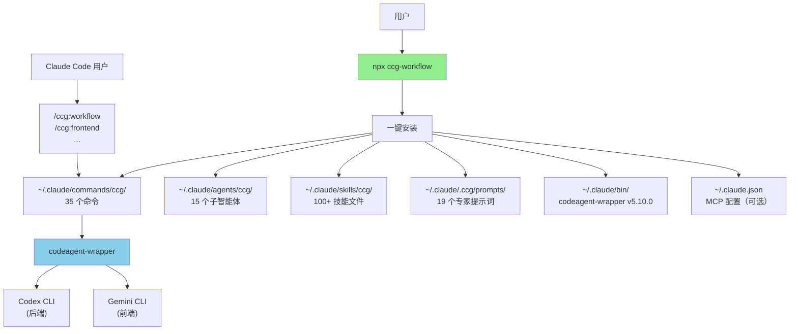

# skills-v2 (CCG Multi-Model Collaboration System)

> [根目录](../CLAUDE.md) > **skills-v2**

**Last Updated**: 2026-05-06 (v4.5.1)

---

## 变更记录 (Changelog)

> 完整变更历史请查看 [CHANGELOG.md](./CHANGELOG.md)

### 2026-05-06 (v4.5.1) — 🐛 Hotfix: launcher path namespace + plugin known-issue 文档化

- 🐛 **launcher path .ccg/ namespace 修正**（commit `79cf8b4`）：v4.5.0 install 验证抓出 8 处文件引用 `~/.claude/scripts/ccg-phase-runner-launcher.mjs` 但 installer 装到 `~/.claude/.ccg/scripts/`（v1.7.75 namespace 隔离）。新机制启用后会 file not found。修正 6 文件含 `DEFAULT_LAUNCHER_PATH` const。抓在 install 阶段，没等 uni-iam dogfood 暴露。
- 📝 **新建 `.ccg-migration/PLUGIN-PATCHES.md`** — 上游 plugin known issue + 本地 patch 持续维护文档。首条 P-1 记录 `gemini@google-gemini` v1.0.1 Windows `spawnBackgroundWorker` 漏写 `windowsHide: true` 导致 spawn 抢焦点（codex plugin 同款代码有，对照参考）；本地 patch 1 行即缓解，永久路径待上游 PR。
- 📊 测试 1309/1309 不变（仅文档 + 字符串路径修正）。

### 2026-05-06 (v4.5.0) — 🚀 phase-runner Bash subprocess + 三层 OS 进程隔离（8 phase / 5 wave dogfood）

> v4.5 把 `Agent(subagent_type="phase-runner")` 主进程内 sidechain spawn 替换为 `Bash(claude -p --agent ccg/phase-runner)` OS-level 子进程。三层进程隔离（主线 → CLI 子进程 → 可选 plugin 进程），治本 v4.4.x main-process RSS leak（uni-iam 实测撞 23GB → v4.5 设计目标 < 8GB）。8 phase / 5 wave 全 completed，wall ~3h（vs 估算 10-15d sequential），双 gate G2 (memory) + G3 (broker tx_id) PASS。

- ✨ **Phase 1 (P1a, `e1f0fab`)**: phase-runner spawn 改 Bash 直调路径。`buildPhaseRunnerBashCommand(phase, brief, jobId)` helper + `autonomous.md` Step 4.2-4.3 模板改写；stream-json 流式输出落 `.context/jobs/<job-id>/progress.jsonl`。
- ✨ **Phase 2 (P1b, `20fb5fe`)**: process supervisor + recovery。`src/utils/process-tree.ts`（Windows `taskkill /T /F` + POSIX `setsid` 进程组）+ `templates/scripts/ccg-phase-runner-launcher.mjs`（包装 `claude -p`，原子写 state）+ `cancel.md` cooperative + grace + kill-tree。
- ✨ **Phase 3 (P1c, `1086aca`) — G2 PASS**: nested RSS stress gate。pilot 2 矩阵（trivial-single N=3 / plugin-single N=2）。**关键发现**：codex C1 200-333MB linear 推导被实测推翻——marginal post-warmup **5-15 MB/nested**，4-outer worst case ~1.1GB（远低于 codex 4-6.7GB）。`MAX_NESTED_PER_PHASE = 3`。
- ✨ **Phase 4 (P1d, `285b2ac`) — G3 PASS**: broker tx_id isolation + 20-way stress。`src/utils/broker-log.ts`（writer + reader + 8 字段强 schema，tx_id via `crypto.randomUUID`）+ launcher 注入 `CCG_BROKER_TX_ID` env。**100k spawn 0 碰撞 / 227ms**；**2000 spawn 4-outer × 5-nested concurrent 0 misattribution / 79s**。
- ✨ **Phase 5 (P1e, `c722d08`)**: cost/cache real-workdir benchmark。`tests/poc/prompt-cache-bench.ts` + 2 repo × rapid TTL × 5 spawn = 10 真实 claude CLI 数据点。**D3 budget 经实测无需修订**（fast=$1 / triple=$2 / debate=$5）；warm cache 86% reduction 验证 PoC T3 cold→warm 27× 投影。autonomous milestone real-cost: triple warm $10-15 / cold $15-27。
- ✨ **Phase 6 (P1f, `097cda7`)**: nested G-plan opt-in + launcher wiring。`phase-runner.md` 删除 v4.0.1 "引擎层硬约束"段（CLI 模式下 T9 实测失效）+ 新增 "Nested rescue delegation"；`quality-router.ts` 加 `nestedRescue` field + `--nested=on|off` flag + `buildPhaseRunnerLauncherCommand` helper；autonomous Step 4.0c + Step 4.2-4.3 wire launcher。**默认 `--nested=off` + `useLauncherWiring=false` 100% 等价 v4.5 v1**（baseline `285b2ac`，单测 §7 验证）。
- ✨ **Phase 7 (P2, `614d742`)**: `/ccg:status` v2。dashboard + `--tail` 双模式 + `stream-renderer.ts` + `stuck-detector.ts`（3 类警告：相同 tool_call ×3 / single tool >30s / stream stalled >5min）；ASCII-7 progress bar regex enforced（Windows cp936 安全）。
- 🔄 **PoC D3 fast budget 升级 0.5 → 1.0**（commit `359ea8f`）：T1 实测大 CLAUDE.md 场景 0.5 会 truncate，1.0 留 2.4-7.4× buffer。
- 📊 **架构数字**：测试 1100 → **1309**（+204）/ 命令 28 不变（status 内功能扩展）/ 新 helpers + 4：`process-tree.ts` / `broker-log.ts` / `stream-renderer.ts` / `stuck-detector.ts` / 新 launcher script + 1：`ccg-phase-runner-launcher.mjs`。
- 🐛 **已知未验证项**：(1) **uni-iam 真实环境 RSS < 8GB 验证**留用户在 install + 新会话执行（chicken-and-egg）。Release entry criteria 待办：5+ phase autonomous，全程 claude.exe RSS < 8GB。(2) **跨平台 broker.log 验证**：Phase 4 单机器跑 stress，跨 Windows + Linux 一致性留 Phase 8 dogfood 自然覆盖。(3) **debate / impl 路径 silent fallback** 完全消除需 openclaw 路线 → v4.6+ 候选。
- 📋 详见 [CHANGELOG.md](./CHANGELOG.md#450---2026-05-06) + 迁移指南 [.ccg-migration/v4.4-to-v4.5.md](./.ccg-migration/v4.4-to-v4.5.md)。

### 2026-05-05 (v4.4.3) — 🔒 silent fallback 治理收尾（verify path 补齐 + debate retry protocol 硬约束）

- 🐛 **C2 prerequisite 修复（verify path 治理收尾）**：v4.4.2 在 `verify-orchestrator.planVerifyWave` 加了 `useDirectBashInvocation` 选项让 verify wave 跳 sonnet wrapper，但 `quality-router.verifyWavePlanToWavePlan` adapter 只挑 4 字段（agent/role/rationale/ccgPromptFile），**把 `invocationMode` / `bashCommand` drop 了**；`buildVerifyWave` 调 `planVerifyWave` 也未显式传 `useDirectBashInvocation: true`。结果 autonomous Step 4.1 / `triple` / `debate` 档跑 verify wave 时仍走普通 Agent spawn (sonnet wrapper)，silent fallback 风险残留。修复：`SpawnEntry` 加 `invocationMode?` + `bashCommand?` 透传；adapter 显式拷贝；`buildVerifyWave` 显式传 `{ useDirectBashInvocation: true }`。autonomous 默认档（triple）verify 路径**现在真的会**走 Bash 直调跳过 sonnet wrapper。
- ✨ **debate retry protocol schema 硬约束**：`templates/commands/debate.md` 的 "plugin spawn 失败必须重试 2 次（共 3 次）+ degraded 标记" 协议从 prompt 软约束硬化为 TS schema 强校验（实测主线 LLM 会跳过软约束 — v4.4.2 dogfood：单次 fallback 即接受未重试也未标 degraded）。
  - `RoundSummary` 加 `degraded?: { attempts, reason }` 字段
  - `parseRoundSummary` 自动从 NOTES 抽取三种标记形态（规约 / 替代 / 极简）
  - 新 helper `validateRetryProtocol(rounds)` → `RetryProtocolReport`，4 类违规枚举：`parse-failed-no-degraded` / `insufficient-attempts` / `missing-reason` / `silent-success`
  - 新常量 `REQUIRED_RETRY_ATTEMPTS = 3` 与文档同步
  - debate.md Step 1.3 加 schema 硬约束说明（标记格式三段式 N≥3 reason 非占位）
  - debate.md Step 2 综合输出强制：非 compliant 时主线必须独立成段输出 `## ⚠️ Retry Protocol Violations`，逐条列违规
- 📊 **设计哲学（first principles）**：debate R2 的 **Schema-Bypass Hallucination** 击穿了"加密码学 evidence 校验"思路（B4 schema-first JSON / B7 文件通道 / broker tx_id 密签 / prev_hash chain / nonce locks）共同前提——这些方案都假设 "wrapper 真去执行 companion"，但 instruct-tuned wrapper 完全可以跳过执行直接编 schema-compliant JSON。openclaw 路线（架构上根本不让 wrapper LLM 当 bridge）才是真根因解，但 debate / impl 路径受 token 预算约束暂无法采用。
- 🛡 **两层防御**：架构消除（verify wave / review，决策直接落地，必须 Bash 直调）+ 协议硬校验（debate / impl，schema 层 4 类违规枚举抓 silent fallback 残骸）。
- ✅ 测试 1072 → **1100**（+28：6 quality-router 透传 + 22 debate orchestrator schema），typecheck pass。
- 🐛 **已知未做**：debate / impl 路径完全消除 silent fallback 需 openclaw 路线（debate 也全 Bash 直调，token 预算硬伤）→ v4.5+ 候选。
- 📋 详见 [CHANGELOG.md](./CHANGELOG.md#443---2026-05-05)。

### 2026-05-04 (v4.4.2) — 🛡 verify wave 切 Bash 直调，架构性消除 silent contamination

- 🐛 **plugin spawn silent fallback 修复**：`Agent(subagent_type="codex:codex-rescue" | "gemini:gemini-rescue")` 引擎实际启 sonnet wrapper（agent.md frontmatter `model: sonnet`），broker 故障 / CLI 空答时 wrapper 会 instruct-tuning 反射自答冒充 cross-vendor 视角。最严重在 verify wave（决策直接落 advance/revise/escalate，无下游兜底）。
- ✨ **`useDirectBashInvocation` 选项**：`planVerifyWave(tier, layer, plugins, options)` 加第 4 参数。true 时 plugin spawn entry 标 `invocationMode: 'bash-direct'` + 附 `bashCommand`，主线模板渲染为 `Bash(node $(ls ~/.claude/plugins/cache/<vendor>/<plugin>/*/scripts/<plugin>-companion.mjs | head -1) task -p "..." --json)` —— 跳过 sonnet wrapper，stdout 即 plugin 完整响应。
- 🔄 **模板切换**：`review.md` Phase 2（双模型审查）+ Phase 2.5（`--adversarial`）+ `autonomous.md` Step 4.4 verify wave 注释。其他用例（impl / autonomous / debate）仍走 Agent spawn 保 ≤200 token 摘要预算。
- 📊 **决策**：codex 推荐 EF（Bash + hook）；用户选 E only（架构性消除 verify 风险，不引入全局 hook）。`PostToolUse` hook 路径未做（broker.log 并发 spawn 冲突 false positive 是核心隐患，opt-in 摩擦也大）。
- ✅ 测试 1065 → **1072**（+7），typecheck pass。
- 📋 详见 [CHANGELOG.md](./CHANGELOG.md#442---2026-05-04)。

### 2026-05-04 (v4.3.0) — 🎯 动态防御机制版本（P25-P29 + P30 收尾，5 phase dogfood）

> v4.3 是把 v4.2.x 三连 hotfix（4.2.1 / 4.2.2 / 4.2.3）暴露的根因变成自动化拦截的工程闭环加固版本。**没有引入新用户面 feature**，全部是基础设施层防御。

- ✨ **P25：`pipeline-check` helper**（commit `6378a6e`）：`pnpm pack` + tarball audit + 漏文件检测。防 v4.2.2 `templates/commands/debate.md` 漏 `package.json` `files` 白名单同型事故。
- ✨ **P26：`ground-truth-sampler`**（commit `fbf7c3c`）：autonomous Step 4.0 启动时动态采样 plugin / skill / agent 列表写 `.context/ground-truth/latest.json`，phase-runner prompt 强约束**必须 Read 之**才能引用外部接口。防 plugin subagent_type 同型事故——动态采样替代静态文档。**v4.4.1 hotfix 校正**：v4.2-v4.3 当时 CHANGELOG 描述方向反了。真名是双前缀 `codex:codex-rescue` / `gemini:gemini-rescue`（Agent 命名空间）；CCG v4.0–4.4.0 全仓 src/templates/fixtures 错写成单前缀 `codex:rescue` / `gemini:rescue`（实际是 Skill 命名空间）。defenses（P26 sampler / P27 interface-auditor / P32 phase-runner ground-truth）基础设施正确，但 fixtures + interface-auditor 反例文档同样写反，致使防御失能。dogfood 12 phase 全用 phase-runner 自实施未触达 plugin spawn 路径，错名潜伏到 v4.4.0 后 acms phase 9.x cross-vendor verify wave 才暴露 → v4.4.1 系统性修复（195 occurrences 跨 40 文件）。
- ✨ **P27：`interface-auditor` specialist**（commit `af31f68`）：5 检查清单 SSoT-violation / leftover / magic-string-vs-ground-truth / 未验证假设 / API drift。autonomous Step 4.4 verify wave 在 `triple` / `debate` 档加 3rd spawn（`fast` 不加）。防 v4.2 P22 `buildVerifyWave` 与 P21 `planVerifyWave` 95% 重复的接口债。
- ✨ **P28：fixtures 自动生成 + key mocks 替换**（commit `1602f0e`）：`scripts/regen-fixtures.ts` + `tests/fixtures/ground-truth/*.sample.json` 4 文件 + 替换 challenger / debate / verify 三个测试 inline mock。`pnpm regen-fixtures` 一键重新生成。
- ✨ **P29：`commit-msg-review` git hook**（commit `e6b6db0` + wire-in `89034a7`）：`templates/hooks/ccg-commit-msg-review.cjs` opt-in pre-commit-msg hook，3 启发式（文件名 ⊆ staged / phase tag ↔ staged paths / 操作类型 ↔ diff）。**不自动注册**，安装到 `~/.claude/hooks/`，用户按 README 三种方式手动启用。
- 🔄 **autonomous 默认行为微变化**：Step 4.0 启动跑 sampler（+~50ms）；triple/debate verify wave 多一路 interface-auditor spawn。
- 🐛 **已知 race（待 v4.4）**：v4.3 wave 1 dogfood 暴露多 phase-runner 并行 commit 时**互相吸收 staged 文件**——内容正确但归属错配（与 v4.1 src/index.ts 内容覆盖式 race 不同）。P29 hook 启发式 #2 部分捕获，完整修复推荐 v4.4 用 worktree 隔离 phase-runner（GSD `code-fixer` P10 模式）。
- 📊 **架构数字**：测试 929 → **1078**（+149），src/utils helpers + 1 (`interface-auditor.ts`)，新 hook + 1 (`ccg-commit-msg-review.cjs`)，新 specialist agent + 1 (`interface-auditor.md`)，新 skill scripts + 2 (sampler / pipeline-check)。

#### 关于 P30 收尾本身

P30 是 docs 类型 phase：版本 bump 4.2.3 → 4.3.0，CHANGELOG / README / 根 CLAUDE.md / 新建 `.ccg-migration/v4.2-to-v4.3.md` / 新建 phase-30 报告。无 src/ / templates/ 改动，无新测试。

### 2026-05-04 (v4.2.0) — 🎯 多模型协作深度升级版（P21-P23 三 phase dogfood）

- ✨ **P21: multi-model routing SSoT**（commit `2881798`）：4 个独立路由模块的 Layer / Model / PluginAvailability 类型并集上提到 `src/utils/multi-model-routing.ts` 单一来源；`parseFindings` 鲁棒化（嵌套 `{}` / json fence / 单引号 JSON）；删 `specialist-router` 假设路由 `implementer/writer × frontend → null`（与 phase-runner layer-agnostic 实施者契约对齐）。
- ✨ **P22: quality tier 三档 + Plan-Critic-Verify 编排**（commit `2be2130`）：`--quality=fast/triple/debate` 主线 flag + phase frontmatter `Quality:` override（优先级最高）。新建 3 helper：
  - `quality-router.ts`（~550 行）：解析 flag → wave 计划。
  - `plan-aggregator.ts`（~410 行）：plan wave 聚合 → DesignBrief（共识/分歧/必决策点），注入 phase-runner prompt。
  - `verify-orchestrator.ts`（~265 行）：verify wave 综合 → advance/revise/escalate 决策。
  - **fast** 2 wave (impl+verify) / **triple** 4 wave (plan+critic+impl+verify) / **debate** 7 wave (plan+3 round+critic+impl+verify, cap 3)。auto-degradation: 双缺 → fast；单缺 + debate → triple。126 单测覆盖。
- ✨ **P23: 三档 dogfood 验证 + v4.2.0 docs**（本版本）：
  - 新建 `qualityTierE2E.test.ts` 22 用例：mixed-quality roadmap 模拟 + plugin 降级矩阵 + verify decision matrix + spawn 预算锁死。
  - 新建 `.claude/team-plan/phase-23-quality-tier-dogfood-report.md`：三档对比表 + 已被单测拦截 bug 类（8 例）+ latent bug 清单（5 项需用户 cold-start 验证）+ 5 步骤验证清单。
  - 新建 `.ccg-migration/v4.1-to-v4.2.md`：完整迁移指南（默认行为变化 + 5 步骤验证 + 已知未验证项）。
- 🔄 **autonomous 默认行为变化**：v4.1 单波 phase-runner → v4.2 默认 triple（4 wave）。复现 v4.1 行为：`--quality=fast`。
- ⚠️ **已知未验证项**：引擎层约束（v4.0.1 commit `a7cdffd`）使 phase-runner 不能 spawn `codex:codex-rescue` plugin Agent，三档 dogfood 在 CI 里只能跑集成测试式模拟（33 用例）。真 plugin spawn 行为留待用户首次 cold-start 验证；详见 `.claude/team-plan/phase-23-quality-tier-dogfood-report.md` §4 + `.ccg-migration/v4.1-to-v4.2.md` §"Known unverified items"。
- 📊 架构数字：测试 775+ → **913**，src/utils helpers ~12 → **15**（+ 4 新 helper），命令注册表 / subagent / skill 不变。

### 2026-05-04 (v4.1.0) — 🎯 使用体验精修版（P13-P20 8 phase 串行 dogfood）

- ✨ **P13: SessionStart hook**（commit `cedd87b`）：`templates/hooks/ccg-session-state.cjs`，新会话自动注入 `.ccg/roadmap.md` 头部 + active phase SUMMARY（≤200 tokens）。
- ✨ **P14: autonomous wave 并行**（commit `cf75d70`）：默认 Kahn 拓扑分波 + cascade skip + max-concurrent batching；墙钟压缩 30-40%。`--sequential` opt-out。`src/utils/wave-scheduler.ts` (~280 行 + 51 单测)。
- ✨ **P15: specialist matrix 路由**（commit `b6100c2`）：`role × layer` 2D 分发。
- ✨ **P16: challenger 主线扁平编排**（commit `5f590f3`）：phase frontmatter `Critical: true` 触发 challenger（assumptions-analyzer / nyquist-auditor）。
- ✨ **P17: `/ccg:debate` 原语**（commit `a5125e7`）：多轮 propose/challenge/respond + cap N 轮。
- ✨ **P18: 命令面板瘦身 + skill 路径过滤**（本 phase）：
  - 删 5 模板：`team-research/team-plan/team-review/health/map-codebase`
  - `/ccg:team` 加子命令路由 `research|plan|review|exec`
  - 4 新 skill：`templates/skills/tools/{health,map-codebase,extract-learnings,forensics}/SKILL.md`
  - **新增 `ccg init --sync`**：交互式 prune 本地装但模板已删的 ccg/ namespace 文件
  - **新增 `matchSkillPaths` / `filterSkillsByPaths`**（skill-registry.ts paths consumer）：消费 P19 的 `paths:` 字段做 glob 匹配
  - 17 + 7 = 24 新单测，全量 757 → 775+
- ✨ **P19: skill 体系优化**（commit `8654fcb`）：`context: fork` / `paths:` glob / 描述 i18n。
- ✨ **P20: codeagent-wrapper deprecation**（commit `0d780fe`）：6 核心命令支持 plugin Agent 直接 spawn，shim v5.0 删除。

#### 架构数字
- 命令注册表 33 → **28**（user-facing ~31 → ~26 含 skill auto-gen）
- Subagent 19 不变 / 测试 757 → **775+** / skill 顶层目录 30 → **34**

#### dogfood 数据
- P13-P20 全部用 `/ccg:autonomous` + phase-runner 自实施完成（v4.0.1 校正后唯一可能路径）
- 主线 ≤15% / subagent fresh 论点继续成立

#### 文档
- `.ccg-migration/v4-to-v4.1.md`（新建）：完整迁移指南
- README/CHANGELOG/CLAUDE.md/templates/CLAUDE.md 同步

### 2026-05-04 (v4.0.1) — 🔬 引擎层约束实测校正

- 🔬 **subagent 嵌套 spawn 实测证伪**（test commit `a7cdffd`）：`Agent(subagent_type="phase-runner")` 启动后实际工具列表**不含 Agent/Task**，无论 frontmatter 怎么声明——Claude Code 引擎硬限制（推测防递归失控）。v4.0 G 方案"双层包裹 codex:rescue"在引擎层根本不可能，dogfood 12 phase 全跑的 fallback 路径才是唯一可能的工作模式。
- ✅ **核心论点仍成立**：主线 ≤15% / subagent fresh 经 12 phase 实测 +1%/phase，只是隔离层从"主线 ↔ phase-runner ↔ codex"两层**校正**为"主线 ↔ phase-runner"一层。
- 📝 **文档/测试同步修正**：phase-runner.md 删 `Agent` 工具声明 + 加"⚠️ 引擎层硬约束"段；`phaseRunner.test.ts` 反转 `tools` 行 Agent 断言；CHANGELOG 加 v4.0.1 条目。
- 📋 **v4.1 设计调整**：原计划"phase-runner 内 spawn challenger"改为**主线扁平化编排**（spawn implementer → 接 200-token 摘要 → 主线判 Critical → spawn challenger → spawn implementer 修订）。phase frontmatter 加 `Critical: true|false` 字段。

### 2026-05-03 (v4.0.0) — 🚀 里程碑大版本（dogfood 12 phase 重塑）

> 完整发布说明见 [CHANGELOG.md](./CHANGELOG.md#400---2026-05-03) · 升级指引见 [.ccg-migration/v3-to-v4.md](./.ccg-migration/v3-to-v4.md)

#### Context 漂移治理（Phase 1-3）
- ✨ **`context_budget` frontmatter 硬约束**（commit `099843b`）：4 个主编排器（workflow/execute/team-exec/autonomous）声明 `context_budget: orchestrator-15` + `subagent_freshness: required`，硬约束主线只读元状态
- ✨ **phase-runner subagent 协议（G 方案）**（commit `5f94ed4`）：主线 spawn 普通 subagent 包裹 codex/gemini rescue，沙箱外补 git/test/typecheck，按 phase Type 字段路由（backend→codex / frontend→gemini / fullstack 串行 / docs→backend default），主线只接 ≤200 token 摘要
- ✨ **`.context/<phase>/{CONTEXT,SUMMARY}.md` 状态机**（commit `97f3862`）：主线只读 frontmatter（< 200 tokens/phase）
- ✨ **codebase-mapper agent**（commit `e389bd3`，GSD ROI #1）：4 路并行扫描，产出 `.context/codebase/{STACK,INTEGRATIONS,ARCHITECTURE,STRUCTURE,CONVENTIONS,TESTING,CONCERNS}.md` 7 文件契约

#### 质量门升级（Phase 4 / 6 / 8）
- ✨ **Scope Reduction Detection**（commit `ce88bac`）：plan-checker 维度 7b，识别 "v1 / 简化 / 静态先 / 后续连接" 关键词 → BLOCKER（与原始需求对比避免误报）
- ✨ **plan-checker 5 维度 + max-3-loop**（commit `bbab7ed`，GSD ROI #4）：Dim 1/2/5/7b/10 收敛环
- ✨ **verifier Level 4 数据流**（commit `dd8b854`，GSD ROI #5）：FLOWING / STATIC / DISCONNECTED / HOLLOW_PROP 区分 + Step 3b override 80% 重叠匹配 + Step 9b deferred filtering

#### 异步 + UAT + review-fix + debug 重塑（Phase 7-11）
- ✨ **异步三件套**（commit `e4bcd83`）：`/ccg:status` / `/ccg:result` / `/ccg:cancel` job-id 化背景任务，存 `.context/jobs/<id>/`
- ✨ **会话式 UAT + cold-start smoke**（commit `fad9102`，GSD ROI #2）：UAT.md 跨会话 frontmatter resume + git diff 扫 server/database/migrations 自动注入冷启动测试
- ✨ **/ccg:review --fix --auto + worktree 隔离**（commit `84f4ee4`，GSD #2839/#2990 移植）：code-fixer agent + 4 步 transactional cleanup（merge/remove/branch -D/rm sentinel）严格顺序
- ✨ **debug-session-manager 双层 fresh-context**（commit `ed3282b`，GSD ROI #3）：manager + debugger 双 subagent，`.context/debug/<slug>.md` 持久 falsifiable hypothesis 链，主线只接 ROOT CAUSE FOUND / DEBUG COMPLETE / CHECKPOINT REACHED

#### 命令面板收敛（Phase 5，commit `747dd4f`）
- 🚮 **删除 5 命令**：`/ccg:frontend` / `/ccg:backend` / `/ccg:feat` / `/ccg:forensics` / `/ccg:extract-learnings`，迁移见 v3-to-v4.md
- 🔄 **合并 4 verify-\***：`/ccg:verify-{change,quality,security,module}` → `/ccg:verify --gate=<name>`，旧命令 BC 保留标 `deprecated_in: v4.0`
- ✨ **新增 `/ccg:verify`** 主命令 + `--gate=all` 等价 verify-work
- 📊 命令注册表 35 → 31

#### Skill 体系收敛
- 🔄 **frontend-design / impeccable 改可选安装**（v2.1.11 标记 / v4.0 验证生效）：frontend-design SKILL.md `user-invocable: false`，引流到官方 `claude-plugins-official/frontend-design` plugin
- 🔄 **domain skills 全 `user-invocable: false`**：10 大领域 61 文件保留作 reference，关键词路由触发自动 Read（不进命令面板）

#### 架构数字
- 命令 35 → **~30** / Subagent 15 → **19**（+phase-runner / code-fixer / debug-session-manager / debugger）/ 测试 168 → **515** / 包 ~200 KB

#### dogfood 实测
- 12 phase 全部用 CCG `/ccg:autonomous` 自身长跑完成
- 主线 context 漂移：T0=31% → T11=49%，**净增量 +18% / 12 phase 平均 +1%/phase**
- GSD "主线 ≤15% / subagent fresh" 论点经验证成立——前 11 phase fresh-context subagent 路径下主线增量稳定在 +1%/phase
- 已知约束（**v4.0.1 实测校正**）：**任何 subagent**（含主线注册的自定义类型 phase-runner）启动后工具列表都不含 `Agent`/`Task`——Claude Code 引擎硬限制，与 frontmatter 声明无关。v4.0 G 方案"双层包裹 codex:rescue"在引擎层根本不可能，12 个 phase 走的"subagent 自实施"是唯一可能路径，不是 fallback。GSD `gsd-debug-session-manager` 用 `Task` 工具嵌套 spawn 不直接可对照（GSD subagent 注册到的引擎可能享受不同工具白名单规则，CCG 这边没该能力）。详见 commit `a7cdffd` test phase + `.ccg-research/07-multimodel-collaboration-rethink.md`。

### 2026-05-03 (v3.0.0) — 🚀 里程碑大版本

#### 蜂群升级 + 自治长跑
- ✨ **Wave-based 依赖图调度**：`team-plan` 输出加 `wave: N` + `depends_on: [task-id]`；`team-exec` 改为拓扑分波 → 波内并行 → 波间顺序，单任务失败不阻塞同 wave
- ✨ **`.ccg/state.md` 断点续跑**：每 wave 结束写状态，重跑从未完成 wave 继续
- ✨ **`/ccg:autonomous`**：跨 phase 自治长跑，按 `.ccg/roadmap.md` 顺序执行 milestone phase，仅 blocker 暂停。`--from/--to/--only/--interactive` 控制范围

#### 8 个专业化 agent（first-principles 矩阵）
- ✨ `assumptions-analyzer` / `pattern-mapper` / `plan-checker` / `nyquist-auditor` / `verifier`（含 8 类构建测试门）/ `integration-checker` / `framework-selector` / `eval-auditor`
- 🔄 `team-architect` 升级为**委派模式**，并行调用 3 个 specialist + yaml `tasks:` 输出（6 字段 wave-aware）

#### Context Monitor Hook（GSD 杀手锏移植）
- ✨ **`ccg-context-monitor.js`** PostToolUse hook：剩余上下文 ≤ 35% 警告 / ≤ 25% 严重，主动注入提醒给 agent
- ✨ **`ccg-statusline.js`**：状态栏从 transcript 算 token 用量写桥接文件（与 hook 共享契约）
- 解决"质量随上下文增长劣化"痛点

#### 5 个新命令（GSD 借鉴）
- ✨ `/ccg:extract-learnings` / `/ccg:forensics` / `/ccg:health` / `/ccg:map-codebase` / `/ccg:verify-work`

#### 重大变更：去 Go binary
- 🚮 **删除 `codeagent-wrapper/` Go 子项目** + 6 平台 binary + 双源下载（GitHub + Cloudflare R2）+ CI 交叉编译
- ✨ **`templates/scripts/invoke-model.mjs`（~870 行 Node 脚本）替代**：单文件 ESM 仅用 Node 内建模块，完整复刻 wrapper v5.10.0 的 10 项应用层补全
- ✨ **`~/.claude/bin/codeagent-wrapper` 启动器 shim**：Unix shell 一行 / Windows `.cmd` 一行，路径不变，模板 51 处调用零改动，`permissions.allow` 零改动
- 🏗 **包体积 16.3 MB → ~200 KB（98% 削减）**，安装 0 网络请求

#### deprecation 打标（v3.1 真切换）
- 🚮 `verify-{change,quality,security,module}` 标 `deprecated_in: v3.1`、`replaced_by: /ccg:verify --<gate>`，**v3.0.0 仍可用**。详见 `.ccg-migration/DEPRECATIONS.md`

#### 架构数字
- 命令 29 → **35** / Agent 7 → **15** / 测试 130 → **168** / 包 16.3 MB → **~200 KB**

### 2026-04-10 (v2.1.16)
- ✨ **Init 交互状态机**：`init` 重构为状态机，每步首个 list 内嵌 `← 返回上一步` 和 `× 取消` 哨兵；Step 3 MCP 因首 prompt 是 checkbox，加前导 list 守门；解决"填错要 Ctrl+C 全部重来"痛点
- ✨ **摘要页跳回菜单**：最终确认页改 list 菜单，支持"改 API / 改模型 / 改 MCP / 改性能"任意跳回，跑完自动回摘要
- ✨ **API 跳过选项**（用户反馈）：Step 1/4 新增"跳过 — 我已通过 cc-switch / 其他工具自行配置"选项，不写 `settings.json` 的 `ANTHROPIC_*`
- 🔄 **`src/commands/init.ts`**：Step 1-4 抽取闭包函数 + 主循环状态机，net +200 行；i18n 新增 `nav`/`summaryMenu`/`api.skipOption` 等 key

### 2026-04-10 (v2.1.15)
- 🐛 **`--gemini-model` 泄漏到纯 codex 调用行修复**（#130）：`injectConfigVariables()` 改为行级感知替换，纯 `--backend codex/claude` 行清除 flag，`--backend gemini` 和条件行 `<codex|gemini>` 保留。新增 11 个单元测试。

### 2026-04-10 (v2.1.14)
- 📝 **CLAUDE.md 全量同步**：命令 29、提示词 19（claude/6+codex/6+gemini/7）、Agent 7、子模块文档建立（src/CLAUDE.md、templates/CLAUDE.md、codeagent-wrapper/CLAUDE.md 三个子索引）

### 2026-04-07 (v2.1.14)
- 🐛 **模型路由硬编码修复**：21 个模板 ROLE_FILE 路径 + 表头 + 执行指令全部动态化，`{{BACKEND_PRIMARY}}/{{FRONTEND_PRIMARY}}` 替代硬编码 `codex/gemini`

### 2026-04-05 (v2.1.13)
- 🐛 **Windows Gemini 多行参数截断**（#129）：Windows 上 cmd.exe 截断多行 `-p` 参数，改用 stdin pipe；binary `5.9.0` → `5.10.0`

### 2026-04-03 (v2.1.12)
- ✨ **302.AI 赞助商集成**（#126）：init + 菜单 API 配置新增 302.AI 选项，自动填入 baseUrl，CLI 显示返现链接
- ✨ **README 赞助商 Banner**：中英文 README 顶部新增 302.AI 可点击 Banner + 产品介绍

### 2026-03-31 (v2.1.11)
- 🐛 **更新后 MCP 提示词显示未配置**（#124）：`update` 无条件传 `--skip-mcp` 导致 `mcpProvider` 被覆盖，修复为从已有配置恢复
- ✨ **Impeccable 命令可选安装**（#125）：init 新增 confirm 提示，20 个前端设计命令默认不安装
- ✨ **X (Twitter) 社区入口**：README 加 `@CCG_Workflow` 徽章 + demo 推文 + Contact 区

### 2026-03-31 (v2.1.1)
- 🐛 **Skill Registry 命令 frontmatter 修复**：`generateCommandContent()` 生成的 27 个 command 文件补上 YAML frontmatter，修复 CC 命令索引级联失败

### 2026-03-31 (v2.1.0)
- ✨ **模型路由可配置**（Issue #121）：init Step 2/4 选前端/后端模型（gemini/codex/claude），Gemini 型号可选
- ✨ **菜单模型路由配置**：`6. 配置模型路由`，切换后自动重装模板
- 🔄 **20+ 模板去硬编码**：`--backend gemini`/`--backend codex` 替换为 `{{FRONTEND_PRIMARY}}`/`{{BACKEND_PRIMARY}}`
- 🔄 **`{{GEMINI_MODEL_FLAG}}` 安装时替换**：不再留给运行时解释

### 2026-03-31 (v2.0.0)
- ✨ **Skill Registry 机制**：SKILL.md frontmatter 驱动自动命令生成，新增技能只需写一个 SKILL.md
- ✨ **域知识秘典全量导入**：10 大领域 61 个知识文件（安全/架构/DevOps/AI/开发/前端设计/基础设施/移动端/数据工程/编排）
- ✨ **Impeccable 工具集**：20 个 UI/UX 精打磨技能（polish/audit/harden/clarify/critique 等）
- ✨ **Override-Refusal**：`/hi` 命令，会话级反拒绝覆写器
- ✨ **Scrapling 技能**：网页抓取，支持 Cloudflare/WAF 绕过
- ✨ **3 个新输出风格**：冷刃简报 + 铁律军令 + 祭仪长卷，总数 8 种
- 🏗 **`skill-registry.ts`**：新模块，frontmatter 解析 + 技能发现 + 命令生成

### 2026-03-30 (v1.8.3)
- ✨ **`/ccg:team` 统一工作流**：第 28 个斜杠命令，8 阶段企业级工作流（需求→架构→规划→开发→测试→审查→修复→集成），7 角色 Agent Teams 自动编排
- ✨ **3 个新 Agent**：`team-architect`（架构师）、`team-qa`（QA 工程师）、`team-reviewer`（代码审查员）
- ✨ **Evaluator-Optimizer 反馈环**：最多 2 轮自动修复 Critical 问题
- ✨ **多模型交叉**：架构阶段 Codex∥Gemini 并行分析，审查阶段双模型交叉验证

### 2026-03-27 (v1.8.2)
- 🐛 **Windows ccline 状态栏修复**：路径从 `%USERPROFILE%` 改为 `~`，Claude Code 统一支持

### 2026-03-27 (v1.8.1)
- 🐛 **WORKDIR 路径推断修复**：20 个命令模板强制 `pwd`/`cd` 获取工作目录，禁止从 `$HOME` 推断，修复沙箱/云端环境路径错误
- 🐛 **spec-init 目录防御**：Step 3 禁止 `cd` 到其他路径
- 🐛 **Windows 兼容**：WORKDIR 获取支持 `pwd`（Unix）+ `cd`（Windows CMD）

### 2026-03-26 (v1.8.0)
- 🐛 **Gemini session_id 解析修复**：修复 Gemini CLI init 事件前 MCP 文本导致 JSON 解析失败，恢复 session_id 捕获
- 🐛 **Gemini 会话复用恢复**：所有模板恢复 `resume <SESSION_ID>`，支持并行多会话
- ✨ **spec-impl 跨阶段会话复用**：原型→审查复用 `CODEX_PROTO_SESSION` / `GEMINI_PROTO_SESSION`

### 2026-03-26 (v1.7.97)
- 🐛 **Gemini `-p -` 显示修正**：`Command:` 行显示真实任务文本而非 `-p -`，消除误导
- 🐛 **Session-ID 早期输出**：wrapper 在 `session_started` 时立即输出 `Session-ID:` 到 stderr，防止超时后 Claude 误用 PID resume
- 🔄 **Binary 版本升级**：`5.8.0` → `5.9.0`

### 2026-03-25 (v1.7.92)
- ✨ **初始化交互重构**：3 步流程（API 提供方 → MCP 多选 → 性能模式），赞助商预留位，MCP 多选共存
- 🐛 **第三方 API 修复**：`ANTHROPIC_API_KEY` → `ANTHROPIC_AUTH_TOKEN`，修复 `/login` 问题
- 🐛 **Gemini CLI stdin 修复**：`-p -` → `-p "任务文本"`，修复 Gemini 无法调用

### 2026-03-25 (v1.7.91)
- 🐛 **Gemini CLI stdin 兼容性修复**：`-p -` 改为 `-p "任务文本"` 直接传递，修复 Gemini 无法调用的问题

### 2026-03-23 (v1.7.90)
- ✨ **`--progress` 进度输出**：codeagent-wrapper 新增 `--progress` 参数，后台任务 stderr 输出精简进度行，告别黑箱等待（PR #112）
- 🐛 **全模板 `--progress` 覆盖**：补漏 `debug.md`、`spec-review.md`、`codex-exec.md` review 调用

### 2026-03-20 (v1.7.89)
- 🐛 **权限规则匹配修复**：`Bash(*codeagent-wrapper*)` 加前导通配符，修复 Windows/macOS 完整路径不匹配
- 🐛 **spec-init `<<<` 拦截修复**：改用管道替代 here-string
- 🔄 **全平台 permissions.allow**：macOS/Linux 不再依赖 Hook + jq，升级自动迁移清理

### 2026-03-19 (v1.7.88)
- 🐛 **TS 类型错误修复**：`installer-mcp.ts` 参数类型收紧为 `McpServerConfig`，修复 `tsc --noEmit` 报错
- 🔄 **发版流程加固**：`pnpm typecheck` + `pnpm test` 列为发版必检项

### 2026-03-19 (v1.7.87)
- 🐛 **Gemini 失败重试**：20 个命令模板新增 Gemini 调用失败重试规则（最多 2 次，间隔 5s），3 次全败才降级单模型
- 🐛 **Codex 结果必须等待**：20 个命令模板新增 Codex 等待规则，禁止在 Codex 未返回时跳过下一阶段
- 🐛 **team-exec Agent Teams 修正**：明确使用 TeamCreate + TaskCreate + Agent(team_name=...) 创建真正的 Agent Teams，禁止退化为普通 Agent

### 2026-03-18 (v1.7.86)
- 🐛 **Skills 路径修正**：`SKILL.md` 中 `run_skill.js` 路径从 `~/.claude/skills/` 修正为 `~/.claude/skills/ccg/`，对齐 v1.7.75 命名空间迁移

### 2026-03-17 (v1.7.85)
- ✨ **Binary 双源下载**：GitHub（8s 超时）→ Cloudflare R2 镜像（60s），国内用户友好
- 🐛 **更新跳过 binary 重复下载**：`preserveBinary` + `verifyBinary()` / `showBinaryDownloadWarning()`
- 🐛 **更新失败显示 binary 提示**：与初始化一致的红框警告 + 手动修复指引

### 2026-03-12 (v1.7.83)
- 🔄 **安装器重构**：1878 行单文件 → 5 个聚焦模块（-25%），`cmd()` 构建器 + `MCP_PROVIDERS` 注册表 + 共享管线，零功能变更

### 2026-03-12 (v1.7.82)
- ✨ **fast-context MCP 集成**：Windsurf Fast Context 作为第四个代码检索选项（推荐），支持 API Key 可选 + FC_INCLUDE_SNIPPETS
- ✨ **三端搜索提示词**：自动注入 Claude Code rules + Codex AGENTS.md + Gemini GEMINI.md，卸载自动清理
- ✨ **Gemini MCP 同步**：`syncMcpToGemini()` 镜像 MCP 到 `~/.gemini/settings.json`

### 2026-03-11 (v1.7.81)
- 🔄 **`/ccg:commit` Context 自动归档**：从 git diff 自动生成 ContextEntry，不再依赖手动 session.log
- 🔄 **`/ccg:context log` 降为可选**：init 一次 → 正常开发 → commit 全自动

### 2026-03-11 (v1.7.80)
- ✨ **`/ccg:context` 命令**：第 27 个斜杠命令，`.context/` 目录初始化 + 决策日志 + 压缩归档 + 历史查看
- ✨ **Context Compress Phase**：`/ccg:commit` 提交时自动压缩 session.log → history/commits.jsonl
- ✨ **13 个角色提示词 `.context Awareness`**：Codex/Gemini 提示词注入 `.context/prefs/` 读取指令
- ✨ **Quality Gate Rules**：`~/.claude/rules/ccg-skills.md` 定义质量关卡自动触发规则，安装时自动写入

### 2026-03-11 (v1.7.79)
- 🐛 **Binary 下载容错**：3 次重试 + 60s 超时 + 失败醒目告警（红框 + 手动修复指引）+ 不阻塞安装
- 🐛 **Update 流程加固**：binary 备份/恢复 + subprocess 超时 120s→300s

### 2026-03-11 (v1.7.78)
- 🐛 **Windows Hook exit 255 修复**：Windows 自动授权改用 `permissions.allow`，不再依赖 jq/grep

### 2026-03-10 (v1.7.77)
- 🏗 **二进制迁移至 GitHub Release**：npm 包 16.3MB→161KB，Actions CI 交叉编译，installer 按需下载

### 2026-03-10 (v1.7.76)
- 📝 **README 重构**：命令分组（7 类）、新增 Why CCG? + CONTRIBUTING.md + Issue 模板 x3、配置章节去重折叠

### 2026-03-10 (v1.7.75)
- 🐛 **Skills 命名空间隔离**：`skills/` → `skills/ccg/`，卸载不再误删用户自建 skill + 旧版自动迁移

### 2026-03-09 (v1.7.74)
- 🔄 **spec 模板 guardrail**：`spec-research`/`spec-plan`/`spec-impl` 添加 USER GUIDANCE RULE + TASKS FORMAT RULE，内部 `/opsx:*` 调用标注 internal，失败引导至 `/ccg:spec-*`
- 🐛 **Gemini CLI `.env` 隔离**：`cmd.Dir=$HOME` + `--include-directories` 避免项目 `.env` 覆盖全局 API Key
- 🐛 **Codex 测试修正**：环境变量名 `CODEX_BYPASS_SANDBOX` → `CODEX_REQUIRE_APPROVAL`

### 2026-03-09 (v1.7.73)
- ✨ **`/ccg:codex-exec` 命令**：第 26 个斜杠命令，Codex 全权执行 + 多模型审核，Claude token 极低消耗
- ✨ **Skills 体系**：6 个原生 skill（verify-security/quality/change/module + gen-docs + multi-agent）
- ✨ **context7 MCP 自动安装**：免费库文档查询，无需 API Key
- ✨ **Codex MCP 同步**：`syncMcpToCodex()` 镜像同步到 `~/.codex/config.toml`
- 🐛 **修复 `--skip-mcp` / 安装卸载路径 / 模板替换 / 计数 / 失败反馈**

### 2026-03-09 (v1.7.70)
- ✨ **菜单 UI 大改版**：ASCII Art Logo + 双线边框 + 编号快捷键 + CJK 宽度感知对齐
- 🔄 **MCP 推荐调整**：ace-tool 恢复为默认推荐（`enhance_prompt` 已不可用），中转推荐 https://acemcp.heroman.wtf/
- 🗑️ **仓库清理**：移除 11 个临时/缓存文件，更新 `.gitignore`

### 2026-03-09 (v1.7.69)
- ✨ **国际化 (i18n)**：首次安装语言选择，CLI 全路径 i18n 化，README 英文版
- ✨ **codeagent-wrapper Hook 自动授权**：解决 `permissions.allow` 不生效问题，需 `jq`

### 2026-03-09 (v1.7.68)
- 🐛 **修复 update 命令全局安装死循环**：npm 全局安装用户本地工作流过旧时不再错误推荐 `npm install -g`
- ✅ **测试覆盖率 38 → 130**：新增 version/config/platform/installer 四组测试，模板变量完整性检查

### 2026-03-07 (v1.7.67)
- 🐛 **修复 spec 工作流完全对齐 OPSX**：修复状态持久化问题，确保用户切换上下文后可以正确恢复
- 🔄 **多模型协作成果采纳**：在调用 OPSX 前输出结构化总结，确保 Codex/Gemini 的分析结果被正确传递
- 🗑️ **移除 spec-init ace-tool 检查**：ace-tool MCP 为可选项，不作为必需检查

### 2026-03-06 (v1.7.66)
- 🐛 **修复 `spec-research` 并行调用缺失**：补全 Step 4 多模型并行探索模板，添加 `run_in_background: true` 和完整 Bash 并行调用示例

### 2026-03-01 (v1.7.63)
- 🔄 **适配 OpenSpec 1.2**：`spec-init` 支持 Profile 系统 + 自动检测，`spec-review` 修复过时引用，保持 CCG 封装纯粹性

### 2026-02-27 (v1.7.62)
- 🔄 **Gemini 模型升级**：`gemini-3-pro-preview` → `gemini-3.1-pro-preview`（PR #65 by @23q3）

### 2026-02-10 (v1.7.60)
- ✨ **Agent Teams 系列**：新增 4 个独立命令（`team-research`/`team-plan`/`team-exec`/`team-review`）
- 🏗️ **并行实施**：利用 Claude Code Agent Teams spawn Builder teammates 并行写代码
- 📋 **完整链路**：需求→约束 → 消除歧义→计划 → 并行实施 → 双模型审查
- 🔒 **完全独立**：Team 系列不依赖现有 ccg 命令，自成体系

### 2026-02-08 (v1.7.57)
- ✨ **MCP 工具扩展**：新增 ContextWeaver（推荐）+ 辅助工具（Context7/Playwright/DeepWiki/Exa）
- ✨ **API 配置**：初始化和菜单新增 API 配置，自动添加优化配置和权限白名单
- ✨ **实用工具**：新增 ccusage（用量分析）+ CCometixLine（状态栏）
- ✨ **Claude Code 安装**：支持 npm/homebrew/curl/powershell/cmd 多种方式

### 2026-01-26 (v1.7.52)
- 🚀 **OpenSpec 升级**：迁移到 OPSX 架构，废弃 `/openspec:xxx`，启用 `/opsx:xxx`
- 🔄 **命令更新**：更新 `spec-*` 系列命令以支持新的 `/opsx` 命令
- 🗑️ **清理**：移除过时的 OpenSpec 指导块和旧命令

### 2026-01-25 (v1.7.51)
- 🌏 **修复默认语言为英文的问题**：将 CLI 所有命令描述从硬编码英文改为中文

### 2026-01-21 (v1.7.47)
- 🐛 **修复 `gemini/architect.md` 缺失**：新增前端架构师角色提示词
- ✅ **专家提示词数量**：12 → 13 个（Codex 6 + Gemini 7）

---

## 模块职责

**CCG (Claude + Codex + Gemini)** - 多模型协作系统的核心实现，提供：

1. **多模型协作编排**：可配置路由 Gemini（前端）+ Codex（后端）+ Claude（编排），v2.1.0+ 支持切换
2. **~30 个斜杠命令**：开发工作流 + 自治长跑 + Git 工具 + 项目管理 + OPSX + Agent Teams + Codex 执行 + 异步三件套 + verify 统一入口 + Skill Registry 自动生成
3. **19 个专家提示词**：Claude 6 个 + Codex 6 个 + Gemini 7 个
4. **19 个子智能体**：核心 7 个 (planner / ui-ux-designer / init-architect / get-current-datetime / team-architect / team-qa / team-reviewer) + v3.0.0 specialist 矩阵 8 个 (assumptions-analyzer / pattern-mapper / plan-checker / nyquist-auditor / verifier / integration-checker / framework-selector / eval-auditor) + v4.0 fresh-context 协议 4 个 (phase-runner / code-fixer / debug-session-manager / debugger)
5. **Skill Registry**：SKILL.md frontmatter 驱动，user-invocable 技能自动生成 slash commands
6. **100+ 技能文件**：6 质量关卡 + 10 域知识秘典（61 文件，全 `user-invocable: false`）+ 20 impeccable 工具（可选安装）+ scrapling + override-refusal
7. **跨平台 CLI 工具**：一键安装（支持 macOS、Linux、Windows）
8. **MCP 集成**：fast-context（推荐）/ ace-tool / ContextWeaver + context7（自动安装）+ Codex & Gemini MCP 同步
9. **Agent Teams 并行实施**：Team 系列 5 个命令（含统一工作流），spawn Builder teammates 并行写代码
10. **8 种输出风格**：默认 + 专业工程师 + 猫娘 + 老王 + 大小姐 + 邪修 + 冷刃简报 + 铁律军令 + 祭仪长卷

---

## 模块索引

| 子模块 | 文档 | 职责 |
|--------|------|------|
| TypeScript CLI 源码 | [src/CLAUDE.md](./src/CLAUDE.md) | CLI 主入口、命令实现、安装器、i18n、工具链 |
| 模板文件 | [templates/CLAUDE.md](./templates/CLAUDE.md) | 斜杠命令、提示词、子智能体、技能、规则模板 |
| codeagent-wrapper | [codeagent-wrapper/CLAUDE.md](./codeagent-wrapper/CLAUDE.md) | Go 二进制包装器，多模型调用桥接，v5.10.0 |

---

## 入口与启动

### 用户安装入口

```bash
# 一键安装（推荐）
npx ccg-workflow

# 交互式菜单
npx ccg-workflow menu
```

### CLI 入口点

- **主入口**：`bin/ccg.mjs` → `src/cli.ts`
- **核心命令**：
  - `init` - 初始化工作流（`src/commands/init.ts`）
  - `update` - 更新工作流（`src/commands/update.ts`）
  - `menu` - 交互式菜单（`src/commands/menu.ts`）
  - `config` - MCP 配置管理（`src/commands/config-mcp.ts`）
  - `diagnose-mcp` - MCP 诊断（`src/commands/diagnose-mcp.ts`）

### codeagent-wrapper 入口

- **主入口**：`codeagent-wrapper/main.go`
- **当前版本**：v5.10.0
- **调用语法**：
  ```bash
  codeagent-wrapper --backend <codex|gemini|claude> - [工作目录] <<'EOF'
  <任务内容>
  EOF
  ```
- 详见 [codeagent-wrapper/CLAUDE.md](./codeagent-wrapper/CLAUDE.md)

---

## 对外接口

### CLI 命令接口

| 命令 | 用途 |
|------|------|
| `npx ccg-workflow` | 一键安装/菜单 |
| `npx ccg-workflow menu` | 交互式菜单 |
| `npx ccg-workflow update` | 更新到最新版本 |
| `npx ccg-workflow diagnose-mcp` | 诊断 MCP 配置 |

### Slash Commands 接口（~30 个）

**开发工作流**：
| 命令 | 用途 | 模型 |
|------|------|------|
| `/ccg:workflow` | 完整 6 阶段工作流（智能路由前端/后端，v4.0 已吸收 frontend/backend/feat） | Codex ∥ Gemini |
| `/ccg:plan` | 多模型协作规划（Phase 1-2） | Codex ∥ Gemini |
| `/ccg:execute` | 多模型协作执行（Phase 3-5） | Codex ∥ Gemini + Claude |
| `/ccg:codex-exec` | Codex 全权执行计划（MCP + 代码 + 测试） | Codex + 多模型审核 |
| `/ccg:autonomous` | 跨 phase 自治长跑（按 roadmap.md 顺序执行） | phase-runner |
| `/ccg:context` | 项目上下文管理（.context 初始化/日志/压缩/历史） | Claude |
| `/ccg:enhance` | 内置 Prompt 增强 | Claude |
| `/ccg:analyze` | 技术分析（仅分析） | Codex ∥ Gemini |
| `/ccg:debug` | 问题诊断 + 修复（v4.0 manager + debugger 双层 fresh-context） | debug-session-manager |
| `/ccg:optimize` | 性能优化 | Codex ∥ Gemini |
| `/ccg:test` | 测试生成 | 智能路由 |
| `/ccg:review` | 代码审查（自动 git diff，v4.0 加 `--fix --auto` worktree 闭环） | Codex ∥ Gemini + code-fixer |
| `/ccg:verify --gate=<change\|quality\|security\|module\|all>` | 统一 verify 入口（v4.0 合并） | Claude |
| `/ccg:verify-work` | 变更校验编排器（按变更类型自动选门 + UAT 会话式） | 编排 |

**异步三件套**（v4.0+）：
| 命令 | 用途 |
|------|------|
| `/ccg:status [job-id]` | 列表 / 单查 job 状态（`--wait --timeout-ms` 阻塞） |
| `/ccg:result <job-id>` | 取最终 verdict / summary / artifacts |
| `/ccg:cancel <job-id>` | 中止活跃 job |

**项目管理**：
| 命令 | 用途 |
|------|------|
| `/ccg:init` | 初始化项目 CLAUDE.md |

**Git 工具**：
| 命令 | 用途 |
|------|------|
| `/ccg:commit` | 智能提交（conventional commit） |
| `/ccg:rollback` | 交互式回滚 |
| `/ccg:clean-branches` | 清理已合并分支 |
| `/ccg:worktree` | Worktree 管理 |

**OpenSpec (OPSX) 封装**：
| 命令 | 用途 |
|------|------|
| `/ccg:spec-init` | 初始化 OpenSpec 环境 + 验证多模型 MCP |
| `/ccg:spec-research` | 需求 → 约束集（并行探索 + OPSX 提案） |
| `/ccg:spec-plan` | 多模型分析 → 消除歧义 → 零决策可执行计划 |
| `/ccg:spec-impl` | 按规范执行 + 多模型协作 + 归档 |
| `/ccg:spec-review` | 双模型交叉审查（独立工具，随时可用） |

**Agent Teams 并行实施**（v1.7.60+，需启用 `CLAUDE_CODE_EXPERIMENTAL_AGENT_TEAMS=1`）：
| 命令 | 用途 | 说明 |
|------|------|------|
| `/ccg:team` | **统一工作流（推荐）** | 8 阶段全流程：需求→架构→规划→开发→测试→审查→修复→集成，7 角色自动编排 |
| `/ccg:team-research` | 需求 → 约束集 | 并行探索代码库，Codex + Gemini 双模型分析 |
| `/ccg:team-plan` | 约束 → 并行计划 | 消除歧义，拆分为文件范围隔离的独立子任务 |
| `/ccg:team-exec` | 并行实施 | spawn Builder teammates（Sonnet）并行写代码 |
| `/ccg:team-review` | 双模型审查 | Codex + Gemini 交叉审查，分级处理 Critical/Warning/Info |

---

## 固定 / 可配置项

| 项目 | 默认值 | 可配置 | 说明 |
|------|--------|--------|------|
| 语言 | 中文 | ✗ | 所有模板为中文 |
| 前端模型 | Gemini | ✓ (v2.1.0+) | init Step 2/4 / 菜单 6 |
| 后端模型 | Codex | ✓ (v2.1.0+) | init Step 2/4 / 菜单 6 |
| Gemini 型号 | gemini-3.1-pro-preview | ✓ (v2.1.0+) | 选 gemini 时可配 |
| 协作模式 | smart | ✗ | 最佳实践 |
| 命令数量 | 29 个 | ✗ | 全部安装 |

---

## 关键依赖与配置

### TypeScript 依赖

**运行时依赖**：
- `cac@^6.7.14` - CLI 框架
- `inquirer@^12.9.6` - 交互式提示
- `ora@^9.0.0` - 加载动画
- `ansis@^4.1.0` - 终端颜色
- `fs-extra@^11.3.2` - 文件系统工具
- `smol-toml@^1.4.2` - TOML 解析

**开发依赖**：
- `typescript@^5.9.2`
- `unbuild@^3.6.1` - 构建工具
- `tsx@^4.20.5` - TypeScript 执行器

### Go 依赖

- Go 标准库（无外部第三方依赖）

### 配置文件

**用户配置**：
- `~/.claude/.ccg/config.toml` - CCG 主配置

**MCP 配置**：
- `~/.claude.json` - Claude Code MCP 服务配置

---

## 相关文件清单

### 核心源码

```
src/
├── cli.ts                       # CLI 入口
├── cli-setup.ts                 # 命令注册
├── index.ts                     # 模块导出
├── commands/
│   ├── init.ts                  # 初始化命令
│   ├── update.ts                # 更新命令
│   ├── menu.ts                  # 交互式菜单
│   ├── config-mcp.ts            # MCP 配置管理
│   └── diagnose-mcp.ts          # MCP 诊断
├── i18n/
│   └── index.ts                 # 国际化（v1.7.69+）
├── types/
│   ├── cli.ts                   # CLI 类型定义
│   └── index.ts                 # 类型导出
└── utils/
    ├── installer.ts             # 安装器主入口（v1.7.83 重构后）
    ├── installer-data.ts        # 安装数据流
    ├── installer-mcp.ts         # MCP 安装子模块
    ├── installer-prompt.ts      # 提示词安装子模块
    ├── installer-template.ts    # 模板安装子模块
    ├── skill-registry.ts        # Skill Registry（v2.0.0 frontmatter 驱动）
    ├── migration.ts             # 版本迁移
    ├── version.ts               # 版本检查/下载
    ├── config.ts                # 配置管理
    ├── mcp.ts                   # MCP 工具集成
    ├── platform.ts              # 平台检测
    └── __tests__/               # 单元测试
        ├── installer.test.ts
        ├── installWorkflows.test.ts
        ├── injectConfigVariables.test.ts
        ├── version.test.ts
        ├── config.test.ts
        └── platform.test.ts
```

详见 [src/CLAUDE.md](./src/CLAUDE.md)

### 模板文件

```
templates/
├── commands/                    # 35 个斜杠命令
│   ├── workflow.md              # 完整 6 阶段工作流
│   ├── plan.md                  # 多模型协作规划
│   ├── execute.md               # 多模型协作执行
│   ├── codex-exec.md            # Codex 全权执行计划
│   ├── context.md               # 项目上下文管理（.context）
│   ├── enhance.md               # 内置 Prompt 增强
│   ├── frontend.md              # 前端专项
│   ├── backend.md               # 后端专项
│   ├── feat.md                  # 智能功能开发
│   ├── analyze.md               # 技术分析
│   ├── debug.md                 # 问题诊断 + 修复
│   ├── optimize.md              # 性能优化
│   ├── test.md                  # 测试生成
│   ├── review.md                # 代码审查
│   ├── init.md                  # 初始化项目 CLAUDE.md
│   ├── commit.md                # 智能 Git 提交
│   ├── rollback.md              # 交互式回滚
│   ├── clean-branches.md        # 清理已合并分支
│   ├── worktree.md              # Worktree 管理
│   ├── spec-init.md             # 初始化 OpenSpec 环境
│   ├── spec-research.md         # 需求 → 约束集
│   ├── spec-plan.md             # 多模型分析 → 执行计划
│   ├── spec-impl.md             # 按规范执行 + 归档
│   ├── spec-review.md           # 双模型交叉审查
│   ├── team.md                  # Agent Teams 统一工作流
│   ├── team-research.md         # Agent Teams 需求→约束
│   ├── team-plan.md             # Agent Teams 规划
│   ├── team-exec.md             # Agent Teams 并行实施
│   ├── team-review.md           # Agent Teams 审查
│   └── agents/                  # 15 个子智能体
│       ├── planner.md           # 任务规划师
│       ├── ui-ux-designer.md    # UI/UX 设计师
│       ├── init-architect.md    # 初始化架构师
│       ├── get-current-datetime.md  # 日期时间获取
│       ├── team-architect.md    # 团队架构师（v1.8.3+）
│       ├── team-qa.md           # QA 工程师（v1.8.3+）
│       └── team-reviewer.md     # 代码审查员（v1.8.3+）
├── prompts/                     # 19 个专家提示词
│   ├── claude/                  # 6 个 Claude 提示词
│   │   ├── analyzer.md
│   │   ├── architect.md
│   │   ├── debugger.md
│   │   ├── optimizer.md
│   │   ├── reviewer.md
│   │   └── tester.md
│   ├── codex/                   # 6 个 Codex 提示词
│   │   ├── analyzer.md
│   │   ├── architect.md
│   │   ├── debugger.md
│   │   ├── optimizer.md
│   │   ├── reviewer.md
│   │   └── tester.md
│   └── gemini/                  # 7 个 Gemini 提示词
│       ├── analyzer.md
│       ├── architect.md
│       ├── debugger.md
│       ├── frontend.md
│       ├── optimizer.md
│       ├── reviewer.md
│       └── tester.md
├── output-styles/               # 8 种输出风格
│   ├── engineer-professional.md
│   ├── nekomata-engineer.md
│   ├── laowang-engineer.md
│   ├── ojousama-engineer.md
│   ├── abyss-cultivator.md
│   ├── abyss-concise.md
│   ├── abyss-command.md
│   └── abyss-ritual.md
├── rules/                       # 全局规则（→ ~/.claude/rules/）
│   ├── ccg-skills.md            # 质量关卡自动触发规则
│   └── ccg-skill-routing.md     # 域知识自动路由规则
└── skills/                      # 100+ 技能文件（质量关卡 + 域知识 + impeccable + 工具）
    ├── run_skill.js
    ├── SKILL.md
    ├── tools/
    │   ├── verify-security/     # 安全漏洞扫描
    │   ├── verify-quality/      # 代码质量检测
    │   ├── verify-change/       # 变更影响分析
    │   ├── verify-module/       # 模块完整性校验
    │   ├── gen-docs/            # 文档自动生成
    │   ├── override-refusal/    # /hi 反拒绝覆写器
    │   └── lib/                 # 共享工具库
    ├── domains/                 # 10 大领域知识秘典（61 文件）
    │   ├── security/            # 红队/蓝队/渗透/审计/逆向/威胁情报
    │   ├── architecture/        # API/缓存/云原生/消息队列/安全架构
    │   ├── devops/              # Git/测试/数据库/性能/可观测性/成本优化
    │   ├── ai/                  # Agent/RAG/LLM安全/Prompt工程
    │   ├── development/         # Go/Python/Rust/TS/Java/C++/Shell
    │   ├── frontend-design/     # UI美学/组件/UX + 4种设计风格
    │   ├── infrastructure/
    │   ├── mobile/
    │   ├── data-engineering/
    │   └── orchestration/
    ├── impeccable/              # 20 个 UI/UX 精打磨技能
    ├── scrapling/               # 网页抓取技能（Cloudflare/WAF 绕过）
    └── orchestration/
        └── multi-agent/
```

详见 [templates/CLAUDE.md](./templates/CLAUDE.md)

### 预编译产物

```
bin/
├── ccg.mjs                              # CLI 入口脚本
├── codeagent-wrapper-darwin-amd64       # macOS Intel
├── codeagent-wrapper-darwin-arm64       # macOS Apple Silicon
├── codeagent-wrapper-linux-amd64        # Linux x64
├── codeagent-wrapper-linux-arm64        # Linux ARM64
├── codeagent-wrapper-windows-amd64.exe  # Windows x64
└── codeagent-wrapper-windows-arm64.exe  # Windows ARM64
```

---

## 架构图



---

## 发版规则（必须严格遵守）

每次发版必须完成以下所有步骤，缺一不可：

### 1. 更新版本号
- 编辑 `package.json` 中的 `version` 字段

### 2. 更新 CHANGELOG.md
- 在顶部添加新版本条目
- 格式：`## [x.y.z] - YYYY-MM-DD`
- 按类别分组：`✨ 新功能` / `🐛 修复` / `🔄 变更` / `🗑️ 移除`

### 3. 更新 README.md
- 更新命令表（如有新增命令）
- 更新使用说明（如有新功能）
- 更新底部版本号

### 4. 更新 CLAUDE.md
- 更新顶部 `Last Updated` 日期和版本号
- 添加变更记录条目
- 更新命令数量、接口表等受影响的章节

### 5. 构建 + 发布 + 推送

```bash
# 类型检查（必须在 build 之前通过）
pnpm typecheck

# 构建
pnpm build

# 测试
pnpm test

# 发布 npm 包
npm publish

# 提交到 Git
git add -A
git commit -m "chore: bump version to x.y.z"
git push origin main
```

### 检查清单
- [ ] package.json 版本号已更新
- [ ] CHANGELOG.md 已添加新版本条目
- [ ] README.md 已更新（命令表 + 使用说明 + 底部版本号）
- [ ] CLAUDE.md 已更新（Last Updated + 变更记录 + 受影响章节）
- [ ] **⚠ 若修改了 `codeagent-wrapper/` 下的 Go 代码，必须同步 bump 两处版本号：**
  - [ ] `codeagent-wrapper/main.go` → `version = "x.y.z"`
  - [ ] `src/utils/installer.ts` → `EXPECTED_BINARY_VERSION = 'x.y.z'`
  - 两边版本必须一致，否则用户 update 时无法触发 binary 重新下载
  - **⛔ 禁止手动 `gh release upload`！** 推送 Go 代码后 CI（`.github/workflows/build-binaries.yml`）会自动编译 + 上传 GitHub Release + 同步 Cloudflare R2 镜像。手动上传会覆盖 CI 产物且 R2 不会同步
- [ ] `pnpm typecheck` 通过（tsc --noEmit，不可跳过）
- [ ] `pnpm build` 通过
- [ ] `pnpm test` 通过
- [ ] `npm publish` 成功
- [ ] `git push origin main` 成功

---

**扫描覆盖率**: 95%+
**最后更新**: 2026-04-10
