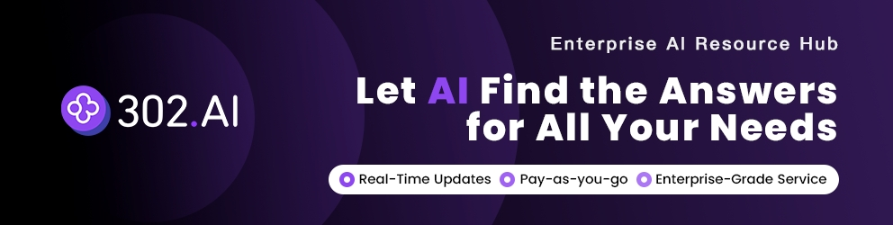

# CCG - Claude + Codex + Gemini Multi-Model Collaboration

<div align="center">


[](https://github.com/fengshao1227/ccg-workflow)
[](https://www.npmjs.com/package/ccg-workflow)
[](https://www.npmjs.com/package/ccg-workflow)
[](https://opensource.org/licenses/MIT)
[](https://claude.ai/code)
[]()
[](https://x.com/CCG_Workflow)


[简体中文](./README.zh-CN.md) | English

</div>

## ♥️ Sponsor

[](https://share.302.ai/oUDqQ6)

[302.AI](https://share.302.ai/oUDqQ6) is a pay-as-you-go enterprise AI resource hub that offers the latest and most comprehensive AI models and APIs on the market, along with a variety of ready-to-use online AI applications.

---

[**n1n.ai**](https://api.n1n.ai/register?channel=c_ivgzug0w) — Global LLM API Gateway. One API Key to access 500+ top AI models (GPT-5, Claude 4.5, Gemini 3 Pro, and more).

---

A multi-model collaboration development system where Claude Code orchestrates Codex + Gemini. Frontend tasks route to Gemini, backend tasks route to Codex, and Claude handles orchestration and code review.

## Why CCG?

- **Zero-config model routing** — Frontend tasks automatically go to Gemini, backend tasks to Codex. No manual switching.
- **Security by design** — External models have no write access. They return patches; Claude reviews before applying.
- **~30 slash commands** — From planning to execution, git workflow to code review, all accessible via `/ccg:*`.
- **Spec-driven development** — Integrates [OPSX](https://github.com/fission-ai/opsx) to turn vague requirements into verifiable constraints, eliminating AI improvisation.
- **Context-drift treated** (v4.0) — `context_budget` frontmatter + fresh-context subagent protocols (`phase-runner` / `debug-session-manager` / `code-fixer`) keep the main thread lean. Dogfood data: +1%/phase main-thread context drift average across 12 self-hosted phases.

## Architecture

```
Claude Code (Orchestrator)
       │
   ┌───┴───┐
   ↓       ↓
Codex   Gemini
(Backend) (Frontend)
   │       │
   └───┬───┘
       ↓
  Unified Patch
```

External models have no write access — they only return patches, which Claude reviews before applying.

> **🎬 [See CCG in action →](https://x.com/CCG_Workflow/status/2038923720610463876)** — Real multi-model collaboration demo on X

## Quick Start

### Prerequisites

| Dependency | Required | Notes |
|------------|----------|-------|
| **Node.js 20+** | Yes | `ora@9.x` requires Node >= 20. Node 18 causes `SyntaxError` |
| **Claude Code CLI** | Yes | [Install guide](#install-claude-code) |
| **jq** | Yes | Used for auto-authorization hook ([install](#install-jq)) |
| **Codex CLI** | No | Enables backend routing |
| **Gemini CLI** | No | Enables frontend routing |

### Installation

```bash
npx ccg-workflow
```

On first run, CCG prompts you to select a language (English / Chinese). This preference is saved for all future sessions.

### Install jq

```bash
# macOS
brew install jq

# Linux (Debian/Ubuntu)
sudo apt install jq

# Linux (RHEL/CentOS)
sudo yum install jq

# Windows
choco install jq   # or: scoop install jq
```

### Install Claude Code

```bash
npx ccg-workflow menu  # Select "Install Claude Code"
```

Supports: npm, homebrew, curl, powershell, cmd.

## Commands

### Development Workflow

| Command | Description | Model |
|---------|-------------|-------|
| `/ccg:workflow` | Full 6-phase development workflow (auto-routes frontend/backend) | Codex + Gemini |
| `/ccg:plan` | Multi-model collaborative planning (Phase 1-2) | Codex + Gemini |
| `/ccg:execute` | Multi-model collaborative execution (Phase 3-5) | Codex + Gemini + Claude |
| `/ccg:codex-exec` | Codex full execution (plan → code → review) | Codex + multi-model review |
| `/ccg:autonomous` | Cross-phase long-run (drives roadmap.md via phase-runner) | phase-runner |
| `/ccg:context` | Project context management (.context/ init, log, compress, history) | Claude |

### Analysis & Quality

| Command | Description | Model |
|---------|-------------|-------|
| `/ccg:analyze` | Technical analysis | Codex + Gemini |
| `/ccg:debug` | Problem diagnosis + fix (v4.0: manager + debugger fresh-context) | debug-session-manager |
| `/ccg:optimize` | Performance optimization | Codex + Gemini |
| `/ccg:test` | Test generation | Auto-routed |
| `/ccg:review` | Code review (auto git diff, v4.0: `--fix --auto` worktree loop) | Codex + Gemini + code-fixer |
| `/ccg:verify --gate=<change\|quality\|security\|module\|all>` | Unified verify gate (v4.0 merged) | Claude |
| `/ccg:verify-work` | Verify orchestrator + session-based UAT + cold-start smoke | Orchestrator |
| `/ccg:enhance` | Prompt enhancement | Built-in |

### Async Job Triplet (v4.0+)

| Command | Description |
|---------|-------------|
| `/ccg:status [job-id]` | List or query a job (`--wait --timeout-ms` blocks) |
| `/ccg:result <job-id>` | Fetch final verdict / summary / artifacts |
| `/ccg:cancel <job-id>` | Abort an active job |

### OPSX Spec-Driven

| Command | Description |
|---------|-------------|
| `/ccg:spec-init` | Initialize OPSX environment |
| `/ccg:spec-research` | Requirements → Constraints |
| `/ccg:spec-plan` | Constraints → Zero-decision plan |
| `/ccg:spec-impl` | Execute plan + archive |
| `/ccg:spec-review` | Dual-model cross-review |

### Agent Teams (v1.7.60+)

| Command | Description |
|---------|-------------|
| `/ccg:team-research` | Requirements → constraints (parallel exploration) |
| `/ccg:team-plan` | Constraints → parallel implementation plan |
| `/ccg:team-exec` | Spawn Builder teammates for parallel coding |
| `/ccg:team-review` | Dual-model cross-review |

> **Prerequisite**: Enable Agent Teams in `settings.json`: `CLAUDE_CODE_EXPERIMENTAL_AGENT_TEAMS=1`

### Git Tools

| Command | Description |
|---------|-------------|
| `/ccg:commit` | Smart commit (conventional commit format) |
| `/ccg:rollback` | Interactive rollback |
| `/ccg:clean-branches` | Clean merged branches |
| `/ccg:worktree` | Worktree management |

### Project Setup

| Command | Description |
|---------|-------------|
| `/ccg:init` | Initialize project CLAUDE.md |

## What's New in v4.0

> Full release notes in [CHANGELOG.md](./CHANGELOG.md#400---2026-05-03) · Upgrade guide in [.ccg-migration/v3-to-v4.md](./.ccg-migration/v3-to-v4.md)

11 dogfooded improvements landed in v4.0, each verified end-to-end by running CCG on itself:

1. **`context_budget` frontmatter** — 4 main orchestrators hard-cap at orchestrator-15, forbidden to slurp builder stdout
2. **`phase-runner` subagent protocol** — autonomous spawns a fresh-context wrapper that handles git/test/typecheck outside sandbox limits, returns ≤200 token summary
3. **`.context/<phase>/{CONTEXT,SUMMARY}.md`** — phase-scoped state files, main thread reads frontmatter only (< 200 tokens/phase)
4. **`codebase-mapper` agent** — 4-way parallel scan produces 7-file `.context/codebase/` contract on init
5. **Scope Reduction Detection** — plan-checker dim 7b blocks "v1 / static-first / wire-up-later" patterns when they don't match staged requirements
6. **`plan-checker` 5 dimensions + max-3-loop** — Dim 1 Requirement Coverage / Dim 2 Task Completeness / Dim 5 Scope Sanity / Dim 7b Scope Reduction / Dim 10 CLAUDE.md Compliance
7. **Async job triplet** — `/ccg:status` `/ccg:result` `/ccg:cancel` with job-id'd state in `.context/jobs/<id>/`
8. **`verifier` Level 4 data-flow** — distinguishes FLOWING / STATIC / DISCONNECTED / HOLLOW_PROP, plus `overrides:` 80% match and deferred filtering
9. **Session-based UAT + cold-start smoke** — `verify-work.md` walks gaps interactively, persists across `/clear`, auto-injects cold-start tests when git diff hits server/db/migrations
10. **`/ccg:review --fix --auto` + worktree isolation** — `code-fixer` agent loops fixes in a temp worktree with 4-step transactional cleanup
11. **`debug-session-manager` two-tier fresh-context** — manager + debugger run multi-round falsifiable hypotheses in isolation, return ROOT CAUSE FOUND / DEBUG COMPLETE / CHECKPOINT REACHED

**Dogfood data**: All 12 v4.0 phases ran via CCG `/ccg:autonomous` on the project itself. Main-thread context drift averaged **+1%/phase** (T0=31% → T11=49%, +18% net) — empirical validation of the "subagent isolation keeps the orchestrator lean" thesis.

## Workflow Guides

### Planning & Execution Separation

```bash
# 1. Generate implementation plan
/ccg:plan implement user authentication

# 2. Review the plan (editable)
# Plan saved to .claude/plan/user-auth.md

# 3a. Execute (Claude refactors) — fine-grained control
/ccg:execute .claude/plan/user-auth.md

# 3b. Execute (Codex does everything) — efficient, low Claude token usage
/ccg:codex-exec .claude/plan/user-auth.md
```

### OPSX Spec-Driven Workflow

Integrates [OPSX architecture](https://github.com/fission-ai/opsx) to turn requirements into constraints, eliminating AI improvisation:

```bash
/ccg:spec-init                          # Initialize OPSX environment
/ccg:spec-research implement user auth  # Research → constraints
/ccg:spec-plan                          # Parallel analysis → zero-decision plan
/ccg:spec-impl                          # Execute the plan
/ccg:spec-review                        # Independent review (anytime)
```

> **Tip**: `/ccg:spec-*` commands internally call `/opsx:*`. You can `/clear` between phases — state is persisted in the `openspec/` directory.

### Agent Teams Parallel Workflow

Leverage Claude Code Agent Teams to spawn multiple Builder teammates for parallel coding:

```bash
/ccg:team-research implement kanban API  # 1. Requirements → constraints
# /clear
/ccg:team-plan kanban-api               # 2. Plan → parallel tasks
# /clear
/ccg:team-exec                          # 3. Builders code in parallel
# /clear
/ccg:team-review                        # 4. Dual-model cross-review
```

> **vs Traditional Workflow**: Team series uses `/clear` between steps to isolate context, passing state through files. Ideal for tasks decomposable into 3+ independent modules.

## Configuration

### Directory Structure

```
~/.claude/
├── commands/ccg/       # ~30 slash commands
├── agents/ccg/         # 19 sub-agents (incl. v4.0 phase-runner / code-fixer / debug-session-manager / debugger)
├── skills/ccg/         # Quality gates + 10 domain knowledge bundles + multi-agent orchestration
├── bin/codeagent-wrapper
└── .ccg/
    ├── config.toml     # CCG configuration
    └── prompts/
        ├── codex/      # 6 Codex expert prompts
        └── gemini/     # 7 Gemini expert prompts
```

### Environment Variables

Configure in `~/.claude/settings.json` under `"env"`:

| Variable | Description | Default | When to change |
|----------|-------------|---------|----------------|
| `CODEAGENT_POST_MESSAGE_DELAY` | Wait after Codex completion (sec) | `5` | Set to `1` if Codex process hangs |
| `CODEX_TIMEOUT` | Wrapper execution timeout (sec) | `7200` | Increase for very long tasks |
| `BASH_DEFAULT_TIMEOUT_MS` | Claude Code Bash timeout (ms) | `120000` | Increase if commands time out |
| `BASH_MAX_TIMEOUT_MS` | Claude Code Bash max timeout (ms) | `600000` | Increase for long builds |

<details>
<summary>Example settings.json</summary>

```json
{
  "env": {
    "CODEAGENT_POST_MESSAGE_DELAY": "1",
    "CODEX_TIMEOUT": "7200",
    "BASH_DEFAULT_TIMEOUT_MS": "600000",
    "BASH_MAX_TIMEOUT_MS": "3600000"
  }
}
```

</details>

### MCP Configuration

```bash
npx ccg-workflow menu  # Select "Configure MCP"
```

**Code retrieval** (choose one):
- **ace-tool** (recommended) — Code search via `search_context`. [Official](https://augmentcode.com/) | [Third-party proxy](https://acemcp.heroman.wtf/)
- **fast-context** (recommended) — Windsurf Fast Context, AI-powered search without full-repo indexing. Requires Windsurf account
- **ContextWeaver** (alternative) — Local hybrid search, requires SiliconFlow API Key (free)

**Optional tools**:
- **Context7** — Latest library documentation (auto-installed)
- **Playwright** — Browser automation / testing
- **DeepWiki** — Knowledge base queries
- **Exa** — Search engine (requires API Key)

### Auto-Authorization Hook

CCG automatically installs a Hook to auto-authorize `codeagent-wrapper` commands (requires [jq](#install-jq)).

<details>
<summary>Manual setup (for versions before v1.7.71)</summary>

Add to `~/.claude/settings.json`:

```json
{
  "hooks": {
    "PreToolUse": [
      {
        "matcher": "Bash",
        "hooks": [
          {
            "type": "command",
            "command": "jq -r '.tool_input.command' 2>/dev/null | grep -q 'codeagent-wrapper' && echo '{\"hookSpecificOutput\": {\"hookEventName\": \"PreToolUse\", \"permissionDecision\": \"allow\", \"permissionDecisionReason\": \"codeagent-wrapper auto-approved\"}}' || true",
            "timeout": 1
          }
        ]
      }
    ]
  }
}
```

</details>

## Utilities

```bash
npx ccg-workflow menu  # Select "Tools"
```

- **ccusage** — Claude Code usage analytics
- **CCometixLine** — Status bar tool (Git + usage tracking)

## Update / Uninstall

```bash
# Update
npx ccg-workflow@latest            # npx users
npm install -g ccg-workflow@latest  # npm global users

# Uninstall
npx ccg-workflow  # Select "Uninstall"
npm uninstall -g ccg-workflow  # npm global users need this extra step
```

## FAQ

### Codex CLI 0.80.0 process does not exit

In `--json` mode, Codex does not automatically exit after output completion.

**Fix**: Set `CODEAGENT_POST_MESSAGE_DELAY=1` in your environment variables.

## Contributing

We welcome contributions! See [CONTRIBUTING.md](./CONTRIBUTING.md) for guidelines.

Looking for a place to start? Check out issues labeled [`good first issue`](https://github.com/fengshao1227/ccg-workflow/labels/good%20first%20issue).

## Contributors

<!-- readme: contributors -start -->
<table>
<tr>
    <td align="center"><a href="https://github.com/fengshao1227"><br /><sub><b>fengshao1227</b></sub></a></td>
    <td align="center"><a href="https://github.com/SXP-Simon"><br /><sub><b>SXP-Simon</b></sub></a></td>
    <td align="center"><a href="https://github.com/RebornQ"><br /><sub><b>RebornQ</b></sub></a></td>
    <td align="center"><a href="https://github.com/Sakuranda"><br /><sub><b>Sakuranda</b></sub></a></td>
    <td align="center"><a href="https://github.com/Mriris"><br /><sub><b>Mriris</b></sub></a></td>
    <td align="center"><a href="https://github.com/23q3"><br /><sub><b>23q3</b></sub></a></td>
    <td align="center"><a href="https://github.com/MrNine-666"><br /><sub><b>MrNine-666</b></sub></a></td>
</tr>
<tr>
    <td align="center"><a href="https://github.com/GGzili"><br /><sub><b>GGzili</b></sub></a></td>
</tr>
</table>
<!-- readme: contributors -end -->

## Credits

- [cexll/myclaude](https://github.com/cexll/myclaude) — codeagent-wrapper
- [UfoMiao/zcf](https://github.com/UfoMiao/zcf) — Git tools
- [GudaStudio/skills](https://github.com/GuDaStudio/skills) — Routing design
- [ace-tool](https://linux.do/t/topic/1344562) — MCP tool

## Star History

[](https://www.star-history.com/#fengshao1227/ccg-workflow&type=timeline&legend=top-left)

## Contact

- **X (Twitter)**: [@CCG_Workflow](https://x.com/CCG_Workflow) — Updates, demos, and tips
- **Email**: [fengshao1227@gmail.com](mailto:fengshao1227@gmail.com) — Sponsorship, collaboration, or development ideas
- **Issues**: [GitHub Issues](https://github.com/fengshao1227/ccg-workflow/issues) — Bug reports and feature requests
- **Discussions**: [GitHub Discussions](https://github.com/fengshao1227/ccg-workflow/discussions) — Questions and community chat
- **Community**: [Linux.do](https://linux.do) — Open-source tech community

## License

MIT

---

v4.0.0 | [Issues](https://github.com/fengshao1227/ccg-workflow/issues) | [Contributing](./CONTRIBUTING.md)
